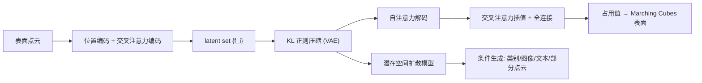

## 一句话总结

提出一种把 3D 形状编码成"一组无坐标潜在向量（latent set）"的神经场表示，天然契合 Transformer，并在其压缩潜在空间上训练扩散模型，显著提升了形状自编码与多条件 3D 生成的质量。

## 研究背景

- 领域现状：扩散模型在 2D 图像上大获成功，但迁移到 3D 生成的关键卡点在于"用什么形状表示"。神经场（neural field）因连续、可表达任意拓扑、分辨率无限而被看好，此前的做法是把潜在信息挂在单个全局向量、规则体素网格或不规则点网格上。
- 核心痛点：全局单向量容量太小、还原不出细节；规则网格太大、只能用极低分辨率（如 $$8\times8\times8$$），不适合生成模型；不规则网格（如 3DILG）虽压缩了尺寸，但每个潜在向量都要绑定一个显式 3D 坐标，结构冗余、且给第二阶段生成模型训练添麻烦。
- 本文 idea：借鉴径向基函数（RBF）与 Transformer 的交叉注意力，把"值 + 相似度插值"的结构保留下来，但**丢掉显式坐标**，让网络自己决定如何编码位置信息，从而得到一个定长、无坐标、专为 Transformer 设计的潜在集合表示。

## 方法

整体是"两阶段"框架：先用变分自编码器把形状压成一组潜在向量（latent set），再在这个压缩潜在空间里训练扩散模型做生成。

关键设计：

- **无坐标的潜在集合表示**：把不规则网格方法 $$\hat{F}_{\text{KN}}(\boldsymbol{x}) = \sum_{i=1}^{M} \boldsymbol{f}_i \cdot \frac{1}{Z}\phi(\boldsymbol{x}, \boldsymbol{x}_i)$$ 中显式坐标 $$\boldsymbol{x}_i$$ 去掉，改用交叉注意力算相似度，得到 $$\hat{F}(\boldsymbol{x}) = \sum_{i=1}^{M} v(\boldsymbol{f}_i)\cdot\frac{1}{Z} e^{q(\boldsymbol{x})^\top k(\boldsymbol{f}_i)/\sqrt{d}}$$。最终一个形状只由一组潜在向量 $$\{\boldsymbol{f}_i \in \mathbb{R}^C\}_{i=1}^{M}$$ 表示，可以看作"查询点 $$\boldsymbol{x}$$ 与潜在集合之间的交叉注意力"。相似度不再靠手工距离核，而是学出来的。

- **点云到潜在集合的聚合**：把大点云信息压进小潜在集合有两种做法。一是用可学习查询集 $$\text{CrossAttn}(\boldsymbol{L}, \text{PosEmb}(\boldsymbol{X}))$$（借鉴 DETR / Perceiver）；二是先用最远点采样得到子集 $$\boldsymbol{X}_0 = \text{FPS}(\boldsymbol{X})$$，再做 $$\text{CrossAttn}(\text{PosEmb}(\boldsymbol{X}_0), \text{PosEmb}(\boldsymbol{X}))$$，相当于"部分自注意力"。实验证明输入相关的点查询优于固定的可学习查询。最终 $$M=512$$、$$C=512$$。

- **KL 正则压缩**：仿照 latent diffusion，用两个线性头把潜在向量投影到低维的均值和方差 $$C_0 \ll C$$，重参数化采样得到 $$z_{i,j} = \mu_{i,j} + \sigma_{i,j}\cdot\epsilon$$，并加 KL 约束。这一步只在训练扩散模型时才需要；纯做表面重建可省略。推荐 $$C_0 = 32$$，把扩散要处理的潜在尺寸从 $$M\cdot C$$ 降到 $$M\cdot C_0$$。

- **潜在集合扩散**：解码器是一串自注意力块 $$\{\boldsymbol{f}_i\} \leftarrow \text{SelfAttn}^{(l)}(\{\boldsymbol{f}_i\})$$；生成阶段遵循 EDM 的去噪目标 $$\mathbb{E}\,\frac{1}{M}\sum_i \lVert \text{Denoiser}(\{\boldsymbol{z}_i + \boldsymbol{n}_i\}, \sigma, \boldsymbol{C})_i - \boldsymbol{z}_i \rVert_2^2$$。去噪网络本身也是 set-to-set 的注意力网络：每层一个自注意力块学潜在集合，一个交叉注意力块注入条件 $$\boldsymbol{C}$$（类别用可学习嵌入、单视图用 ResNet-18、文本用 BERT、部分点云用形状编码器），无条件时交叉注意力退化为自注意力。采样只需 18 步去噪。

## 实验结果

在 ShapeNet-v2（55 类）上做形状自编码（从点云重建表面），与全局潜在（OccNet）、规则网格（ConvOccNet、IF-Net）、不规则网格（3DILG）对比，报告全部 55 类平均：

| 方法 | 潜在结构 | IoU↑ | Chamfer↓ | F-Score↑ |
|------|----------|------|----------|----------|
| OccNet | 全局单向量 | 0.825 | 0.072 | 0.858 |
| ConvOccNet | 规则网格 | 0.888 | 0.052 | 0.933 |
| IF-Net | 多尺度规则网格 | 0.934 | 0.041 | 0.967 |
| 3DILG | 不规则网格 | 0.953 | 0.040 | 0.966 |
| 本文（可学习查询） | 潜在集合 | 0.955 | 0.039 | 0.966 |
| 本文（点查询） | 潜在集合 | **0.965** | **0.038** | **0.970** |

点查询版在所有类别上都优于可学习查询版，也全面超过既有基线。生成方面，作者提出 Rendering-FID/KID（2D 渲染视角）与 FPD/KPD（基于预训练 PointNet++ 的 3D 直接度量）作评测，在无条件生成上以 $$C_0=32$$ 取得最佳，优于 Grid-8³、PVD、3DILG、NeuralWavelet；并展示了类别、文本、单视图图像、部分点云补全四类条件生成。消融显示：增大潜在数 $$M$$ 提升重建但受算力限制（取 512）；用 KL block 降 $$C_0$$ 做压缩，比减少 $$M$$ 更划算——重建几乎不掉，却让第二阶段扩散训练更容易。

## 亮点与局限

- 亮点：
  - 表示极简且优雅——形状 = 一组无坐标潜在向量，天然是 Transformer 的输入格式，摆脱了显式坐标与手工插值核。
  - 一套编码器统一支撑重建与多种条件生成（类别/文本/图像/点云补全），扩展性强。
  - KL 压缩解耦了"重建质量"和"生成难度"：可激进压缩潜在维度而重建几乎不损失，显著缓解扩散训练难度。
- 局限：
  - 潜在数 $$M=512$$ 受 Transformer 二次复杂度和训练时间限制，难以进一步增大以还原更精细结构。
  - 训练成本高（自编码器 8×A100、扩散 4×A100，数千 epoch）。
  - 仍在 ShapeNet 这类规范化、水密化的合成物体上评测，对真实扫描、开放曲面、复杂场景的泛化未充分验证。

## 延伸思考

这项工作把"神经场表示"从"坐标绑定的空间数据结构"推向"集合式潜在表示"，本质是用注意力的可学习相似度替代手工空间核，与后来大量以 Transformer / set latent 为骨干的 3D 生成工作（如各类 latent diffusion、triplane 扩散）一脉相承。值得追问的方向：$$M$$ 的二次复杂度能否用线性注意力或分层集合缓解，从而扩到更高保真度；无坐标潜在是否可与显式几何先验（法向、SDF 梯度）结合，兼顾生成灵活性与表面精度；以及这种 set latent 表示能否直接对接 3D Gaussian Splatting 等更利于实时渲染的下游表示。
