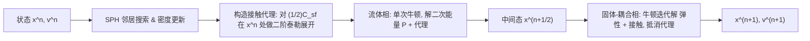

## 一句话总结

本文提出一个纯拉格朗日视角下的 SPH 流体与 FEM 固体双向强耦合框架，用基于障碍函数的摩擦接触保证无穿透，并借助"接触代理（contact proxy）"的时间分裂策略把流体相压缩到每步单次牛顿迭代，从而在保持稳定与精度的同时大幅提速。

## 研究背景

- 领域现状：固体常用拉格朗日网格模拟，流体常用欧拉网格以适应拓扑变化；要精确耦合这两种不同的离散化，往往需要复杂且昂贵的算法，且难以处理薄壳。纯欧拉、SPH、以及 MPM 等混合方法虽能做双向耦合，但要么难以扩展到非线性弹性体，要么存在人为粘连、无法保证轨迹不相交等问题。
- 核心痛点：现有方法难以在"统一离散化、保证无穿透、支持任意本构模型的非线性固体、以及高效求解"这几点上同时做到。若把 SPH 流体与 FEM 固体统一成优化问题用牛顿法求解，流体部分因需要大量邻居粒子而产生巨大且稠密的 Hessian，成为严重的计算瓶颈。
- 本文 idea：把固体、流体与交互项都写成势能，将双向耦合转成一个优化问题；用增量势接触（IPC）的障碍函数处理界面上可分离的摩擦接触以保证无穿透；再用带"接触代理"的时间分裂把二次的流体能量从高度非线性的固体与接触能量中剥离，让流体相每步只需一次牛顿迭代，并配合定制的线性求解器进一步加速。

## 方法

整体框架：先把耦合系统写成隐式欧拉下的优化时间积分问题 $$\boldsymbol{x}^{n+1} = \arg\min_{\boldsymbol{x}} \tfrac{1}{2}\lVert \boldsymbol{x} - \hat{\boldsymbol{x}}^n \rVert_{\boldsymbol{M}}^2 + h^2\big(P(\boldsymbol{x}) + \Psi(\boldsymbol{x}) + C(\boldsymbol{x})\big)$$，其中 $$P$$ 是流体（不可压 + 粘性）势能、$$\Psi$$ 是固体弹性势能、$$C$$ 是接触势能。随后把这个整体优化按"流体相 + 固体-耦合相"分裂求解。

关键设计：

- **流体势能全部二次化**。不可压性用惩罚体积比 $$J$$ 偏离 1 的二次能量 $$\psi_{f,I}(J)=\tfrac{k_I}{2}(J-1)^2$$ 建模，并用"更新拉格朗日"更新规则 $$J^{n+1}_i = J^n_i(1 + h\,\nabla\!\cdot\!\boldsymbol{v}^{n+1}_i)$$ 追踪体积变化，使 $$J$$ 与位置保持线性关系、每步重新初始化以避免密度与粒子分布误差累积。粘性则采用速度拉普拉斯形式，并做对称化近似使相互作用力等大反向、满足动量守恒且可积，得到一个二次的粘性势。这么做的原因是：只有能量二次，流体相的 Hessian 才是常量，可以一次牛顿迭代解完。
- **基于 IPC 障碍函数的可分离接触**。把固体表面三角形与流体粒子之间的距离代入障碍势 $$b(d,\hat{d})$$，仅当距离 $$d<\hat{d}$$ 时激活、$$d\to 0$$ 时排斥力趋于无穷，从而算法上保证界面无穿透，同时允许分离；摩擦按最大耗散原理用半隐式摩擦势建模。
- **带接触代理的时间分裂**。直接分裂（流体相忽略接触）会在界面产生不稳定（粘性流体尤其明显，粒子会粘在固体边界）。作者在流体相引入一个接触代理能量 $$\hat{C}_{sf}(\boldsymbol{x})$$——取 $$\tfrac{1}{2}C_{sf}$$ 在 $$\boldsymbol{x}^n$$ 处的二阶泰勒展开（保持流体相只含线性力），并在固体-耦合相把该代理贡献抵消掉以保持与原 PDE 一致。理论上该方案相对隐式欧拉只有 $$O(h^4)$$ 的失配误差。代理还能提前在流体相削减高速冲击粒子的速度，减少后续固体相牛顿迭代与接触集变化。作者进一步给出可选的"流体-固体-接触"三相分裂（适用于抗翻转本构模型）。
- **定制线性求解器**。流体相因需考虑 SPH 粒子的 2 环邻居、Hessian 稠密，改用无矩阵（matrix-free）共轭梯度求解，用 $$\boldsymbol{H}\boldsymbol{p} = \boldsymbol{g}(\boldsymbol{p}) - \boldsymbol{g}(\boldsymbol{0})$$ 通过梯度计算矩阵-向量积、仅取对角块做块 Jacobi 预条件；固体-耦合相则基于 Schur 补做域分解，只需分解固体自由度规模的补矩阵。

## 实验结果

主实验对比三种时间积分方案——联合优化（Joint）、基线时间分裂（TS）、带接触代理的时间分裂（TSCP）——在每帧耗时与牛顿迭代次数上的表现，验证 TSCP 的效率优势：

| 场景 | 方案 | 每帧秒数 | 每帧牛顿迭代数 |
|------|------|----------|----------------|
| Bob | Joint | 66.1 | 63.5 |
| Bob | TS | 38.0 | 117.3 |
| Bob | TSCP（本文） | 22.5 | 37.1 |
| 粘性 Armadillo | Joint | 41.3 | 16.5 |
| 粘性 Armadillo | TS | 32.3 | 29.0 |
| 粘性 Armadillo | TSCP（本文） | 25.5 | 10.5 |

TSCP 相比联合优化最多快约 3 倍，且牛顿迭代显著减少（高速冲击已在流体相部分化解）。其余实验以文字补充：在 Shot Armadillo 上，无矩阵 CG 让流体相求解快约 20 倍、内存大幅下降，域分解求解器比直接分解固体与接触系统快约 40%；与欧拉-拉格朗日耦合的 ElastoMonolith 相比，两个相同设置场景本文均取得超 5 倍加速；与 IISPH、DFSPH 相比，本文弱可压公式虽略慢，但能耦合任意本构的弹性体并保证无穿透，且粒子分布更平滑。方法还支持浮力、可调边界摩擦、薄壳双向耦合，以及混合任意余维（粒子、杆、壳、体、刚体）材料的紧耦合系统。

## 亮点与局限

- 亮点：
  - 用统一的纯拉格朗日视角同时处理固-固与固-流接触，避免了跨离散化的几何对齐难题，且天然支持薄壳与任意余维材料。
  - 接触代理的二阶泰勒展开既保证流体相线性可解、每步单次牛顿，又通过在固体相抵消把分裂误差压到 $$O(h^4)$$，兼顾效率与一致性。
  - 借助 IPC 障碍函数获得算法级的无穿透保证；配套无矩阵 CG 与 Schur 补域分解求解器在时间与内存上都有明显收益。
- 局限：
  - 流体采用弱可压建模，不严格满足不可压；较大的刚度 $$k_I$$ 虽更好保体积却使系统病态、CG 迭代增多，需要折中取值。
  - 相比纯 SPH 不可压求解器（IISPH/DFSPH），因更精细的边界处理而更慢。
  - 三相分裂只对抗翻转本构模型有保证，在接触相无法保证不翻转；当流体自由度占主导时，空间哈希的构建与查询开销也会变大。
  - 尚未建模固-流之间的粘附（adhesion）与表面张力。

## 延伸思考

- 接触代理"在子步用势能的二阶泰勒展开近似、再在后续相抵消以保持一致"的思路，本质上是一种可控误差的算子分裂，或可迁移到其它多物理场耦合（如磁流体、颗粒-流体）中，用来把病态或稠密的子系统线性化后单步求解。
- 作者提出的未来方向里，只在流体与固体扩展包围盒交集处构建空间数据结构，是把"内部粒子无固-流接触"这一物理稀疏性转成计算稀疏性的典型优化，值得在大规模流体 DOF 场景中尝试。
- 与后续 IPC 家族工作（如基于势能的 FEM-MPM 耦合）对照，本文进一步说明"障碍函数 + 优化时间积分"作为统一接触框架，正逐步覆盖流体、弹性体、薄壳乃至混合余维系统；如何把弱可压放松为严格不可压、并保持这套无穿透保证，是一个自然的追问点。
