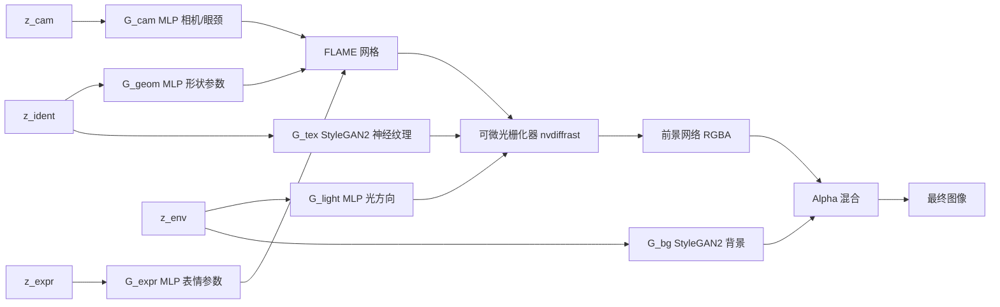

## 一句话总结

把 3D 可变形头模型、透视相机、可微光栅化这些"固定功能"的图形学原语直接嵌进 GAN 内部，用完全无标注的无条件生成任务训练，让 StyleGAN 级别的写实人脸自然长出对身份、表情、姿态、背景等的可解释、可解耦控制。

## 研究背景

- 领域现状：以 StyleGAN 为代表的 GAN 已能生成超越传统图形学的写实人脸，但其内部表示是黑箱，细粒度、可解释的控制仍是活跃难题。
- 核心痛点：已有的可控人脸方法（DiscoFaceGAN、GIF、Exp-GAN、VariTex 等）大多要么把相机位姿、FLAME 参数、光照等控制变量作为**带标签的条件输入**喂给生成器，要么依赖预训练推断模型、对比学习或模仿学习来"逼出"解耦。这既需要昂贵的标注/推断，又容易引入伪影（背景与身份纠缠、贴像素的抖动等）。
- 本文 idea：换一种哲学——不做条件生成，而是把问题当作**无条件合成**任务，通过精心设计的**归纳偏置**让可解释行为作为副产品自然涌现。具体做法是把可解释的图形学原语（3DMM + 光栅化 + 纹理映射）埋进生成器深处，只从数据中学习各控制变量的**统计分布**，而不要求每张训练图都知道其取值。

## 方法

整体框架：生成器接收四个相互独立的正态潜向量，分别驱动"身份""表情""相机""环境"四条支路。身份和表情经小型 MLP 映射为 FLAME 头模型参数生成网格，身份还经一个 StyleGAN2 网络生成神经纹理；固定功能的可微光栅化器把带神经纹理的网格渲染成 2D 条件图（纹理/法线/光照/噪声图），交给一个 StyleGAN2 式的前景网络合成带 alpha 的 RGBA 前景；环境潜向量另经 StyleGAN2 生成背景，最后用标准 alpha 混合合成终图。所有测试期控制都通过修改这些可解释的内部表示（潜向量或直接改网格顶点）实现。

关键设计：

1. **潜结构反映数据的统计依赖**。用身份潜向量同时驱动神经纹理与 FLAME 形状（因为外观和头形并非独立）；表情、相机各自独立成潜向量；环境潜向量控制背景和光方向。值得注意的是相机潜向量还要驱动眼睛和脖子的 FLAME 参数——训练数据里被摄者通常看向并朝向相机，位姿与眼颈并不独立。整个过程没有任何 loss 或推断模型去"指示"某个自由度该起什么作用,解耦完全是无条件任务加模型结构的涌现结果。

2. **把图形学原语埋在中间而非输出端**。作者刻意**不**让模型输出可被传统渲染器直接渲成写实结果的 3D 资产（那样质量会明显下降,如 GET3D）。而是让光栅化器提供一个"稳定的像素布局",后续 CNN 只需在这个布局上填出写实像素,无需自己学会在像素空间平移。这既保住了 StyleGAN 的画质,又让网格操作能等变地传导到终图。

3. **跟随几何的神经纹理与噪声**。神经纹理用固定 UV 贴在网格上,身份信息随表面"粘"住而动;更巧的是前景网络的噪声图不再是贴在图像像素上,而是把一张 12 通道随机纹理映射到网格上由渲染器提供——噪声随头部几何自然运动,消除了 StyleGAN 常见的"贴像素"运动伪影。为噪声做 mipmap 时每级降采样按 2 倍放大以保持方差。

4. **前景网络与 alpha 强制**。前景网络基于 StyleGAN 合成网络改造:仅最后三层保留风格调制,其余层改用把条件图拼接进特征栈的图像条件方式;最后两层的调制输入取自背景生成器的 $$\boldsymbol{w}_{bg}$$,让前景色调与环境一致。最终 1×1 调制卷积输出 RGBA,并对网格轮廓内部像素强制不透明、轮廓远外强制透明,防止训练早期塌缩到忽略前景或背景某一支。

## 实验结果

在同一份 256×256 FFHQ-U 数据集上与原生 StyleGAN2 对比。FID 反映"整体分布匹配",而精度/召回分别衡量"生成质量"与"覆盖多样性"。

| 指标 | 本文 | StyleGAN2 | 说明 |
|------|------|-----------|------|
| FID ↓ | 12.4 | 5.14 | 本文更差,主要因召回下降 |
| Precision ↑ | 0.82 | 0.63 | 本文更高,大部分结果质量好 |
| Recall ↑ | 0.25 | 0.38 | 本文更低,漏掉更多数据变化 |

FID 变差并非画质差,而是模型被强归纳偏置约束为"单人+背景",丢弃了 FFHQ-U 中大量含其他人、麦克风等附加前景的模式(掉模),精度反而显著更高印证了这一点。定性上,终图与所控网格的形状/位姿高度吻合,可用捕捉的面部动画序列(顶点偏移)驱动,且身份、表情、相机、视场角之间解耦良好。

## 亮点与局限

- 亮点：
  - 训练**完全无需标注**,不依赖预训练推断模型、对比或模仿学习,只学控制变量的统计分布,大幅简化训练。
  - 图形学原语深埋于生成器,实现了此前写实人脸模型少有的**近等变、细粒度几何控制**——直接改网格顶点即可让终图对应变化,可用传统动画工具驱动。
  - 头发、眼镜等超出网格轮廓的结构能被前景网络自然合成并与背景透出融合,无需额外辅助几何。

- 局限：
  - **光照方向控制未完全达标**,只有有限、微弱的效果,作者认为是微妙的平衡问题。
  - 存在**掉模与族裔多样性不足**(疑似数据集不均衡),牙齿运动不真实、极端下颌/远距离/侧视等训练分布外几何会失败。
  - 采用非等变的 StyleGAN2 + 256×256 分辨率(受算力限制),牙齿和轮廓外发丝仍有轻微贴像素;身份与光照/肤色发色存在一定纠缠。

## 延伸思考

- 这条"固定功能图形学原语 + 神经网络,靠归纳偏置涌现可解释控制"的路线,与 EG3D(tri-plane 辐射场)、StyleRig(外挂 rigging 网络)形成鲜明对比:后者要么牺牲可控性要么需要预训练/条件。本文提示,把领域先验以"可微图形块"的形式植入生成器中段,可能比事后解耦或前置条件更省数据、更稳。
- 作者顺带质疑了用 DECA 等推断网格当"真值"来评测或做训练目标的常见做法——本文渲染出的图与其自身控制网格的吻合度远高于 DECA 反推的网格,值得做 3D 感知生成评测时警惕。
- 迁移到光照/反射率等更多可解释控制、迁移到人脸以外的特定域乃至一般场景,关键都在于慎重设计固定功能组件与潜结构;换 StyleGAN3 的 alias-free 架构或许能直接消除残留的贴像素伪影。
