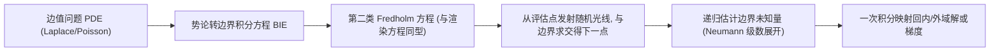

## 一句话总结

本文把源自势论(potential theory)的 Walk-on-Boundary (WoB) 方法引入计算机图形学，将边值问题转化为边界积分方程，用蒙特卡洛光线追踪的方式在边界上"游走"求解，从而在同一框架下统一支持 Dirichlet / Neumann / Robin / 混合边界与内外域问题，并能直接复用渲染中的双向估计、MIS、VPL、MCMC 等成熟技巧。

## 研究背景

- 领域现状：边值问题(如 Laplace/Poisson 方程)在图形学中应用广泛，传统解法依赖网格离散并求解矩阵方程。Sawhney 和 Crane 于 2020 年把无网格的蒙特卡洛求解器 Walk-on-Spheres (WoS) 引入图形学，凭借几何表示灵活、鲁棒、可并行、支持逐点求解等优点迅速流行，且被指出与蒙特卡洛光线追踪存在联系。
- 核心痛点：WoS 基于"在球面上随机游走"，存在固有短板：处理 Neumann/Robin 边界(尤其非凸域)效率低；处理外域问题需借助 Kelvin 变换转成内域；依赖 $$\epsilon$$-壳终止准则，导致在边界附近产生偏差、无法精确估计边界上的解;而且它本质上求解的是 Volterra 方程,与光线追踪并非完全等价,导致 MIS 双向估计等技巧难以直接套用。
- 本文 idea：改用势论出发的 WoB。它以边界积分方程(BIE)为基础，通过"从当前点发射随机光线、与边界求交得到下一个采样点"的方式在边界上递归游走，数学与算法结构都与光传输方程高度一致，因此能自然继承渲染中的各类先进采样技术，同时避开 WoS 的 $$\epsilon$$-壳偏差与外域/Neumann 困难。

## 方法

WoB 的主干是：先用势论把 PDE 写成边界积分方程(直接型或间接型)，得到一个关于边界未知量(解、法向导数，或单/双层势的源密度)的第二类 Fredholm 方程——这与渲染方程同型——再像光线追踪那样对其做递归蒙特卡洛估计，最后用一次积分把边界量映射回内(外)域评估点的解。

关键设计：

1. 按问题选对 BIE 形式。作者系统梳理了直接 BIE(基于 Green 第三恒等式，直接关联解值)与间接 BIE(单层势/双层势，引入边界源密度函数)，并给出各类问题的最佳搭配：Dirichlet 用双层势、Neumann 用直接 BIE、Robin 与混合边界用单层势。将直接 BIE 与混合边界纳入 WoB 是本文相对前人的新贡献。

2. 与渲染方程的对应关系。以 Dirichlet 为例，重排双层势方程得到 $$\nu = \mathcal{H}\nu + 2u_D$$，其中积分算子 $$(\mathcal{H}f)(x)=\int_\Gamma 2\frac{\partial G}{\partial n_y}(x,y)f(y)\,dA_y$$。可把 $$p(x_{i+1}\mid x_i)$$ 看作采样光线的 PDF，把 $$2\frac{\partial G}{\partial n_y}$$ 看作几何项乘 BRDF，把 $$2u_D$$ 看作发射项，于是 WoB 能几乎原样搭在光线追踪系统上，核心代码仅约 100 行。

3. 修正的 Neumann 级数与路径截断。与渲染不同，核 $$2\frac{\partial G}{\partial n_y}$$ 每次递归不衰减，直接截断 Neumann 级数 $$\nu=(\mathcal{I}-\mathcal{H})^{-1}2u_D=(\mathcal{I}+\mathcal{H}+\mathcal{H}^2+\cdots)2u_D$$ 会引入不可忽略误差。作者对级数做解析延拓式变换，等价于让最后一步的贡献乘以 $$1/2$$——利用算子 $$\mathcal{H}$$ 的负号带来的交替符号使 $$\tfrac12(\mathcal{H}^i+\mathcal{H}^{i+1})$$ 收敛到零，从而可安全截断(代价是固定长度截断带来的偏差，类比有限路径长度的 MC 渲染)。

4. 采样策略与渲染技巧移植。发射光线可完美重要性采样核 $$2\frac{\partial G}{\partial n_y}$$(正比于微分立体角)，但因无可见性项需在整个球面采样并用 "all-hits" 求交(随机取一个交点避免路径指数分裂)。作者进一步实现了对应"反向/正向追踪"的 backward/forward 估计器、双向估计 + MIS、RIS、VPL 式路径复用与 PSSMLT(MCMC)，并指出 WoB 的样本贡献可正可负这一与渲染的独特差异。对混合边界中出现的第一类 Fredholm 方程(Dirichlet 部分)，通过乘常数 $$k$$ 并两边加 $$\mu(x)$$ 的技巧改写成可递归估计的形式。

## 实验结果

在与 WoS 的等价 CUDA 实现对比中(内域 Dirichlet 问题，WoB 路径长 $$M=2\sim7$$，WoS 壳尺寸 $$10^{-2}\sim10^{-7}$$，各跑 2 小时取最优)，主要结论如下：

| 域类型 | WoS 效率 | WoB 效率 | 原因 |
|--------|----------|----------|------|
| 凸域 | 相当 | 相当 | 二者性能接近 |
| 非凸域 | 更高 | 较低 | WoS 单样本更慢但方差低; WoB 单样本快但方差高、需更多路径 |

作者强调这只是一般性指引，并不宣称某一方法在任意问题上更优；WoB 的真正价值在于理论层面的通用性(统一支持四类边界与内外域)与边界附近/边界上的精确性(无 $$\epsilon$$-壳误差)。其余实验用文字概括：WoB 遵循 $$O(1/\sqrt{N})$$ 的标准 MC 收敛率，RMSE 最终因截断偏差趋于平台，增大路径长度可降低偏差但引入更大方差;在 Neumann 问题中可按边界值分布采样起点(前向估计器)并直接估计边界上的解;双向估计 + MIS 在边界值分散与局部化两种设定下都稳健，且不像 WoS 双向估计那样引入额外偏差;PSSMLT 在等时对比中比朴素 MC 噪声更低。

## 亮点与局限

- 亮点：
  - 单一 BIE 框架统一覆盖 Dirichlet / Neumann / Robin / 混合边界及内外域，处理外域无需 Kelvin 变换、处理非凸 Neumann 无需特殊改造。
  - 不依赖 $$\epsilon$$-壳，能在边界附近乃至边界上精确估计解与法向导数，弥补 WoS 的固有偏差。
  - 与 MC 光线追踪数学/算法同构，可直接搭在现有渲染器(如 PBRT)上，并平滑移植 MIS、双向估计、RIS、VPL、MCMC 等技术;支持非零源项(Poisson 方程)。

- 局限：
  - 固定路径长度截断带来偏差，Russian roulette 式无偏截断留作未来工作;部分估计器方差偏高，非凸域整体效率不及 WoS。
  - Dirichlet 双层势的梯度/法向导数估计器涉及超奇异核，方差大甚至发散，需额外变换处理。
  - 混合边界第一类方程的乘常数 $$k$$ 只能试错选取，缺乏理论界;多连通域、外域一般衰减率等情形需要额外预处理，部分适用性尚待确认。

## 延伸思考

WoB 与 WoS 并非替代而是互补：WoS 擅长非凸域的整体效率，WoB 胜在通用性与边界精度，二者都属于"无网格蒙特卡洛 PDE 求解"这一正快速发展的方向(与并发的 Walk-on-Stars、边界值缓存等工作互为呼应)。把 PDE 求解与光传输统一在同一数学框架下，意味着渲染社区多年积累的方差缩减武器库(零方差理论、路径引导、去噪、可微渲染)几乎都能顺势迁移到物理仿真、几何处理与流体等应用中。样本贡献可正可负这一特性也提示了不同于传统渲染的采样与去噪策略设计空间，值得进一步探索。
