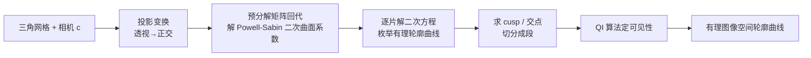

## 一句话总结

给定一个三角网格和相机视角，用逐片二次（Powell-Sabin）曲面去近似网格，使得该曲面的遮挡轮廓（occluding contour）能以闭式的有理曲线解析求出，从而又快又准地画出平滑、可见性一致的轮廓线。

## 研究背景

- 领域现状：遮挡轮廓（物体在视线下法向与视向正交、且可见的那条边界曲线）是三维非真实感渲染（NPR，如卡通描边、钢笔画、建筑草图）的核心一步。原理看似简单——找 $$\boldsymbol{n} \cdot \boldsymbol{\tau}$$ 变号的点再判可见性——但对平滑物体一直难做好。
- 核心痛点：三角网格的轮廓虽能鲁棒计算，却是一堆带虚假奇点的折线，拓扑脏、动画时抖动，不适合风格化。而对平滑曲面，轮廓是经投影变换后的高阶代数隐式曲线，没有闭式解。已有方法要么用折线采样近似（可见性与真实曲面不一致），要么重新生成一张以轮廓为边的三角网（如 ConTesse），代价高、还依赖启发式搜索与迭代精修，不保证成功。
- 本文 idea：换一种"天生可解析"的曲面表示。基于一条代数事实——不可约代数曲线只有在线性或二次时才对任意系数都存在有理参数化——作者选择用二次曲面近似网格：当 $$\boldsymbol{p}(u,v)$$ 是二次时，法向也是二次，正交投影下轮廓方程退化为二次（圆锥曲线），解曲线就是有理函数。于是只要造出一张几乎处处 $$G^1$$ 的逐片二次曲面，轮廓即为逐片有理曲线，可闭式求解、精确判可见性。

## 方法

整体框架：预处理阶段为网格算一张全局共形参数化，把每个三角形按 12-split 拆成二次子片，并预分解一个矩阵；运行时对每个新视角，先做投影变换把透视问题化归为正交投影问题，再一次回代解出 Powell-Sabin 曲面系数，然后逐片解二次方程枚举轮廓、求交点与 cusp 尖点、最后用改造过的 QI 算法定可见性。

关键设计分为四点：

1. **透视变透视为正交（先变换再造面）**：把相机坐标 $$[x,y,z]$$ 变为 $$[x/z, y/z, -1/z]$$，透视投影就等价于对变换后网格做正交投影（视向 $$\boldsymbol{\tau}=[0,0,1]$$）。关键洞察是：投影变换必须在构造平滑曲面之前作用到网格上，这让曲面近似变成视角相关的，但实测不产生非刚性抖动等可见瑕疵。

2. **逐片二次曲面构造（Powell-Sabin）**：正交化后需要一张逐片二次、且几乎处处 $$G^1$$ 的曲面（轮廓跨片连续要求至少 $$G^1$$）。作者基于 He 等人的思路但做了几处关键改动：先算一个局部双射的全局共形参数化（保证注入性、可控锥点位置与数量，比原方法畸变小），再用 12-split Powell-Sabin 插值把每个三角形变成一片 $$C^1$$ 二次宏片。每个顶点带位置 $$\boldsymbol{p}$$ 与两个切向 $$\boldsymbol{g}^u, \boldsymbol{g}^v$$，每条边中点带一个法向切向 $$\boldsymbol{g}^m$$，共享这些自由度即可保证 $$C^1$$。锥点（cone）处设切向为零、造退化片，允许曲面在极少数孤立点非光滑。

3. **薄板能量拟合 + 预分解加速**：曲面自由度 $$\boldsymbol{q}$$ 通过最小化薄板能量确定，兼顾光滑与逼近输入顶点：

$$E(\boldsymbol{q}) = \sum_{\ell} \int_{\Omega_\ell} \boldsymbol{p}_{uu}^2 + \boldsymbol{p}_{vv}^2 + 2\boldsymbol{p}_{uv}^2 \, du\,dv + w \sum_i A_i (\boldsymbol{p}_i - \boldsymbol{p}_i^0)^2$$

因为二次片的积分项对自由度是二次型，能量可写成 $$E(\boldsymbol{q}) = \tfrac{1}{2}\boldsymbol{q}^T \boldsymbol{H}\boldsymbol{q} - w\boldsymbol{q}^T \boldsymbol{H}_f \boldsymbol{q}_0 + \text{const}$$，最小化只需一次稀疏线性求解。矩阵 $$\boldsymbol{H}$$ 只依赖参数坐标、与顶点位置无关，故可预分解 Cholesky；视角改变只改 $$\boldsymbol{q}_0$$，运行时一次回代即可，代价极低。

4. **有理轮廓的解析提取与可见性**：单片内轮廓方程 $$\boldsymbol{\tau}\cdot\boldsymbol{n}(\boldsymbol{r}) = \tfrac{1}{2}\boldsymbol{r}^T \boldsymbol{A}\boldsymbol{r} + \boldsymbol{b}^T\boldsymbol{r} + c = 0$$ 是圆锥曲线，通过对角化枚举出椭圆/双曲线/相交直线/抛物线/平行线五种稳定解形式，各自有闭式有理参数化 $$\boldsymbol{r}(t)$$；映射到图像空间是四次有理曲线。可见性沿用 Quantitative Invisibility（QI，统计每点被遮挡次数，为零才可见），但改造到有理轮廓上：可见性只在 cusp 尖点、图像空间交点、片边界处变化，故在这些点切段、每段打一条射线测试并传播 QI 即可。尖点检测避开直接求解 10 次多项式，转而利用轮廓切向 $$\boldsymbol{t}(u,v) = -\boldsymbol{p}_u(\boldsymbol{n}_v\cdot\boldsymbol{\tau}) + \boldsymbol{p}_v(\boldsymbol{n}_u\cdot\boldsymbol{\tau})$$ 是二次的，把尖点条件化为两个二次方程组，用 pencil 方法降到一元三次方程求解。

## 实验结果

作者在 ConTesse 的测试集（29 个模型、每模型 26 个随机视角）上评测，重点对比运行时性能。核心结论是本方法每帧计算比 SOTA 的 ConTesse 快一到数个数量级，且随网格规模增长更平缓（仅需一次线性回代，而 ConTesse 需大量迭代启发式搜索来找合法网格）。

| 模型 | 本文每视角(视角相关) | ConTesse 每视角(仅网格生成) | 本文预处理 |
|------|------|------|------|
| Fertility | 0.4 s | 16 s | 4.4 s |
| Killeroo | 0.5 s | 33 s | 3 s |

注：ConTesse 只报告了网格生成阶段的耗时，而本文的每视角时间已是完整可见性流水线；本文测试机（2.7GHz MacBook Pro）还比 ConTesse 报告所用机器更旧。此外每帧耗时方差很小（最大模型标准差小于 150 ms），预处理与每帧耗时都近似随输入规模线性增长。

## 亮点与局限

- 亮点：
  - 首个通用的、遮挡轮廓可闭式求解的平滑曲面构造，把长期依赖启发式搜索/迭代精修的难题变成"一次线性求解 + 解低阶多项式"。
  - 可见性精确一致，输出的有理曲线不会违反平滑曲面轮廓应满足的拓扑条件（除非退化视角下的数值误差），避开了以往方法的可见性错误。
  - 视角相关的曲面近似配合预分解矩阵，让每帧更新极快且随规模扩展性好，比 SOTA 快一到多个数量级。
  - 本质上是对一系列经典与近期技术（鲁棒共形参数化、Powell-Sabin 插值、QI、Bézier clipping、射线-二次片求交）在高约束条件下的巧妙整合与适配。

- 局限：
  - 曲面近似是视角相关的，原理上旋转时物体可能显得非刚性（作者用视频论证投影变换不产生此类瑕疵，但这仍是设计上需注意之处）。
  - 依赖全局参数化与锥点处理，锥点处曲面非光滑、不传播可见性，是需要特殊处理的孤立退化点。
  - 实现是串行、未深度优化的；"car"这类高复杂度模型每帧需上百万次射线-片求交，说明最坏情况成本仍与轮廓段数强相关。
  - 属于二次曲面的近似，不是原始平滑曲面的精确轮廓（尽管接近），且退化/非一般位置视角下仍可能有数值问题。

## 延伸思考

- 论文指出一个自然的推广方向：探索更高阶、但轮廓参数方程可约（reducible）的曲面构造，若能成立或可摆脱对全局参数化的依赖——这与 Jüttler 的线性法向（LN）曲面思路相关，只是后者在抛物点处退化。
- 框架的可扩展性很好：加锐利特征、处理非流形/自相交、以折线形式叠加 suggestive contours 或 apparent ridges、加入风格化着色都相对容易，可作为 NPR 矢量化描边的统一底座。
- 每视角计算"高度可并行"，当前串行实现已比 SOTA 快数个数量级，GPU 化后有望进一步大幅提速，适合交互式/实时的矢量轮廓渲染场景。
- "把问题约束到只有二次才有闭式解、于是反过来选二次表示"这一思路值得借鉴：当通用表示求解代价高时，主动选择一个解析性质更好的近似表示，往往能换来数量级的效率提升。
