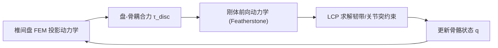

## 一句话总结

用有限元与刚体耦合仿真，构建了一套包含椎骨、椎间盘、韧带、关节突和肩带的高保真人体躯干模型，既能从常规动捕数据中"补全"看不见的脊柱与肩部骨骼运动，又足够高效可用于全身动态动作的轨迹优化。

## 研究背景

- 领域现状：图形学里的人体骨架通常被简化为"刚体 + 转动关节"的树状结构，这对四肢基本够用；生物力学界虽有更细致的脊柱/肩部模型，但往往各自孤立、稳定性与效率不足，几乎只能做静态姿态分析。
- 核心痛点：躯干远比四肢复杂——椎骨既能旋转提供脊柱柔韧性，又能平移吸收沿脊柱的压缩冲击；肩复合体的活动范围受多重非线性骨间约束支配。仅靠转动关节建模躯干，在舞蹈、体操、投球等上肢丰富的动作里只能靠繁琐的手工调参硬凑视觉合理性。
- 本文 idea：不用关节连接椎骨，而是用可形变的椎间盘（有限元）加韧带、关节突（非线性不等式约束）来共同决定骨骼的活动范围与动力学特性，让模型参数系统化匹配真人活动范围，做到既符合生理、又能高效仿真与最优控制。

## 方法

整体框架：躯干仍被当作一棵关节化刚体树来处理（椎骨间、肋骨与胸椎间用占位的 6 自由度自由关节相连），但骨与骨之间的相对运动不由关节限制，而由三类解剖组件共同约束——有限元模拟的椎间盘、作为单向弹簧/不等式约束的韧带、以及用椭球滑动约束表达的关节突。每个时间步先解有限元、再解带约束的刚体前向动力学，两者弱耦合。

关键设计：

1. **椎间盘（有限元 + 投影动力学）**：把椎间盘离散为四面体，用隐式欧拉的变分形式求解每步的节点位置，能量项含各向同性弹性与体积保持。借助 Projective Dynamics 的"局部投影 / 全局求解"交替框架，把非线性能量写成到约束流形的投影距离，从而复用 Cholesky 分解加速。由于盘紧贴骨骼、惯性可忽略，采用准静态简化（$$h \to \infty$$）去掉动量项以提升稳定性，方程简化为 $$\boldsymbol{L}\boldsymbol{x}_t = \boldsymbol{d}$$。盘与骨通过附着点能量 $$E_{\text{pos}} = \lVert \boldsymbol{x}_B - \boldsymbol{P}(\boldsymbol{q}) \rVert^2$$ 耦合，其梯度即盘对骨的耦合力。

2. **韧带（单向弹簧 → 不等式约束）**：韧带用分段线性折线表示，本质是只在被拉伸时产生收缩力的单向弹簧（Hill 肌肉模型）。为避免大收缩力破坏仿真稳定，改写成由 LCP 求解的不等式约束，预先把每段长度限制在 $$C_{\text{ligament}}(\boldsymbol{q}) = \lVert \boldsymbol{p}_+(\boldsymbol{q}) - \boldsymbol{p}_-(\boldsymbol{q}) \rVert_2 \le l_{\max}$$ 内。

3. **关节突与肩带（椭球滑动约束）**：关节突是两片软骨相互近乎无摩擦滑动的滑膜关节，把承载软骨的表面几何近似为扁椭球 $$C_{\text{facet}}(\boldsymbol{p}) = \lVert \boldsymbol{S}^{-1}\boldsymbol{R}^T(\boldsymbol{p} - \boldsymbol{p}_{\text{center}}) \rVert_2 - 1$$，让另一片软骨上选取的若干点保持在该椭球面上（实践中取四点、松弛为 $$\lvert C_{\text{facet}} \rvert \le 0.2$$）。同一套椭球约束还用来近似肩胛骨在肋骨后侧滑动的肩胸关节，从而形成闭链运动学。

4. **参数辨识**：韧带的最大长度靠"逐步收紧"策略从生物力学记录的极端相对姿态反推——不断缩短 $$l_{\max}$$ 直到某个已知极端姿态不再可达；关节突椭球的位置、朝向、尺寸靠标注骨几何确定；椎间盘的杨氏模量等则手工调至稳定且视觉合理。

## 实验结果

模型共 195 个自由度（24 个占位自由关节 + 17 个球窝关节），20 条韧带、74 个关节突，脊柱上 440 个肌腱约束、总计 680 个刚体约束；基于 DART 引擎用 C++ 实现，重定向以 600Hz、轨迹优化以 1800Hz 运行。作者用它无人工干预地"改造"了整个 Mixamo 数据集（1293 段、约 1 小时 18 分动作），16 核并行下约 20 小时完成，验证了鲁棒性。

生理有效性方面，模型的多项统计与生物力学文献吻合。以 L4-L5 椎间盘压力载荷对比为例：

| 任务 | 临床实测压力 | 本文模型趋势 |
|------|------------|------------|
| 站立 | 约 0.5 MPa | 相近 |
| 手持 20 kg 箱（贴胸） | 约 1.1 MPa | 随负载增大，但偏低 |
| 手持箱距胸 60 cm | 约 1.8 MPa | 随力臂进一步增大，但偏低 |

模型偏低的原因在于 PD 控制器增益过高，导致椎间盘的旋转形变几乎为零，仅平移形变随负载正确增大。此外，脊柱各椎骨的活动范围作为"涌现量"与文献平均值大体一致，肩部还自发复现了肩肱节律（约 30° 阈值后肩胛上抬与肱骨外展维持约 1:2 比例）。消融实验表明：去掉椎间盘会使腰椎骨-骨碰撞率飙升（L5、L4 分别达 8.0%、14.1%），有盘时几乎为零；去掉韧带则活动范围失真地变宽（L5 屈伸达 −30° 到 60°），重定向时倾向只让 L5 旋转的极端解。

## 亮点与局限

- 亮点：
  - 用图形学成熟的 FEM + 刚体 LCP 混合方案，把生物力学界"只能做静态分析"的细致躯干模型做到了鲁棒、高效、可跑大规模动态仿真。
  - 活动范围、肩肱节律、椎间盘压力等生理现象是从物理与几何耦合中"涌现"出来的，而非显式设定关节限位，说服力强。
  - 可无人工干预批量"改造"动捕数据补全躯干骨骼运动，也能直接嵌入现有全身骨架做无参考的轨迹优化。

- 局限：
  - 未建模驱动脊柱与肩部的肌肉。
  - 关节与椎间盘的被动动力学参数（弹簧阻尼系数、泊松比等）靠手工调，尚未匹配实测动态数据。
  - 重定向逐帧求解，缺乏时间平滑性，某些动作会出现抖动。

## 延伸思考

作者指出最激动人心的应用在医疗健康：模型有望模拟椎间盘突出对神经根的压迫深度随姿态的变化，或预测最小化脊柱负载的最佳深蹲姿势，成为无创诊断的辅助工具。此外，细致骨骼网格也为新的蒙皮流水线（可视化肩胛/椎骨在皮肤下的轮廓）打下基础，甚至可迁移到四足动物脊柱以提升动画真实感。值得追问的是：一旦补上肌肉层并用真实动态数据标定被动参数，这套"图形学效率 + 生物力学保真"的路线能否真正打通娱乐动画与临床分析之间的鸿沟。
