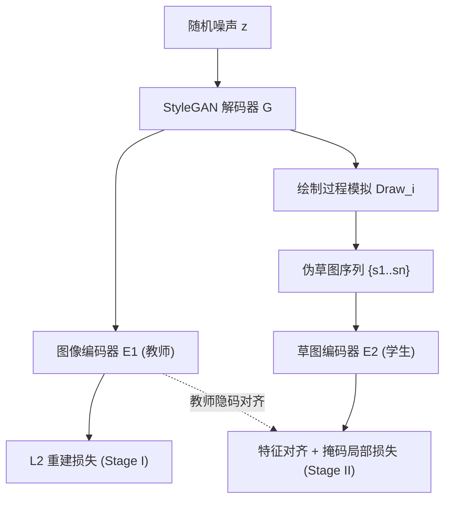

## 一句话总结

AniFaceDrawing 让用户在逐笔绘制的过程中实时得到高质量动漫肖像引导——通过在预训练 StyleGAN 的隐空间里做"笔画级解耦"探索，即便草图只有稀疏、残缺的几笔，也能生成与之局部匹配的动漫人脸。

## 研究背景

- 领域现状：sketch-to-image（S2I）与 GAN 反演（如 pSp）已能把完整线稿还原成高质量图像，StyleGAN 也让高质量动漫肖像生成成为可能。
- 核心痛点：绘制过程本质上是"从残缺到完整"的连续过程，而现有 S2I 方法几乎只针对**完整草图**训练。面对绘制早期稀疏、抽象的笔画，它们要么输出崩坏，要么无法与局部笔画对应；动漫风格比写实更抽象，缺失信息更多，问题更严重。先"草图→真人脸"再做风格迁移（如 DualStyleGAN）的组合也会因真人与动漫差异过大而出现输入输出不一致与模式坍塌。
- 本文 idea：把用户笔画视为 StyleGAN 结构隐码中"边缘相关属性"的子集，提出**笔画级解耦（stroke-level disentanglement）**。用一套两阶段、无需人工标注的训练策略，让残缺草图在隐空间里被约束到一个邻域内，随着笔画增多逐步逼近完整肖像对应的隐码，从而全程保持高质量与局部匹配。

## 方法

整体框架是"两阶段编码器 + 隐空间探索"。第一阶段用预训练 StyleGAN 生成的随机图像训练一个**图像编码器**（做 GAN 反演，充当"教师"）；第二阶段模拟人的逐笔绘制过程，自动造出"草图-图像"配对，训练一个**草图编码器**（学生），让它对残缺草图的隐码去对齐教师编码器里已解耦的表征。推理时把草图编码器给出的结构码（W+ 空间 1-8 层）与来自随机高斯噪声的颜色码（9-18 层）做 style-mixing，得到彩色结果。整套流程数据全部由解码器自生，无需额外数据库，属于无监督学习。

关键设计：

1. **笔画级解耦的两个理想条件**。作者形式化提出学生映射 $$\boldsymbol{F}: \boldsymbol{S} \to \boldsymbol{Q}$$ 应满足：一是"笔画独立性"，即单笔画应映射到对应的解耦结构码 $$\boldsymbol{F}(\boldsymbol{s}_i)=\boldsymbol{d}_i$$；二是"笔画顺序不变性"，无论以什么顺序加入某笔画，最终结果应与完整草图 $$\boldsymbol{F}(\boldsymbol{s}_1,\boldsymbol{s}_2,\dots,\boldsymbol{s}_n)$$ 一致。这两条保证了草图与生成图之间的局部匹配不依赖绘制顺序。

2. **绘制过程模拟（Stage II 的数据来源）**。先对 StyleGAN 生成图做 style-mixing 抹掉颜色、用 xDoG 提取完整线稿，再用动漫人脸关键点检测把脸部拆成 $$n=7$$ 类部件。随后逐笔"造草图"：每次随机选一个部件，经随机形变（高斯模糊/膨胀/腐蚀/保持原样）与随机描绘（原图/轮廓）生成一笔，累积成从简到繁的伪草图序列，同时维护对应的**累积损失掩码**，只在已画出的区域计算局部损失。

3. **特征对齐损失**。图像编码器隐码记为 $$I(\boldsymbol{z}):=E_1(G(\boldsymbol{z}))$$，草图编码器隐码记为 $$S(\boldsymbol{z}):=E_2(\text{Draw}_i(G(\boldsymbol{z})))$$。第一阶段损失就是简单的重建 $$L_I=L_2(G(I(\boldsymbol{z})),G(\boldsymbol{z}))$$。第二阶段损失为 $$L_S=L_1(G(S(\boldsymbol{z}))\ast M,\; G(\boldsymbol{z})\ast M)+L_2(I(\boldsymbol{z}),S(\boldsymbol{z}))$$：带掩码 $$M$$ 的 $$L_1$$ 项约束已绘制局部与原图相似，$$L_2$$ 项则把"完成度更高的草图"拉近到原图在隐子空间的投影，从而实现随笔画增多的渐进收敛。

4. **背景增强**。头发等无法被人脸检测器提取的部分被当作背景处理，通过对背景随机裁剪、并随机混入人脸轮廓做增强，显著提升了训练稳定性——否则新增笔画会让草图编码器无法正确定位而输出崩坏。

5. **交互界面**。系统实时把笔画栅格化并给出两种引导：展示整脸布局的"detailed guidance"，与随鼠标位置只显示单一语义部件的"rough guidance"（语义色由少样本分割 + StyleGAN 单样本控制算出）。配合 Pin/Undo/Eraser 与参考图选色，用户绘制完成后可一键上色。

## 实验结果

主实验用 FID 衡量生成质量：让用户画 10 张草图，收集本文方法生成的 177 张图作为 "Ours"、同输入下基线（用随机裁剪策略训练的完整草图 pSp 编码器）生成的 "Baseline"，并以解码器随机生成的 1000 张 "Decoder1k" 与 Danbooru 真实动漫头像 1000 张 "Danbooru1k" 作参照。FID 越低越接近参照分布。

| 方法 | vs Decoder1k ↓ | vs Danbooru1k ↓ |
|------|----------------|-----------------|
| Ours | 74.14 | 125.19 |
| Baseline | 106.03 | 151.42 |

作为标尺，Decoder1k 与 Danbooru1k 之间的 FID 为 70.86；本文方法对 Decoder1k 的 74.14 已非常接近该下限，说明生成质量显著优于基线、且贴近解码器与真实动漫图的分布。

其余实验以文字补充：在"草图-引导匹配"上，作者把匹配视为预测问题，用召回率衡量重叠比例。在前 1/3/6/9 笔及全过程中，本文的召回率均高于基线（如前 1 笔 0.48 vs 0.40，全过程 0.39 vs 0.31），说明在笔画最稀疏的绘制早期也能给出更匹配的引导；precision 与 F1 略低则反映本文引导包含了更多细节。15 名研究生的用户研究中，SUS 可用性得分 73.84（"good"），创造力支持指数 CSI 达 77.69，自定义问卷中"整体匹配""引导质量""全程保持高质量"等条目均分在 4 左右。

## 亮点与局限

- 亮点：
  - 首个覆盖动漫肖像**整个逐笔绘制过程**的高质量 S2I 绘制辅助系统。
  - 提出无监督的笔画级解耦训练策略，草图与人脸局部自动对应，**无需任何语义标签或人工配对数据**——数据全部由 StyleGAN 现场生成。
  - 对稀疏草图、"坏笔画"（含无效信息的笔画）与不同绘制顺序都表现稳健，能忽略无意义部分、只匹配有效信息。
- 局限：
  - 头发部分匹配较弱——因训练时只对脸部轮廓做笔画拆解，头发用随机裁剪策略处理，双马尾等特殊发型难以生成。
  - 结果完全受限于预训练解码器：本文模型基于 Danbooru 女性动漫头像训练，故生成结果**全为女性**，风格也较单一。
  - 每笔约 1.65 秒的响应时间偏长，影响沉浸感与交互流畅度。

## 延伸思考

- 该工作的核心其实是"如何为一个逐步给定、信息不完整的条件生成稳定输出"，与后来扩散模型时代的交互式/渐进式编辑（如 ControlNet、拖拽式编辑）关切一致，但它给出了纯 StyleGAN 隐空间下的优雅无监督解法，思路上很值得对比。
- 用"绘制过程模拟"自造训练数据以绕开配对数据缺失，是一个可迁移到其他抽象绘制任务（Ukiyo-e、水彩、设计草图）的通用范式，作者也把风格扩展列为未来方向。
- 把结构码/颜色码在 W+ 不同层解耦以支持 style-mixing 上色，说明隐空间分层语义可被显式利用——若换成更可控的生成骨干（如可提示的扩散模型），头发与多样风格的短板或许能被针对性补上。
