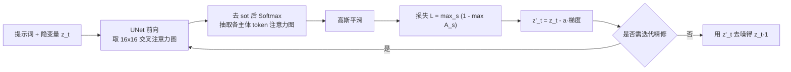

## 一句话总结

无需重新训练，在推理阶段实时微调扩散模型的隐变量、强化每个主体词的交叉注意力激活，从而缓解 Stable Diffusion 生成时"漏画主体"和"属性绑错对象"两类语义失真问题。

## 研究背景

- 领域现状：以 Stable Diffusion 为代表的文本到图像扩散模型能生成多样且富有创意的图像，文本条件通过交叉注意力注入到去噪 UNet 中。
- 核心痛点：作者观察到两类顽固的语义失真。其一是"灾难性忽略"（catastrophic neglect）——提示词中的某个或多个主体根本没被画出来（如"a horse and a dog"只画了马）；其二是"属性绑定错误"（attribute binding）——颜色等属性被绑到了错误的主体上（如"yellow bowl and blue cat"里把黄色绑给了别的物体）。根源在于：交叉注意力为每个图像块定义了一个在文本 token 上的概率分布，但没有任何机制保证每个主体 token 都被某个图像块所关注，一旦主体 token 无块关注，它就不会出现在图中。
- 本文 idea：提出"生成式语义看护"（Generative Semantic Nursing, GSN）的概念——在去噪的每一步轻微地朝语义更忠实的方向平移隐变量。其具体实例 Attend-and-Excite 要求每个主体 token 至少在某个图像块中"占主导"，通过优化注意力激活来实现，全程无需额外训练或微调。

## 方法

整体框架：给定提示词，先抽出主体 token（如 "lion"、"crown"）及其对应的交叉注意力图；在每个去噪步 $$t$$ 对注意力图施加平滑，定义一个"强化最被忽略主体"的损失，用其梯度更新噪声隐变量 $$z_t$$，促使下一步的隐变量更好地承载所有主体，再继续正常去噪。

关键设计：

1. **抽取并归一化注意力图**：在语义信息最丰富的 $$16 \times 16$$ 注意力层上，对所有注意力头求平均得到聚合图 $$A_t$$。由于 CLIP 文本编码器前置的 $$\langle sot \rangle$$ 起始 token 会持续吸走大量注意力，作者先剔除它再对其余 token 做 Softmax，使每个图像块的注意力真正反映"各文本 token 出现的概率"。

2. **高斯平滑抗对抗解**：单个高激活块可能只对应主体的局部残片（如某个像动物身体的轮廓），并不代表主体真的被生成。对每张主体注意力图 $$A_t^s$$ 施加高斯滤波后，最大激活块的取值依赖其邻域，从而避免这种"孤立高激活"的对抗性捷径。

3. **实时优化目标**：核心损失只盯住当前最被忽略的那个主体：

$$
\mathcal{L} = \max_{s \in S} \mathcal{L}_s, \quad \mathcal{L}_s = 1 - \max(A_t^s)
$$

按梯度更新隐变量 $$z'_t = z_t - \alpha_t \cdot \nabla_{z_t} \mathcal{L}$$。不同时间步会强化不同 token，最终让所有被忽略的主体都在某一步得到加强。该更新只在 $$t = 50$$ 到 $$t_{end} = 25$$ 的时间步上执行，因为后期时间步不再改变物体的空间位置。

4. **迭代式隐变量精修**：若早期去噪阶段某 token 的注意力值一直上不去，对应物体就会彻底缺席；但反复更新又会让隐变量偏离分布、产生不连贯的图。作者折中地在 $$t_1=0, t_2=10, t_3=20$$ 三个节点做渐进精修，要求主体最大注意力分别达到阈值 $$0.05, 0.5, 0.8$$，既逼出被忽略的主体，又防止隐变量跑偏。

一个额外收益是：缓解忽略后，交叉注意力图能正确定位所有主体，从而重新成为可信的生成"解释"（explanation）。

## 实验结果

作者自建了包含两主体、覆盖 Animal-Animal / Animal-Object / Object-Object 三个子集的评测集（每条提示 64 个随机种子）。由于 CLIP 图文相似度存在"词袋"倾向、对忽略不敏感，作者用 BLIP 为生成图打字幕、再算提示词与字幕的 CLIP 文本-文本相似度作为主指标。Attend-and-Excite 在三个子集上均优于全部基线至少 4.7%（括号内为各方法相对本文的下降幅度）：

| 方法 | Animal-Animal↑ | Animal-Object↑ | Object-Object↑ |
|------|------|------|------|
| Stable Diffusion | 0.767 (-5.08%) | 0.793 (-4.74%) | 0.765 (-5.89%) |
| Composable Diffusion | 0.692 (-16.47%) | 0.769 (-7.94%) | 0.759 (-6.85%) |
| StructureDiffusion | 0.761 (-5.91%) | 0.781 (-6.31%) | 0.762 (-6.49%) |
| Attend-and-Excite | **0.806** | **0.830** | **0.811** |

其余实验也一致支持结论：在 CLIP 图文相似度（全提示相似度与"最被忽略主体相似度"）上本文全面领先，最被忽略主体相似度至少高出 7%；65 人用户研究中，用户偏好本文的比例在三个子集分别达到 90.70% / 77.64% / 77.16%，且逐条提示均以多数票胜出。StructureDiffusion 的结果与 Stable Diffusion 高度相似，说明其未能真正修正语义缺陷；Composable Diffusion 则常把多个主体混成一体。

## 亮点与局限

- 亮点：
  - 完全推理期干预，无需训练/微调，可直接套在预训练模型上，保留其已学到的强语义先验。
  - 抓住了"每个主体 token 必须被某块主导"这一简洁直觉，用轻量的注意力损失同时缓解了灾难性忽略，并隐式改善了属性绑定（因文本编码已把属性信息链接到主体 token 上）。
  - GSN 是一个更通用的框架，理论上可通过定义不同损失推广到其他编辑/生成任务，甚至不依赖文本条件。
- 局限：
  - 受限于底层生成模型的表达力——当提示词落在模型分布之外时，优化可能把隐变量推向分布外，产生不符合文本的图像。
  - 对自然界不共现的主体组合（如"戴宽边帽的大象"），生成结果偏向绘画风、真实感下降。
  - 只处理了忽略与属性绑定两类问题，复杂的物体间关系/空间关系（如"骑在…上""在…前面"）以及否定语义仍未解决。

## 延伸思考

- Attend-and-Excite 与后续的注意力引导控制类工作（如 attention re-weighting、layout-to-image guidance）思路一脉相承，都把交叉注意力当作可干预、可解释的中间量。其"实时看护隐变量"的范式对无训练可控生成很有启发。
- 主体 token 的确定依赖名词解析，对复杂或抽象提示可能失效；把主体识别做得更鲁棒、或让优化目标覆盖关系类语义，是自然的延伸方向。
- 论文把 GSN 定义成"任意任务损失都可插入"的通用框架，这一点值得追问：在超出"主体存在性"之外的目标（如风格、构图、物理合理性）上，这种推理期梯度看护能否稳定收敛而不破坏图像连贯性。
