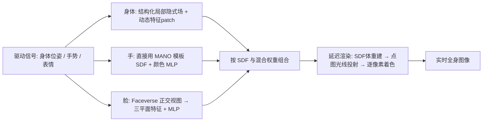

## 一句话总结

AvatarReX 从多视角视频中学习基于 NeRF 的全身虚拟人，用"身体/手/脸分部件建模 + 几何与外观解耦"的组合表示，配合延迟表面渲染管线，第一次让可同时控制身体、手势与表情的表现力全身 Avatar 达到实时渲染。

## 研究背景

- 领域现状：从图像/视频学习可驱动的人体 Avatar 已有大量工作，基于显式网格、隐式辐射场或两者结合的方法都能在自由视角下合成逼真人体。
- 核心痛点：两大难题同时存在。其一是"表现力"——多数方法只建模躯干和四肢，缺少手和脸的精细控制，而真正传神的 Avatar 需要身体动作、手势、表情三者协同；能做到全身表现力的工作又依赖工业级密集相机阵列，普通研究者拿不到。其二是"速度"——主流方法建在 NeRF 上，体渲染要沿光线密集采样、百万次查询网络，难以实时。
- 本文 idea：提出组合式 Avatar 表示，身体、手、脸各用最适合自身形变特性的隐式表示，并把几何与外观解耦、统一用 SDF 表达几何;基于此设计延迟表面渲染管线绕开昂贵的体采样,并用"两阶段训练"结合体渲染与表面渲染,兼顾从零学几何与学习锐利外观细节。

## 方法

整体框架：Avatar 由身体、手、脸三个独立隐式场组合而成，每部分都各自包含一个几何场（SDF）和一个视角相关的颜色场，且分别依托 SMPL-X、MANO、Faceverse 三种参数化模板。三部分按 SMPL-X 上预定义的混合权重拼装成完整模型，再送入延迟渲染管线得到实时图像；训练则采用先体渲染、后表面渲染的两阶段策略。

关键设计：

1. **分部件表示，因材施法**。身体的服装拓扑多变，用结构化局部辐射场（在 SMPL-X 上采样一组节点，每个节点带一个小 MLP 局部场，节点可有残差位移表示非刚性形变），摆脱对 SMPL-X 拓扑的依赖；为补足 MLP 的低频偏置，给身体颜色场的每个局部场额外挂一个由卷积网络回归的**动态特征 patch**（显式存高频细节，如衣纹和纹理）。手的形状变化有限，直接用 MANO 网格表面算 SDF 作几何、只学一个颜色 MLP，省去学复杂手指运动的负担。脸对表情最敏感，借鉴 EG3D 把 Faceverse 模型的正/左/右三个正交视图渲染出来、编码成三平面特征，为空间提供随位置变化的表情条件，比全局表情系数更能表达细节。

2. **几何与外观解耦，统一用 SDF**。不同于原版 NeRF 用一个网络同时出密度和颜色，本文把几何场（SDF，小网络）和颜色场分开。SDF 有跨部件统一无歧义的定义，既方便三部分拼装（式 14/15 用混合权重在手/脸与身体的 SDF、颜色间插值），也是实时渲染和两阶段训练的前提。

3. **延迟表面渲染管线**。分三步：先与相机无关地重建几何为显式 SDF 体（粗到细，先 128³ 低分辨率算身体、再 4 倍上采样细化手和脸，并利用局部场"只影响邻域"的性质并行查询）；再对 SDF 体做光线投射，取每个像素与零等值面的交点存成 2D 点图；最后只对点图上的交点查询颜色场做逐像素着色。相比体渲染沿光线采样百万点，表面渲染只在表面处求值，配合自定义 CUDA 核与 TensorRT，把渲染提速约两个数量级。

4. **两阶段训练**。第一阶段"拓扑无关训练"：把 SDF 经 Laplace CDF 转成密度，用体渲染从零学几何，稀疏像素上加 RGB/mask/Eikonal 等损失。第二阶段"基于拓扑的微调"：几何已可靠后固定几何分支，用表面渲染在 128×128 的图像 patch 上施加 LPIPS 感知损失（体渲染因显存限制一次只能渲约 400 像素、patch 太小无结构信息），从而学到锐利外观，并让训练与实时测试都走表面渲染、消除训练-测试鸿沟。

## 实验结果

在新姿态合成任务上与主流身体 Avatar 方法对比（为公平比较去掉了本文的手和脸，只留身体）。本文在 LPIPS 上最优、PSNR 有竞争力，同时以 25 fps 的帧率远超其它 NeRF 类方法（多在 1 fps 以下），SMPLPix 虽帧率高但图像质量指标全面落后。

| 方法 | PSNR ↑ | LPIPS ↓ | FID ↓ | 帧率 ↑ |
|------|--------|---------|-------|--------|
| SMPLPix | 23.199 | 0.050 | 42.832 | 36 fps |
| Neural Body | 23.946 | 0.096 | 81.527 | 0.32 fps |
| Animatable NeRF | 22.453 | 0.097 | 76.258 | 0.54 fps |
| ARAH | 22.070 | 0.092 | 104.330 | 0.07 fps |
| SLRF | 23.363 | 0.051 | 58.038 | 0.16 fps |
| HumanNeRF | 23.395 | 0.054 | 39.014 | 0.14 fps |
| Neural Actor | 23.531 | 0.066 | 19.714 | 0.25 fps |
| 本文 | 23.709 | 0.044 | 30.860 | 25 fps |

其余方面：训练数据为约 2000 帧的多视角视频（16 机位拍身体和手、6 机位拍脸），整套训练约 3 天、单张 RTX 3090 即可，远低于此前"数百 GPU 训两周"的工业方案；实时渲染在 RTX 3090 上以 1024×1024 分辨率跑到 25 fps。消融显示动态特征 patch 对恢复身体高频细节、LPIPS 感知损失对锐利外观都有明显帮助。

## 亮点与局限

- 亮点：
  - 第一个把"身体+手+脸"全身表现力控制与实时渲染同时做到的 NeRF 类方法，且只需单卡数天训练、无需预扫描模板或非刚性网格追踪。
  - 几何/外观解耦 + SDF 统一表示，既支撑延迟表面渲染的两个数量级提速，又让两阶段训练能在大 patch 上加感知损失学到锐利细节，设计自洽。
  - 分部件"因材施法"的表示（身体结构化局部场、手直接用模板 SDF、脸用三平面）把参数模板先验用在了刀刃上。
- 局限：
  - 仍依赖 16+6 共 22 台同步相机的多视角采集与逐帧 SMPL-X/Faceverse 拟合，采集门槛不低，离单目/手机级重建尚远。
  - 手部几何直接锁定在 MANO 模板表面，难以表达戴戒指、握物或手部软组织形变等超出模板的情形；脸依赖 Faceverse 表情空间，表情外推受模板能力限制。
  - 实时性能依赖 CUDA 定制核与 TensorRT 及高端显卡，几何用 128³（体素 2 cm）粗网格重建，对手指等细结构分辨率偏紧。

## 延伸思考

这项工作把"组合式部件表示 + 几何外观解耦 + 表面渲染加速"的思路整合得很完整，思路上与后来用 3D Gaussian Splatting 做可驱动全身/头部 Avatar 的路线形成对照——高斯泼溅天然是显式基元、渲染更快，是否能替代这里的 SDF 体重建与延迟着色、进一步简化管线值得追问。另一个方向是降低采集门槛：能否用更少视角甚至单目视频结合更强的人体/手/脸先验来学到同等表现力。此外，把手、脸与身体的交界处理（式 14/15 的硬阈值混合）做成可学习的软过渡，或引入物理约束处理服装与肢体的接触，可能进一步提升拼装处的真实感。
