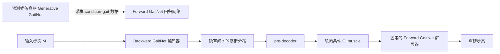

## 一句话总结

本文提出 Bidirectional GaitNet：一个双向生成模型，既能从人体解剖条件（骨骼/肌肉参数）预测步态，又能反过来从一段步态推断出可能导致它的解剖条件分布。

## 研究背景

- 领域现状：肌骨仿真（musculoskeletal simulation）已能在生物力学层面复现丰富的人体运动，也能预测解剖条件（骨骼畸形、肌肉无力/挛缩、质量分布等）如何影响运动。近期的预测式步态仿真器（如 Generative GaitNet）已能在高维参数空间上生成健康与病理步态。
- 核心痛点：为特定个体（健康或患病）建立准确的肌骨模型极其困难，因为精确测量活体器官和组织往往需要侵入式手段或昂贵的 CT/MRI 与人工标注。反过来"由步态反推解剖条件"这一逆问题更棘手：搜索空间高维（280 维条件向量）、解不唯一（多种身体条件可产生几乎相同的步态）、且每次前向仿真代价高昂。
- 本文 idea：把解剖到步态视为一个概率性映射而非一一对应。先用监督蒸馏把预测式仿真器的策略"搬"进一个前向回归网络（anatomy→gait），再以这个前向网络作为解码器构建条件变分自编码器（c-VAE），训练完成后其编码器即成为反向模型（gait→解剖条件分布）。

## 方法

整体框架：系统由 Forward GaitNet 与 Backward GaitNet 两部分组成，二者共同构成一个 c-VAE。先通过策略蒸馏训练前向网络，冻结它后再训练反向网络，使反向网络在"重建输入步态"的约束下学会推断解剖条件。

关键设计：

1. **前向映射的简化**。原始前向映射 $$\hat{F}(M \mid C_{anatomy}, C_{gait})$$ 要一次性输出整段步态，网络规模随帧率膨胀。作者把相位 $$\phi \in [0, 4\pi]$$ 放进输入层，让网络改为逐相位输出单帧全身姿态 $$F(Q_\phi \mid C_{anatomy}, C_{gait}, \phi)$$。这大幅降低了预测复杂度，用更小的回归网络就能取得更高精度。姿态误差用根高度、根速度与各关节旋转的加权差衡量：

$$D_{pose}(Q, Q') = w_h \lVert h - h' \rVert^2 + w_v \lVert v - v' \rVert^2 + \sum_j \lVert D_{rot}(q, q') \rVert^2$$

2. **反向映射与 pre-decoder**。反向网络只需预测肌肉条件 $$B(C_{muscle} \mid M, C_{skeleton}, C_{gait})$$，因为步幅、步频、肢体长度等可从动捕数据直接算出，无需网络推断。关键设计是把概率分布放在反向模型的中间隐空间、而非直接放在输出 $$\hat{C}_{muscle}$$ 上：隐码先采样，再经 pre-decoder 解码为肌肉条件。好处有二——其一，众多肌肉功能相关、内在维度低，适合在低维空间建模；其二，标准 c-VAE 的单峰隐分布无法刻画"差异很大却产生几乎相同步态"的多解性，pre-decoder 能把简单单峰分布映射为复杂多峰分布。训练损失为重建损失、KL 散度与向参考（正常成人）条件靠拢的正则项之和：

$$w_g D_g(M, \hat{M}) + w_{kl} D_{kl}(N(\mu, \sigma) \mid\mid N(0, I)) + \sum_m w_m (1 - \hat{c}_m)^2$$

3. **多反向网络的混合（Mixture-of-Experts）**。肌肉条件空间高度多样，且需推断病人身上出现的极端条件。作者训练多个 Backward GaitNet 各覆盖一个子空间，再按定性/定量结果择优采用——类比"多位擅长不同病症的医生会诊同一位病人"。本文用了三个模型：一个只针对膝踝肌肉，另两个针对全部肌肉但采用不同损失权重。

4. **基于网格的角点采样**。280 维条件空间若按角点全采需 $$2^{280}$$ 个样本，不可行；实验发现约 170 万条 condition-gait 元组即可让网络良好泛化。相比均匀随机采样，作者采用 grid-based sampling，只在每个条件取最小或最大值的角点处采样。理由是运动与肌肉条件常呈单调关系，让模型见识极端组合比在有效区间内均匀采样更高效，尤其利于复现严重受损步态。

## 实验结果

主实验是采样策略的消融：在 51 个未见过的仿真步态上，比较前向/反向网络分别用均匀采样(Uniform)与网格采样(Grid)训练时的关节角预测误差（单位：度，越低越好）。Grid-Grid（本文）在多数下肢关节上误差最低。

| 关节 | Uniform-Uniform | Uniform-Grid | Grid-Grid（本文） |
|------|-----------------|--------------|-------------------|
| Pelvis | 8.87 | 8.77 | 8.48 |
| FemurR | 12.00 | 11.86 | 11.87 |
| TibiaR | 5.54 | 5.47 | 5.79 |
| TalusR | 14.87 | 15.09 | 14.77 |
| FemurL | 12.25 | 12.22 | 11.16 |
| TibiaL | 5.34 | 5.37 | 5.49 |
| TalusL | 14.70 | 14.68 | 14.55 |

其余结论用文字补充：在未见仿真数据上，用反向模型预测的解剖条件重新仿真出的步态，与真值步态的平均关节角误差小于 8 度，视觉上几乎不可区分。对于典型病理步态（如 trendelenburg 髋下垂），反向模型能同时发现"一侧肌肉挛缩"与"另一侧肌肉无力"两种生理上都成立的条件。用 UMAP 对反向模型采样出的 1000 组肌肉条件做二维嵌入，真值条件落在预测分布的高概率区域内。在真实病人步态上（无肌肉条件真值），通过临床 Physical Exam 测量关节活动度验证——例如系统能正确预测某病人步态不对称的原因是右侧小腿肌肉比左侧更弱。

## 亮点与局限

- 亮点：
  - 用 c-VAE 巧妙地把"高维、非唯一、计算昂贵"的逆问题转化为可学习的概率映射，反向模型直接产出解剖条件的分布而非单一解，契合问题的多解本质。
  - 以蒸馏得到的前向网络作解码器，回避了训练时反复跑物理仿真的巨大开销；pre-decoder 把单峰隐分布映射到多峰肌肉条件分布，保留了多模态性。
  - 不仅在仿真数据上验证，还用真实病人步态与临床体检数据交叉验证，向临床步态分析落地迈了一步。
- 局限：
  - 部分关节（踝 talus、股 femur）误差偏大，因其在数据集中变化范围更广；作者认为 Transformer 等更强架构或更好的损失可能改善。
  - 目前只预测下肢肌肉条件，上肢因运动自由度大、与肌肉条件相关性弱而被排除；模型也缺少神经系统、柔性肌腱、皮肤等解剖要素。
  - 训练数据全部来自仿真，应用于真实病人时存在 Sim-to-Real 差距；输入须为动捕数据，获取成本较高。

## 延伸思考

作者设想用单目视频替代动捕作为输入（借助 video-to-mocap 方案），这会显著降低临床使用门槛。把 pre-decoder 这种"简单单峰隐分布 → 复杂多峰输出分布"的思路推广到其它逆问题（如从观测反推材料/物理参数）也值得探索。更远看，若把当前基于 Hill-type 肌肉的模型换成含体积肌肉的更精细全身或面部肌骨模型，对影视动画工业会有直接价值——但代价是仿真与数据生成开销的进一步上升，如何在精度与可训练性之间平衡将是关键。
