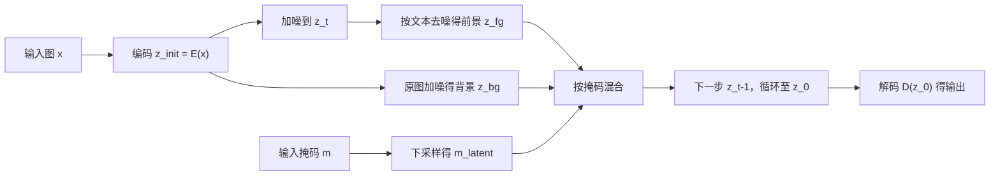

## 一句话总结

本文把 Blended Diffusion 的"逐步混合"思想搬进 Latent Diffusion 的隐空间，实现了零训练、快一个数量级、且更精确的文本驱动局部图像编辑——用户给一张图、一个掩码和一句文本，即可只改掩码区域而保持其余部分不变。

## 研究背景

- 领域现状：文本引导的图像生成与编辑发展迅速，扩散模型在多样性上超过 GAN 成为主流；但绝大多数方法关注"从零生成"或"全局编辑"。
- 核心痛点：针对"只改一张真实图像的局部、其余保持不变"这一实用场景，公开可用的方案很少（Blended Diffusion、GLIDE、DALL·E 2，且多数未完整开源）。它们都在像素空间做扩散，推理慢（Blended Diffusion 单图约 25 分钟），还会产生像素级噪点伪影。
- 本文 idea：借助已训练好的文本到图像 Latent Diffusion Model（LDM），在低维隐空间做扩散，既省掉每步的 CLIP 梯度计算又避免像素级伪影；再针对隐空间带来的两个新问题（VAE 重建不精确、细掩码失效）给出对应补救，得到一个零样本的局部编辑方案。

## 方法

整体框架：以预训练的文本条件 LDM 为底座（编码器 $$E$$、解码器 $$D$$、加噪/去噪算子）。把输入图编码进隐空间，在每一步去噪时按掩码把"文本引导生成的前景隐变量"和"原图对应噪声级的背景隐变量"混合，使编辑只发生在掩码内、背景保持不变；解码得到结果。随后用两项技术修补隐空间固有缺陷。

关键设计：

1. **隐空间混合（Blended Latent Diffusion）**。核心迭代式为把前景、背景两个隐变量按掩码逐元素混合：

$$z_t \leftarrow z_{\text{fg}} \odot m_{\text{latent}} + z_{\text{bg}} \odot (1 - m_{\text{latent}})$$

其中 $$z_{\text{fg}}$$ 来自条件去噪、$$z_{\text{bg}}$$ 来自把 $$z_{\text{init}}$$ 加噪到当前噪声级。由于 VAE 卷积特性，隐空间分辨率是原图的 1/8，掩码需相应下采样。混合后的隐变量不保证连贯，但下一步去噪会把它"修圆"。相比像素级 CLIP 引导，好处是推理快一个数量级、无像素级裁剪伪影、无对抗样本风险。

2. **背景重建（可选）**。VAE 编码是有损的，即使不做任何扩散，重建也会与原图有可察觉差异（对人脸、文字等高频区域尤其明显）。像素级直接缝合会留接缝，泊松无缝克隆会改变颜色，隐变量优化则过度平滑。本文借鉴 GAN inversion 的"逐图微调生成器"思路，改为**逐图微调解码器权重** $$\theta$$：

$$\theta^* = \arg\min_{\theta} \lVert D_\theta(z_0) \odot m - \hat{x} \odot m \rVert + \lambda \lVert D_\theta(z_0) \odot (1-m) - x \odot (1-m) \rVert$$

取 $$\lambda = 100$$，使前景跟随编辑结果、背景保留原图细节、过渡无缝。此步仅在掩码外含重要高频内容时才需要。

3. **渐进式掩码收缩**。当掩码很细时，其下采样版本会更细，导致文本编辑在重建结果中几乎不可见。作者通过可视化去噪过程发现：早期步骤只生成粗略颜色和形状，细掩码会在混合时把文本效果"覆盖"掉。于是**从一个膨胀的粗掩码开始，随扩散推进逐渐收缩到原始细掩码**，只有最后几步才用最细的掩码混合，从而保住细区域的编辑效果。

4. **预测排序**。扩散的随机性天然支持一对多输出；生成一批预测后，按各预测的 CLIP 嵌入与文本提示 CLIP 嵌入的归一化余弦距离排序，取最优结果。

## 实验结果

在 50 张随机图像 / 随机掩码 / 随机 ImageNet 类别文本上做定量对比。精度（precision）用现成 ImageNet 分类器评估（避免用 CLIP 评估基于 CLIP 的梯度方法），多样性用批内正确分类预测两两之间的 LPIPS 距离衡量，并辅以 AMT 人类偏好研究。

| 方法 | 批精度↑ | 批多样性↑ | 最优结果精度↑ |
|------|---------|-----------|----------------|
| 本文 | 28.66% | 0.115 | 54% |
| Blended Diffusion | 10.4% | 0.106 | 36% |
| Local CLIP-guided diffusion | 10.49% | 0.419 | 38% |
| PaintByWord++ | - | - | 0% |
| GLIDE-filtered | 1.87% | 0.114 | 4% |

本文在精度上（批级与最优级）大幅领先。多样性仅次于 Local CLIP-guided diffusion，后者因不保留背景、整幅图都在变，掩码区内容约束更少所以多样性虚高。人类偏好研究中，多数评估者在视觉质量和文本匹配上更偏好本文（唯一例外是 GLIDE-filtered 的视觉质量，但它大多几乎没改动输入，看着自然却没完成编辑）。推理时间上，本文在隐空间做扩散且背景优化只对排序最优的一张执行，批处理时全面快于所有基线（单图不含背景优化约 6 秒，Blended Diffusion 约 27 秒）。

## 亮点与局限

- 亮点：
  - 零样本、无需额外训练，直接复用预训练 LDM 与 CLIP，即插即用。
  - 把像素级混合思想迁移到隐空间，推理提速约一个数量级并消除像素级噪点/对抗样本问题。
  - 针对隐空间的两个真实痛点（VAE 有损重建、细掩码失效）给出简洁有效的补救：逐图解码器微调与渐进式掩码收缩。
  - 提出面向局部文本编辑的新评估指标（precision 与 diversity）。
- 局限：
  - 结果上界受 VAE 解码器重建能力限制；背景重建靠逐图微调解码器，需要额外的按图优化开销。
  - 渐进式掩码收缩虽缓解细掩码问题，但在生成精细细节时仍会吃力（如"绿色手镯"示例）。
  - 编辑质量依赖底座 LDM 的先验与 CLIP 排序，继承了它们的偏差。

## 延伸思考

本文是把"像素空间扩散编辑"高效化为"隐空间扩散编辑"的代表性一步，与后来大量基于 Stable Diffusion 的 inpainting / 局部编辑工作一脉相承。其"逐图微调解码器换取无缝背景"的取舍，本质是在通用先验与单图保真之间做权衡，值得追问的是能否用更轻量的方式（如仅微调少量参数或引入更强的重建先验）替代逐图优化。此外，渐进式掩码收缩揭示的"扩散早期定粗结构、后期补细节"的动态，对理解和设计其他掩码引导的扩散控制方法也有借鉴价值。
