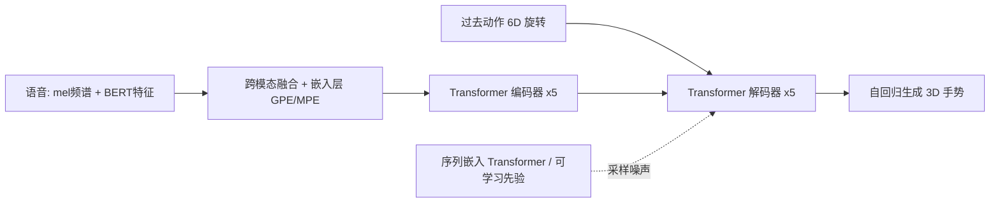

## 一句话总结

提出一个基于变分 Transformer 的框架 BodyFormer，从语音自动生成多样、逼真且与语义同步的 3D 全身手势，并用模式位置编码和同模态预训练来应对小数据集下的建模难题。

## 研究背景

- 领域现状：语音驱动手势合成早期以规则式或基于韵律等低层特征的方法为主；深度方法后来用 CNN、前馈网络、RNN 学习语音到手势的映射，近期开始尝试 Transformer 与生成式建模。
- 核心痛点：一是这是跨模态学习问题，需要大量语音-动作同步数据，而高质量动捕数据集规模很小（Trinity 仅 4 小时、TWH 约 20 小时），远小于自然语言/视觉预训练数据；二是语音与手势的相关性弱、映射存在歧义，直接从低层特征回归容易失败；三是手势往往与高层语义和当前"说话模式"相关，不引入这些信息难以学到。RNN 类模型还会"遗忘"长期上下文。
- 本文 idea：用带变分推断的生成式 Transformer 建模手势的随机分布以产生多样输出；引入模式位置编码捕捉不同说话模式下的运动速度差异；用同模态预训练缓解小数据下的跨模态学习难度。

## 方法

整体框架是一个 Transformer 编码器-解码器：编码器把语音的低层特征（27 通道 mel 频谱）与高层特征（ASR 转文本后取 BERT 特征、PCA 降到 32 维）融合后编码，解码器以自回归方式、结合过去动作与编码后的语音生成当前姿态。姿态用关节旋转的 6D 表示。整个系统先做同模态预训练，再做跨模态学习。

关键设计：

- **变分推断产生多样性**：训练时用一个"序列嵌入 Transformer"（借鉴 set transformer，含两个多头注意力块和 PMA 池化）把整段动作编码成后验分布，同时学习一个可学习的多元正态先验 $$\boldsymbol{\eta} \sim \mathcal{N}(\boldsymbol{\mu}, \boldsymbol{\sigma})$$；推理时关闭该编码器，直接从学到的先验采样噪声，使同一段语音能生成不同但合理的手势。
- **模式位置编码 MPE**：作者假设不同说话模式（不说话 NS、短说话 SS、长说话 LS）下运动速度不同，而全局位置编码 GPE 会把各模式的速度平均掉。于是在 GPE 之外增加按模式学习周期参数 $$\omega_m$$ 的 MPE，$$MPE(m, t') = [\sin(\omega_m t'), \cos(\omega_m t')]$$，其时间跨度 $$T'$$ 随检测到的模式长度动态变化，从而刻画每个模式内部的局部时间信息。嵌入层把两者合成：$$Embed = \mathrm{LayerNorm}(c \cdot (x + GPE(t)) + MPE(m, t'))$$，其中 $$c = \sqrt{512/3}$$。
- **同模态预训练**：因动捕数据太小，先分别对编码器做掩码语音建模（MSM）、对解码器做掩码动作建模（MMM），类似 BERT 的掩码语言建模，但用更易的超参、不用 mask token，随机改动 20% 数据（10% 换成噪声、其余置零）。预训练时禁用解码器的多头注意力块，让跨模态学习从合理的单模态流形出发。
- **损失与训练技巧**：总损失 $$\ell = \lambda_1 L_g + \lambda_2 L_m + \lambda_3 L_{KL}$$，含关节预测 MSE 损失、鼓励时序连贯的幅值损失、以及 KL 散度正则（$$\lambda_3$$ 用循环退火防止后验坍塌）。此外用余弦 warmup、spec 增强、以及从 100% 退火到 60% 的动作输入 dropout，强迫注意力尽量利用语音而非只依赖过去姿态。

## 实验结果

在 Trinity 数据集上与多种基线比较客观指标（MAJE 越低越好、FGD 越低越好），BodyFormer 全面领先：

| 方法 | MAJE↓ | FGD↓ |
|------|-------|------|
| BodyFormer（本文） | 70.05 | 9.66 |
| 本文 w/o 解码器预训练 | 71.92 | 10.83 |
| StyleGestures | 107.95 | 20.81 |
| Gesticulator | 86.04 | 51.53 |
| Trimodal | 126.71 | 254.90 |
| Aud2Repr2Pose | 125.50 | 346.50 |

在 TWH 数据集上同样领先（本文 MAJE 81.66 / FGD 12.12，最强基线 Gesticulator 为 157.28 / 55.26）。用户研究（Amazon MTurk 成对 A-B 测试）显示本文在人类相似度与合适度上显著优于所有基线（p<0.001），相对最强基线 StyleGestures 的胜率约为 70.5% / 69.0%；在合适度上甚至略胜真实动捕数据（59.5%）。消融显示同模态预训练、MPE、以及音频+文本联合特征都对质量有正向贡献。

## 亮点与局限

- 亮点：
  - 用变分 Transformer 显式建模手势的随机性，推理时采样可生成多样手势，缓解语音-手势的一对多歧义。
  - 模式位置编码是一个针对"说话模式速度差异"的巧思，实验中让生成动作的速度分布更接近真实数据。
  - 同模态预训练 + 一系列训练技巧，使 Transformer 能在仅数小时的动捕数据上训练成功。
- 局限：
  - 作者坦言合成动作质量本身缺乏公认的评价标准，只能用逐模式平均速度等间接方式衡量。
  - 依赖 ASR + BERT 的高层语义，识别错误可能传导到手势；说话模式（NS/SS/LS）是按句长自动划分的启发式。
  - 需 4 张 GPU 训练 7 天，且在 TWH 上运动速度与真实数据仍有差距。

## 延伸思考

这项工作与音乐驱动舞蹈的生成式 Transformer（如 Transflower）思路相通，都在处理弱相关、强歧义的跨模态序列生成，区别在于本文强调高层语义（BERT）与低层音频的互补。它的"同模态预训练缓解小数据"策略对其它动捕数据稀缺的任务（面部、手部、交互动作）有借鉴意义。后续可关注：用扩散模型替代变分推断是否能进一步提升多样性与质量，以及如何把说话模式从离散启发式升级为连续、可学习的表示。
