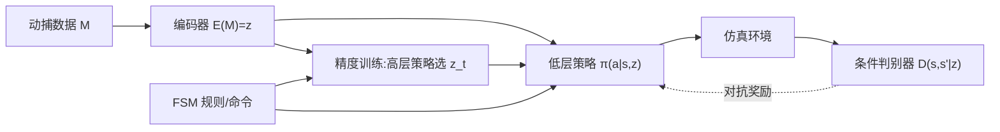

## 一句话总结

CALM 用无标注动捕数据端到端联合训练一个"动作编码器"和一个"隐变量条件控制策略"，让物理仿真角色既能生成多样的类人动作、又能被直接指定去做哪个动作，最终配合有限状态机像操控游戏角色一样零训练地完成新任务。

## 研究背景

- 领域现状：基于物理与深度强化学习的角色控制近年进展显著。DeepMimic 能模仿单条动作片段但每条动作要独立训练、不可扩展；AMP 把对抗式模仿学习和任务奖励结合，但数据分布与任务不匹配时表现差、换任务需重训；ASE 引入隐变量并最大化互信息，能产生多样动作，却牺牲了对生成动作的可控性。
- 核心痛点：现有隐变量方法的隐空间"难以控制"——ASE 容易模式坍缩，且没有把动作映射到隐空间的清晰通道，用户无法可靠地指定角色去做某个具体动作。语言监督类方法（如 PADL）虽可控但依赖有标注数据。
- 本文 idea：完全用无标注数据，端到端联合学习一个语义结构清晰的动作表示与一个可被引导的隐变量条件策略。关键手段是把判别器也条件化在动作隐编码上，强迫策略"复现每一条动作"，从而在保持多样性的同时获得可控性。

## 方法

CALM 分三个阶段：底层训练学出编码器与低层策略（动作生成器），精度训练学出高层策略以控制运动方向，推理阶段用有限状态机（FSM）无需再训练地组合动作解决任务。

关键设计：

- **条件对抗模仿（底层训练）**：每步从数据集随机采一条动作 $$M$$，编码为 $$z=E(M)$$，让低层策略和判别器都以 $$z$$ 为条件。判别器要区分策略产生的状态转移 $$(s,s')$$ 与该隐编码对应的真实转移，策略则以 $$r(s_t,s_{t+1},z)=-\log(1-D(s_t,s_{t+1}\mid z))$$ 为奖励。把判别器条件化在 $$z$$ 上，是缓解模式坍缩的核心——它逼迫策略产出与给定隐编码相匹配的动作，而不是笼统地"像数据"。策略无需精确复刻参考动作，只要符合该片段的分布特征，因此能生成数据里没有的自然新动作。
- **语义化编码器**：编码器是标准 MLP，输出投影到 $$l_2$$ 单位超球面上（固定范数提升点积训练稳定性，并降低推理时采到分布外隐变量导致的怪异动作）。判别器的梯度被截断、不流入编码器，使表示只为控制任务服务。为让隐空间语义连续，把动作切成 2 秒重叠子片段，对时间上重叠的子片段施加对齐损失 $$L_{\text{align}}=\mathbb{E}\lVert E(M)-E(M')\rVert_2^2$$，对随机采样对施加均匀性损失 $$L_{\text{uniform}}=\log\mathbb{E}\exp(-2\lVert E(M)-E(M')\rVert_2^2)$$，让相似动作聚在一起、整体分布铺开。
- **技能过渡**：训练时在随机时刻切换条件动作 $$M$$，显式教会策略在不同动作间平滑衔接，这样即便数据里没有某对动作的过渡演示，角色也能自然转换。
- **精度训练（高层控制）**：底层策略给"run"的编码并不能指定跑的方向。于是冻结编码器与低层策略，训练高层策略输出隐变量 $$z_t$$。奖励结合方向项与隐相似项：$$r_t^{\text{locomotion}}=\exp(-0.25\lVert d_t^{*}-\dot{x}_t^{\text{root}}/\lVert\dot{x}_t^{\text{root}}\rVert\rVert^2)+\exp(-4\lVert z_t-\hat{z}\rVert^2)$$，把生成隐变量约束在目标动作编码 $$\hat{z}$$ 附近，从而实现"按指定风格朝指定方向移动"。
- **范例引导 + FSM 推理**：任务设计者用 FSM 描述任务——需要精度时（如朝目标移动）由 FSM 给高层策略下达"动作编码 + 方向"；需要孤立动作时（如某记剑击）直接把编码喂给低层策略。一套（编码器、低层策略、高层策略）即可零训练解不同新任务，交互方式类似手柄操控游戏角色。

## 实验结果

数据为 160 段、共 30 多分钟的动捕片段，切成 2 秒重叠子序列；在单张 A100 上用 Isaac Gym 并行 4096 环境、PPO 训练共 50 亿步，低/高层策略决策频率 30/6 Hz，隐空间为 64 维超球面。下表为底层训练阶段与 ASE 的核心对比：

| 指标 | CALM | ASE |
|------|------|-----|
| 编码器质量（Fisher 类可分性 ↓） | 0.23 | 0.68 |
| 多样性（Inception Score ↑） | 19.8±0.1 | 18.6±0.4 |
| 可控性（生成准确率 ↑） | 78% | 35% |

编码器质量用 Fisher 类可分性衡量隐空间中不同动作类的分离度，CALM 分离更好；多样性用在参考数据上训练的分类器算 Inception Score，CALM 更高；可控性通过用户研究评定生成动作是否与指定参考动作一致，CALM 把感知准确率从 35% 提升到 78%。在下游任务上，高层策略能对 run / walk / crouch-walk 三种风格做方向控制（heading 得分普遍 0.8~0.9 以上），并零训练完成 location（到达并停留目标）与 strike（到达并击打，含踢击、盾冲、剑劈等结尾动作）等任务，结尾动作成功率多在 0.96~1.0。

## 亮点与局限

- 亮点：
  - 用无标注数据端到端学出既多样又可控的动作表示，摆脱了语言标注依赖；条件化判别器这一简洁改动显著缓解模式坍缩、把可控性从 35% 提到 78%。
  - 三阶段解耦（底层生成 / 高层方向控制 / FSM 组合）让一套模型零训练迁移到多个新任务，交互直觉贴近游戏手柄，工程落地友好。
  - 隐空间语义连续，可在语义相关动作（如冲刺↔蹲伏待机）间平滑插值。
- 局限：
  - 模式坍缩仍未根治，例如以待机动作为条件时会出现缓慢漂移的不自然微动。
  - 只保证分布内动作质量，对分布外的未见动作无法保证生成效果。
  - 精度训练目前只验证到风格化移动，控制剑/盾轨迹等精细动作尚需预训练阶段的进一步创新。
  - FSM 方案受策略鲁棒性包络限制，面对与训练动力学差异大的场景（上楼梯、崎岖地形）可能失效。

## 延伸思考

CALM 处在 DeepMimic → AMP → ASE 这条物理角色对抗模仿学习脉络上，核心贡献是"把判别器条件化在动作编码上"来换回可控性，这个思路与条件 GAN 把类别标签喂给判别器如出一辙，只是这里的"标签"是自监督学出的连续动作编码。值得追问的方向：一是能否把语言/文本条件与这套无标注编码融合，兼得可控与开放指令；二是精度训练阶段能否引入对分布外动作的外推能力，让角色处理训练集里没有的地形与交互；三是 FSM 之上是否可以接一个学习型的高层规划器，替代人工规则去自动编排长时序任务。
