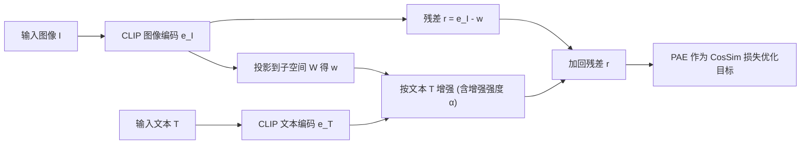

## 一句话总结
针对"CLIP 联合空间里图像与文本嵌入其实相距很远"这一现象，本文提出投影-增强嵌入（PAE）来替代文本嵌入作为优化目标，从而让基于 CLIP 的文本引导人脸编辑更解耦、更可解释、更可控。

## 研究背景
- 领域现状：CLIP 把图像和文本编码进同一潜空间后，人们普遍把"让生成图像在 CLIP 空间里靠近目标文本"当作优化目标，结合 StyleGAN、扩散模型做文本引导的图像编辑。
- 核心痛点：作者通过实证发现，图像嵌入与文本嵌入虽在同一空间却分处两个互不重叠的区域（跨模态余弦相似度远低于模态内），因此文本嵌入并不能代表"理想目标图像"的嵌入。直接朝文本优化会引入伪影、改动无关属性、破坏人脸身份，且大多数方法无法自由控制编辑强度，解耦性、可解释性、可控性三者难以同时满足。
- 本文 idea：不直接朝文本优化，而是构造一个更接近"图像区域"、又受目标文本引导、且引导被约束在相关属性子空间内的新嵌入 PAE，作为即插即用的优化目标。

## 方法
整体框架：给定输入图像 $$I$$ 和文本 $$T$$，先用 CLIP 编码得到 $$\boldsymbol{e}_I, \boldsymbol{e}_T$$；把图像嵌入投影到由"相关文本"张成的语料子空间 $$\mathfrak{W}$$ 上得到 $$\boldsymbol{w}$$ 并记录残差；在子空间里按目标文本对 $$\boldsymbol{w}$$ 做增强；最后把残差加回，得到最终嵌入 PAE。PAE 可直接替换任意 CLIP-based 编辑流程损失函数里的文本嵌入。

关键设计：

- **子空间蒸馏相关信息**：联合空间是向量空间，可用一组相关文本作基向量构造子空间（如"情绪子空间"）。作者用"从中性到大笑"的人脸视频验证：在情绪子空间里帧间相似度变化远快于原始 CLIP 空间或发型子空间，说明投影会丢弃无关属性、只保留相关属性。因此在子空间内改动嵌入，只会引起相关属性变化，天然解耦。

- **投影操作**：给定基向量后做投影 $$P_{\mathfrak{W}}(\boldsymbol{e}_I) = \sum_k (\hat{\boldsymbol{b}}_k^{T}\boldsymbol{e}_I)\,\hat{\boldsymbol{b}}_k$$。提供两种取基方式：语义基（Gram-Schmidt，如用六种基本情绪文本作基，适合有明确语义基的属性）与 PCA 基（对相关文本语料做主成分分析取前 $$N$$ 个主成分，适合像发型这种找不到"基本类别"的属性）。

- **增强操作与可控强度**：朴素地做 $$A_{\mathfrak{W},T}(\boldsymbol{w},\alpha)=\boldsymbol{w}+\alpha\boldsymbol{e}_T$$ 会让 PAE 太接近原嵌入、几乎不编辑。作者改为削弱 $$\boldsymbol{w}$$ 中投影文本取值低的分量、同时保持系数和：$$A_{\mathfrak{W},T}(\boldsymbol{w},\alpha)=\sum_{k=1}^{N}(c_k-\alpha\lvert c_k\rvert)\boldsymbol{b}_k+\dfrac{\alpha\sum_{k=1}^{N}\lvert c_k\rvert}{\sum_{k=1}^{N} d_k}\,P_{\mathfrak{W}}(\boldsymbol{e}_T)$$，其中 $$c_k=\boldsymbol{w}^{T}\boldsymbol{b}_k$$、$$d_k=P_{\mathfrak{W}}(\boldsymbol{e}_T)^{T}\boldsymbol{b}_k$$，$$\alpha\in\mathbb{R}^{+}$$ 即用户可调的增强强度，实现对编辑幅度的自由控制。

- **加回残差**：残差 $$\boldsymbol{r}=\boldsymbol{e}_I-\boldsymbol{w}$$ 保证 PAE 回到"图像区域"，从而比文本嵌入更接近真实目标图像的嵌入。整个构造不含额外监督损失或可训练参数。

## 实验结果
案例研究为文本引导人脸编辑：用 FFHQ 上的 StyleGAN2 生成图像，在四个基于潜码优化的方法（Naive、StyleCLIP、StyleMC、TediGAN）上，分别以文本嵌入（原模型）、PAE、扩散先验图像嵌入（DP）、方向 CLIP（Dir）作优化目标，共 16 个模型、7 个指标。下表摘取各基方法"原始文本目标 vs 加 PAE"在代表性指标上的对比（FID/LPIPS/IL 越低越好，Acc-C 越高越好）：

| 方法 | FID ↓ | LPIPS ↓ | 身份损失 IL ↓ | 编辑准确率 Acc-C(%) ↑ |
|------|-------|---------|--------------|----------------------|
| Naive | 96.32 | 0.251 | 0.279 | 22.6 |
| Naive + PAE | 73.06 | 0.103 | 0.140 | 42.9 |
| StyleCLIP | 75.68 | 0.157 | 0.198 | 23.7 |
| StyleCLIP + PAE | 67.80 | 0.071 | 0.134 | 52.9 |
| StyleMC | 73.52 | 0.123 | 0.144 | 29.2 |
| StyleMC + PAE | 63.16 | 0.094 | 0.119 | 26.7 |
| TediGAN | 76.78 | 0.298 | 0.618 | 56.6 |
| TediGAN + PAE | 63.20 | 0.073 | 0.232 | 67.9 |

加入 PAE 后几乎所有模型在绝大多数指标上都获得提升；即便 Naive+PAE 没有显式身份损失，其身份保持（IL）也优于把身份损失写进训练的 StyleCLIP、StyleMC。50 人用户研究同样显示 PAE 在解耦度（Dis-S）与文本一致性（Acc-S）上大幅领先。此外固定文本"happy"、改变 $$\alpha$$ 可平滑控制编辑强度。

## 亮点与局限
- 亮点：
  - 把"图文嵌入不重叠"这一被忽视的现象做了系统实证，并据此提出简洁、无需额外训练参数的优化目标；
  - 即插即用——可替换任意 CLIP-based 编辑流程里的文本嵌入，跨四种基方法均带来一致提升；
  - 通过显式选择子空间基向量获得可解释性，通过增强强度 $$\alpha$$ 获得可控性，同时兼顾解耦。
- 局限：
  - 子空间需人工挑选相关文本/语义基（情绪用六基本情绪、发型用 68 条文本），对新属性需要额外设计；
  - 主要在人脸（StyleGAN2/FFHQ）上验证，对更一般图像的泛化仅在附录做初步展示；
  - 个别指标（如 StyleMC+PAE 的 Acc-C）未必优于原模型，增强公式中的强度 $$\alpha$$ 仍需经验选取。

## 延伸思考
PAE 的核心洞见——文本嵌入不是理想目标图像嵌入的良好代理——与 DALL·E 2 用扩散先验把文本嵌入映射到图像嵌入的动机一致，但 PAE 走了一条无需训练先验、靠几何投影+子空间约束的轻量路线，二者可对比其解耦与可控性的权衡。子空间的构造思路也可推广到 CLIP 之外的多模态联合空间，用于约束"只改相关属性"的通用编辑；若能让子空间基向量自动发现（而非手工挑文本），将进一步降低使用成本。
