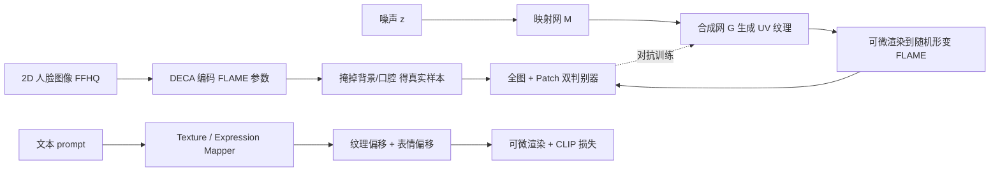

## 一句话总结

ClipFace 用自监督方式为 3D 可变形人脸模型（FLAME）训练出一个高质量 UV 纹理生成器，再借助 CLIP 文本引导，联合编辑纹理与表情，让用户仅凭一句话就能生成和操控带纹理、可动画的 3D 人脸。

## 研究背景

- 领域现状：3D 可变形模型（3DMM，如 FLAME）用紧凑的参数化表示描述人脸几何，保留了适配传统图形管线的 mesh 表示，便于编辑与动画，是可动画数字人的主流路线之一。
- 核心痛点：3DMM 依赖 PCA 建模，可控性有限；且纹理空间是从极少量 3D 扫描纹理构建的，纹理表现力很弱。而这两点恰恰是内容创作与视觉消费最关键的。已有 UV 纹理生成方法多为全监督，需要真值纹理（须在受控采集环境获得），且不少方法（如 StyleUV、Slossberg 等）不建模头部与耳朵，难以直接当游戏/影视资产用。
- 本文 idea：不学真值 UV 纹理，改从大规模 2D 人脸图像出发，用可微渲染 + 对抗训练自监督地学出纹理生成器；再训练两个映射网络，用 CLIP 文本方向引导，同时预测纹理隐码偏移与表情参数偏移，实现文本驱动的纹理与表情联合编辑。

## 方法

整体分两阶段：先自监督学一个把 UV 纹理渲染到 FLAME 网格上就能生成真实人脸图像的纹理生成器；再冻结该生成器，用 CLIP 引导训练文本到"纹理偏移 + 表情偏移"的映射网络。

**关键设计一：自监督纹理生成。** 没有 UV 真值，作者用 FFHQ（过滤掉帽子/眼镜等,约 45K 张）做自监督。用预训练的 DECA 从 RGB 图回归出 FLAME 的形状 $$\boldsymbol{\beta}$$、姿态 $$\boldsymbol{\theta}$$、表情 $$\boldsymbol{\psi}$$ 及相机参数,并据此掩掉背景与口腔内部得到"真实样本";同时从 $$\mathcal{N}(0,\boldsymbol{I})$$ 采样 $$\boldsymbol{z}\in\mathbb{R}^{512}$$,经映射网 $$M$$ 得 $$\boldsymbol{w}\in\mathbb{R}^{512\times18}$$,再由合成网 $$G$$ 生成 $$512\times512$$ 的 UV 纹理,可微渲染到随机形变的 FLAME 网格上得到"假样本"。用 StyleGAN-ADA 框架对抗训练。

**关键设计二：Patch 判别器。** 在全图判别器之外额外加一个 $$64\times64$$ 的 patch 判别器,专门促使局部区域出现高频细节。消融显示它不仅提升纹理质量,还能改善 UV 纹理与网格几何（尤其嘴部）的对齐。

**关键设计三：CLIP 方向损失 + 解耦映射器。** 编辑目标是求纹理偏移 $$\boldsymbol{w}_{\text{delta}}$$ 与表情偏移 $$\boldsymbol{\psi}_{\text{delta}}$$。纹理映射器 $$T=[T^1,...,T^{18}]$$ 对 18 个层级各自预测偏移;表情映射器 $$E$$ 以 $$\boldsymbol{w}_{\text{mean}}=\lVert \boldsymbol{w}_{\text{init}}+\boldsymbol{w}_{\text{delta}}\rVert_2$$ 为输入预测 $$\boldsymbol{\psi}_{\text{delta}}$$。把纹理与表情分成两个映射器是关键,能保持二者空间解耦。为避免直接用 CLIP 损失导致身份/光照漂移,借鉴 StyleGAN-NADA 使用 CLIP 空间的方向对齐:文本方向 $$\Delta t = E_T(t_{\text{tgt}})-E_T(t_{\text{init}})$$,图像方向 $$\Delta i = E_I(i_{\text{tgt}})-E_I(i_{\text{init}})$$,损失为

$$L_{\text{clip}} = 1 - \frac{\Delta i \cdot \Delta t}{\lvert \Delta i \rvert \, \lvert \Delta t \rvert}$$

其中初始文本统一取 "A photo of a face"。表情用 Mahalanobis 先验正则 $$L_{\text{reg}}=\boldsymbol{\psi}^T \Sigma_\psi^{-1}\boldsymbol{\psi}$$ 防止不真实形变,总损失 $$L_{\text{total}}=L_{\text{clip}}+\lambda_{\text{reg}}L_{\text{reg}}$$。若只改纹理不改表情,冻结表情映射器即可。

**关键设计四：动画序列的时变纹理。** 给定表情视频序列 $$\mathcal{V}=[\boldsymbol{\theta}_{1:T};\boldsymbol{\psi}_{1:T}]$$,把每帧表情/姿态与初始纹理码拼接为 $$\boldsymbol{e}_t=[\boldsymbol{w}_{\text{init}};\boldsymbol{\psi}_t;\boldsymbol{\theta}_t]$$,送入时间共享的纹理映射器得到逐帧偏移,再用重要性权重 $$i_t$$（衡量每帧相对中性表情的偏离程度、经 min-max 归一化）加权:$$\boldsymbol{w}_{\text{tgt}}^t=\boldsymbol{w}_{\text{init}}+i_t\cdot\boldsymbol{w}_{\text{delta}}^t$$,从而强调表情剧烈的关键帧,得到连贯、随表情变化的动画纹理。

## 实验结果

纹理生成质量上,ClipFace 在 masked FFHQ 上以 FID/KID 显著超过无监督基线,且 patch 判别器带来大幅提升:

| 方法 | FID ↓ | KID ↓ |
|------|-------|-------|
| FlameTex | 76.63 | 0.063 |
| Slossberg 等 | 32.79 | 0.021 |
| 本文（无 Patch） | 16.64 | 0.013 |
| 本文（有 Patch） | 9.56 | 0.006 |

文本编辑任务上（FID/KID/CLIP Score）,ClipFace 取得最优的 FID 80.34 与 KID 0.032,CLIP Score 0.251 与最好基线相当。作者指出 Text2Mesh 虽 CLIP Score 略高（0.264）,但只是让渲染颜色匹配文本、忽略了全局人脸语义（编辑区域不对）,产生语义不合理结果;而 ClipFace 在感知质量指标 KID 上明显更好,兼顾了文本匹配与真实感。动画实验表明其时变纹理比恒定纹理更富表现力。

## 亮点与局限

- 亮点：
  - 无需 UV 纹理真值,仅靠 2D 图像 + 可微渲染自监督学出高质量、覆盖全头（含头部与耳朵）的纹理生成器,更适合当游戏/影视资产。
  - 纹理与表情双映射器解耦设计 + CLIP 方向损失,实现身份/光照保持的一致编辑,单次前向即可联合输出 UV 纹理与表情。
  - 支持文本驱动的时变纹理动画,通过重要性加权保证跨帧连贯。
  - 输出仍是标准 mesh 表示,天然适配传统图形管线与动画流程。
- 局限：
  - 受限于 FLAME 模型,无法表示首饰、头饰、眼镜及复杂头发等配件。
  - 依赖 DECA 的参数回归与 FFHQ 数据分布,几何表现力仍受 3DMM 的 PCA 先验约束。

## 延伸思考

- 把参数化 3DMM 与艺术家设计的头发/头饰/眼镜资产结合,是补齐配件缺失最直接的方向;更进一步可考虑用隐式或混合表示扩展几何表达力,同时保留 mesh 的可编辑性。
- 方法核心是"冻结生成器 + 学 CLIP 方向映射"的范式,与 StyleGAN-NADA、StyleCLIP 一脉相承,思路可迁移到身体（SMPL）、动物等其它可变形模型的文本编辑。
- 当前用 CLIP 做监督,若换成更强的文本-图像模型或引入扩散先验,纹理多样性和文本对齐或可进一步提升;而如何在保证 3D 一致性的同时避免语义漂移（如 Text2Mesh 暴露的问题）仍是值得追问的点。
