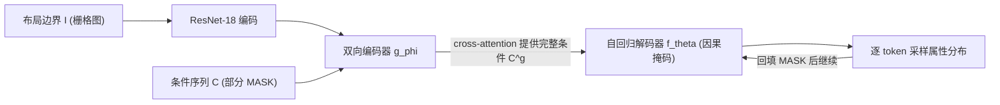

## 一句话总结

COFS 用一个 BART 式的编码器-解码器 Transformer 做室内家具布局生成，在保留"对物体顺序近似置换不变"的同时，首次支持对**任意物体属性子集**（比如只指定类别、只指定位置）的细粒度条件控制。

## 研究背景

- 领域现状：室内布局生成的主流做法是把场景拍平成 token 序列，用自回归 Transformer 逐 token 生成（SceneFormer、ATISS 等）。ATISS 通过训练时随机置换物体顺序、去掉位置编码，做到了"从任意物体子集补全场景"。
- 核心痛点：自回归模型的条件只能放在序列开头，否则后续生成步会漏看条件信息。ATISS 虽然能对"完整物体的任意子集"做条件，但无法对**物体属性的子集**做条件——用户想说"给我一张桌子两把椅子，但位置随意"，或者"指定某个位置，问这里最可能放什么物体"，现有方法都做不到。
- 本文 idea：既保留物体置换近似不变性，又额外引入一个双向 Transformer 编码器，把整个条件（含散落在任意位置的约束 token）编码后通过 cross-attention 喂给自回归解码器的每一步，从而让每个生成 token 都能看到完整条件。

## 方法

整体框架：模型是 BART 式的编码器-解码器。编码器双向注意力，读入被随机 mask 的条件序列；解码器带因果掩码自回归生成，并在每个 block 对编码器输出做 cross-attention。训练时随机置换物体顺序、随机 mask 一部分 token，让模型同时学"把未 mask 的 token 原样复制"和"预测被 mask 的 token"两个任务。

关键设计：

1. **布局表示**：3D 布局由边界 $$I$$（房间墙体的二值俯视图）和一组带朝向的包围盒 $$B=\{B_i\}$$ 组成。每个盒子有四个属性 $$B_i=(\tau_i, t_i, e_i, r_i)$$——类别、中心位置、尺寸、绕竖轴的朝向，共 8 个标量。序列写成 $$S=[\text{SOS}; B_{\pi_1}; \dots; B_{\pi_k}; \text{EOS}]$$，物体顺序随机置换 $$\pi$$，但单个物体内部的属性顺序固定。

2. **细粒度条件的两个机制**：一是把条件作为部分序列 $$C$$ 给出，其中用特殊 mask token $$\mathcal{M}$$ 标记"不约束"的属性，约束序列为 $$c_i$$（当 $$i\le \lvert C\rvert$$ 且 $$c_i\neq\mathcal{M}$$）否则取生成值 $$s_i$$；二是用编码器把完整条件编码成特征集合 $$C^g=\{g_\phi(c_1,C),\dots,g_\phi(c_{\lvert C\rvert},C)\}$$，让每一步的生成都以完整条件为依据：$$p(s_i \mid S^C_{<i}, C)=f_\theta(S^C_{<i}, C^g)$$。这样约束 token 即使散落在序列任意位置，生成步也不会漏看。

3. **位置编码三件套**：编码器额外输入物体索引 token $$O_i$$（标记 token 属于哪个物体）和相对位置 token $$R_i$$（标记 token 是物体属性元组里的第几个，用于辨认属性类型）；解码器输入绝对位置 token $$P_i$$。这套设计在"物体可置换"和"属性可辨认"之间取得平衡。

4. **输出分布与训练**：连续参数（位置/尺寸/朝向）用 $$T$$ 个 logistic 分布的混合表示 $$p(b)=\frac{1}{\sum_i \pi_i}\sum_{i=1}^{T}\alpha_i\,\text{Logistic}(\mu_i,\sigma_i)$$，离散类别用 softmax over logits。连续量用负对数似然、类别用交叉熵，teacher-forcing 联合训练边界编码器、条件编码器与生成器。采样时初始全 mask，每步生成后回填 mask token 再继续，实验发现这样能提升生成质量。

## 实验结果

在 3D-FRONT 数据集（约 1 万个专业设计的室内场景，沿用 ATISS 预处理，涵盖卧室/客厅/餐厅/书房）上评估。下表为无条件生成质量的主实验，给定真实户型边界后比较生成场景的分类准确度得分 CAS（越低越好，衡量生成与真实难以区分的程度）与类别分布 KL 散度：

| 方法 | CAS×10² ↓ (卧室/客厅/餐厅/书房) | KL×10³ ↓ (卧室/客厅/餐厅/书房) |
|------|------|------|
| FastSynth | 88.3 / 94.5 / 93.5 / 81.5 | 6.4 / 17.6 / 51.8 / 43.1 |
| SceneFormer | 94.5 / 97.2 / 94.1 / 88.0 | 5.2 / 31.3 / 36.8 / 23.2 |
| ATISS* (重训) | 61.1 / 76.4 / 69.1 / 61.8 | 8.6 / 14.1 / 15.6 / 10.1 |
| Ours | 61.0 / 78.9 / 76.1 / 66.2 | 5.0 / 8.1 / 9.3 / 6.7 |

CAS 上 COFS 与 ATISS 基本持平，而在类别分布 KL 散度上全面领先，说明生成场景的物体类别构成更贴近真实分布。合成速度方面 COFS 全面胜出：单场景合成时间约为 ATISS 的三分之一（如卧室 33.7 vs 102.4），且参数量仅约 19.4M——不到次优方法的一半（其中约 10M 来自 ResNet-18 编码器），FID 与 ATISS 相当。此外论文定性展示了四类应用：离群检测（把 token 逐个 mask 估计似然，识别并重采样不合理物体）、无条件生成、部分场景补全、以及任意属性条件（如先给定位置再让模型推断类别/尺寸/风格）。

## 亮点与局限

- 亮点：
  - 首个支持对任意属性子集做条件的布局生成模型，条件 token 无需连续、无需放在序列开头，交互灵活度显著超过 ATISS。
  - 完全复用标准 Transformer 语言建模模块（BART 式编解码），无需特制置换不变算子；同时兼具 ATISS 的全部功能（补全、离群检测、似然估计）。
  - 参数少、训练与采样都更快，工程上更轻量。
- 局限：
  - 仍是自回归生成，采样偏慢（尽管比基线快），训练时间长、调参依赖专家经验。
  - 要求所有物体具有相同数量的属性，无法处理"每个物体用变长 token 序列描述"的情形。
  - 置换不变只是"近似"的，靠数据增强而非结构保证；面对更长序列（大场景）扩展性存疑。

## 延伸思考

论文把 MLM/BART 的双向编码器思想嫁接到自回归布局生成上，本质是用 cross-attention 补齐了自回归"只能看前文"的信息缺口——这一思路对任何"需要全局约束的序列生成"任务都有借鉴价值。作者提到的未来方向也很自然：用分层自回归或并行采样（类似 MaskGIT 的思路）来缓解逐 token 的速度瓶颈，以及支持变长物体描述以适配更复杂的资产。值得追问的是，随着后来扩散模型在布局/场景生成上的兴起，这种"Transformer + 细粒度掩码条件"的路线在可控性与生成质量上如何与扩散式方法权衡。
