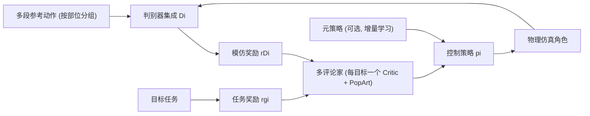

## 一句话总结

用多判别器 + 多评论家的多目标强化学习框架，让物理仿真角色同时模仿多段针对不同身体部位的参考动作、并完成多个目标任务，无需人工拼接全身参考动作或手动调权重。

## 研究背景

- 领域现状：物理仿真角色控制近年大量采用深度强化学习 + 动作捕捉数据做模仿学习（如 DeepMimic、AMP、ICCGAN），能生成自然鲁棒的全身动作。
- 核心痛点：现有方法几乎都只学"全身"动作。想要组合行为（边走边挥手、边走边瞄准）时，要么得为每种新组合重新采集/拼接一段全身参考动作，要么得手工设计并调节多个相互冲突的奖励项权重——既费力又难扩展。
- 本文 idea：把全身控制"解耦"成若干身体部位组，每组用各自的参考动作和独立判别器做模仿，把组合动作学习转化为一个多目标优化问题；由策略自己学会如何把各部位动作动态组合起来，并可叠加目标导向任务奖励。

## 方法

整体框架：在"强化学习 + GAN 式模仿"的基础上，把全身姿态拆成多个部位组（如上/下半身、手臂/其余），每组配一个判别器集成来产生模仿奖励；再把每个模仿奖励和每个目标任务奖励都当作独立目标，交给对应的独立评论家（critic）评估，形成"单策略 + 多评论家"结构。可选地复用一个预训练策略作为元策略，用增量学习快速扩展出新的组合行为。

关键设计：

- **全身动作解耦 + 多判别器模仿**：把角色姿态按部位切成若干组 $$\boldsymbol{P}^i_t \subset \boldsymbol{P}_t$$，每组只用属于该部位的参考动作集合 $$\boldsymbol{M}_i$$ 训练一个判别器集成。判别器用 hinge loss + 梯度惩罚评估一段姿态轨迹 $$\boldsymbol{o}^i_t = \lbrace \boldsymbol{P}^i_{t-n_i}, \dots, \boldsymbol{P}^i_{t+1} \rbrace$$ 与参考的相似度，直接给出模仿奖励，无需手写误差函数、也不用显式对齐目标姿态。相邻部位组可共享个别关节状态（如共享一条腿）来避免同侧步态等不协调问题。

- **多目标学习（多评论家）**：传统做法是把各奖励加权求和 $$r_t = \sum_k \omega_k r^k_t$$，权重难调且判别器奖励分布不可预测。本文改为对每个目标 $$k$$ 独立估计优势并标准化后再加权：$$\mathcal{L}_\pi = \sum_{k=1}^K \mathbb{E}_t \lbrack \omega_k \bar{A}^k_t \log \pi(\boldsymbol{a}_t \mid \boldsymbol{s}_t, \boldsymbol{g}_t) \rbrack$$，其中 $$\sum_k \omega_k = 1$$。这样每个目标都以同一尺度更新策略，避免了标量化调权；实验中 $$\omega_k = 1/K$$（各目标等权）在多数情况下就够用。

- **PopArt 值归一化**：不同目标的状态值量级差异很大，直接训练评论家不稳定。为每个评论家配一个独立的 PopArt 归一化器，用滑动均值/方差归一化值目标，且保证归一化器更新前后输出一致，从而稳定策略训练、加快收敛、降低模仿误差。

- **增量学习（元策略 + 协作策略）**：复用一个预训练元策略 $$\pi_{\text{meta}}$$（如走路），训练新的协作策略以"动作相加"方式扩展：$$\pi(\boldsymbol{a}_t \mid \boldsymbol{s}_t, \boldsymbol{g}_t, \boldsymbol{a}^{\text{meta}}_t) := \mathcal{N}(\boldsymbol{\mu}_t + \boldsymbol{w}_t \, \text{Stop}(\boldsymbol{a}^{\text{meta}}_t), \boldsymbol{\sigma}^2_t)$$。逐自由度的可学习权重 $$\boldsymbol{w}_t$$ 决定各关节多大程度依赖元策略（元策略被梯度停止、不更新），使角色能在"走路"上快速叠加"边走边瞄准"等新行为，而无需从零重学。

## 实验结果

在 IsaacGym 中用 15 个刚体、28 自由度的人形角色（仿真 120Hz、控制 30Hz），验证了纯组合模仿、目标导向控制（定向行走、目标定点、网球挥拍、边走边杂耍、瞄准）以及增量学习等任务。下表为单段参考动作组合模仿的定位误差（用 DTW 对齐后按身体链位置计算，越低越好），体现上/下半身两个模仿目标被均衡学习、没有偏废其一：

| 组合动作 | 部位 | 模仿误差 [m] |
|------|------|------|
| 挺胸 + 前开合跳 | 上/下 | 0.11 / 0.16 |
| 挺胸 + 深蹲 | 上/下 | 0.10 / 0.09 |
| 扭腰 + 弓步 | 上/下 | 0.15 / 0.13 |
| 挥手 + 走路 | 上/下 | 0.06 / 0.09 |
| 出拳 + 走路 | 上/下 | 0.11 / 0.10 |
| 出拳 + 跑步 | 上/下 | 0.17 / 0.14 |

消融实验表明：去掉多目标框架（w/o MO）时策略难以平衡两段参考动作，常放弃较难的一个（如 Punch+Run 里几乎不学跑）；去掉 PopArt 会收敛更慢、误差更高、方差更大。增量学习在四目标任务上大幅提速——如 Aiming+Run 用增量学习约 1.5 小时、2000 万样本即可完成，而从零训练需多花约 20 小时、多耗约 3 亿样本才能达到相近水平。

## 亮点与局限

- 亮点：
  - 无需人工拼接全身参考动作，也无需手工调多目标权重，组合方式由策略自动学习且物理合理性天然保证。
  - 多评论家 + PopArt 的多目标框架把"竞争目标平衡"变得简单稳定，$$\omega_k = 1/K$$ 往往就够。
  - 增量学习通过逐自由度权重复用元策略的部分身体动作，训练效率显著优于 MoE 式全身动作线性组合与从零训练。
- 局限：
  - 不擅长处理有明显阶段划分的多相位行为——模仿没有相位锁定，判别器也不区分动作的不同阶段。
  - 未建模不同动捕演员之间的差异，会在模仿中引入偏差；系统能按物理特性自动调整，但无法区分风格性的误差。

## 延伸思考

- 作者提出可引入状态机 / 状态转移来支持多相位行为，这与后续将有限状态机与对抗式模仿结合的工作思路一致，值得关注如何在不牺牲"自动组合"优势的前提下加入相位控制。
- "逐自由度权重复用元策略"的增量思路，本质是一种可组合的技能叠加机制，和 latent-space / MoE 类技能复用相比更聚焦于身体部位级别的迁移，或可推广到更长的技能库累积与终身学习场景。
- 组合动作由策略自主协调（如网球挥拍需下肢步法配合上肢挥拍、杂耍需与行走同步），说明多目标解耦对"部位间时序耦合"有一定处理能力，但对更强耦合、需精确接触时序的任务（如双人交互）能力边界仍待检验。
