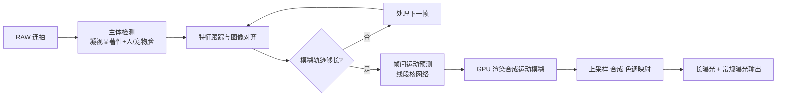

## 一句话总结
这篇论文提出了一套在智能手机上运行、按一下快门键即可全自动生成长曝光照片（前景虚化与背景虚化两种效果）的计算摄影系统，即 Google Pixel 6/7 上的 "Motion Mode"。

## 研究背景
- 领域现状：现代手机凭借连拍与后处理，已能做出高动态范围、暗光增强、合成景深虚化等过去只有大型相机才能实现的效果；但"运动模糊 + 静止清晰"这类长曝光效果在移动端几乎无人涉足。
- 核心痛点：传统长曝光有两种玩法——前景虚化（丝滑流水、车轨灯轨，需三脚架 + 减光镜、曝光可达数秒）和背景虚化（追随拍摄/panning，需精准跟踪运动主体）。两者都对器材和技巧要求极高，且要手动设置快门速度以匹配场景运动速度。
- 本文 idea：用一套连拍计算摄影流水线，在手持手机上全自动完成上述两类效果：自动检测并分割主体、跨帧跟踪并对齐场景运动、按目标模糊长度自适应选帧、预测帧间运动并合成运动模糊，最后与常规清晰曝光合成，保护人脸和几乎静止区域的锐度。

## 方法
整体框架：系统对 RAW 连拍流做增量式处理，分两种分辨率、四个阶段推进——先在 1/8 降采样低分辨率上做主体检测、特征跟踪、运动分析与运动预测；再在 1/2 分辨率上合成运动模糊；最后上采样回 1200 万像素做合成与色调映射，同时输出常规曝光和长曝光两张成片。整个流水线内嵌多个轻量神经网络，在手机算力/内存预算下几秒内跑完。

关键设计：

1. **自适应连拍调度与选帧**。以图像对角线百分比度量模糊轨迹长度（对分辨率/长宽比不敏感）。前景虚化要求轨迹长度分布的第 98 百分位达到 30%，背景虚化取第 80 百分位达到 2.8%（轨迹更短以保住主体清晰、留住场景语境）。系统据此决定何时停止增量取帧：背景虚化通常选约 4 帧，前景虚化最多约 12 帧、拍摄可延长至 7 秒且延迟对用户隐藏。

2. **自动主体检测**。用蒸馏自 SALICON 的移动端 3 层 U-Net 预测凝视显著性，再叠加人/猫/狗人脸区域信号补足（显著性往往只聚在主体中心，脸部信号帮助保住人脸锐度）。二者按 $$w = s(1 + f)$$ 组合并归一化到 [0,1]，得到主体权重图，用于按密度采样特征轨迹与求解对齐。

3. **两类效果的图像对齐**。先估计全局相似变换消除相机运动。前景虚化再用网格顶点上的局部细化变换做空间可变形变，抵消背景运动、保留前景运动，从而背景锐利。背景虚化则求解一个相似变换，其目标函数平衡两项：主体锐度项（前景对应点重投影误差的 L2 范数）与时间平滑先验（惩罚相邻帧对背景位移向量不平行）：
$$\underset{s,R,t}{\min}\; \lambda_f E_f(s,R,t) + \lambda_b E_b(s,R,t)$$
其中平滑项用向量点积衡量平行度，并用 smooth-$$L_1$$ 损失防止梯度消失（取 $$\lambda_f{=}1,\ \lambda_b{=}10$$）。对平面内旋转的主体，把估计出的滚转角约束到 25%，避免"旋转漩涡"般在旋转中心产生额外锐利区。

4. **运动预测、渲染与合成**。改造自 Brooks & Barron 的线段核预测网络：只预测单通道权重（而非 17 通道），并引入归一化递减斜坡权重 $$w_n = 1 - n/N$$，让预测线段真正张成完整时间区间、消除模糊轨迹中段的接缝伪影。渲染在 OpenCL kernel 中用立方 Hermite 样条对帧间流做平滑插值（避免分段线性的锯齿感），并在一种可逆的"soft gamma"色彩空间 $$\gamma_s(v) = \dfrac{v}{v + (1-v)\,k} \approx v^k$$ 中累积模糊，保住高光（如车灯）轨迹亮度不被拉暗。最后把半分辨率的模糊图与全分辨率清晰曝光合成：用基于运动幅度的掩膜保护几乎静止区域，再叠加人脸掩膜保护略有移动但语义重要的人脸。

## 实验结果
运动预测模型在 2000 例测试集上（合成模糊图与 FILM 伪真值对比）的定量比较，主看在参数量大幅削减下能否保持质量：

| 模型 | PSNR↑ | SSIM↑ | 参数(M) | 感受野(px) |
|------|-------|-------|---------|-----------|
| BB19 | 41.78 | 0.9862 | 7.057 | 202 |
| BB19-uni. | 40.07 | 0.9803 | 7.056 | 202 |
| Ours-large | 41.32 | 0.9842 | 7.301 | 202 |
| Ours | 40.78 | 0.9823 | 4.173 | 128 |
| Ours-abl. | 40.61 | 0.9808 | 4.173 | 128 |

本文的移动端简化模型（Ours）参数量仅约为 BB19 的 1/1.7，质量却相当，且在 Google Pixel 7 的 TPU 上单帧对推理小于 80ms。系统端到端延迟随选帧数变化：背景虚化约 1.7 秒，前景虚化的处理多在延长拍摄期间完成、延迟基本对用户隐藏。此外论文还通过消融验证了斜坡权重（消除轨迹中段断裂）、样条插值（比分段线性更自然）、soft gamma 色彩空间（比 sRGB/线性更好地保住高光轨迹）的作用，并与 Spectre 等手机 App 及既有长曝光数据集做了对比，显示其在手持背景对齐、主体保护和运动轨迹连续性上更稳定。

## 亮点与局限
- 亮点：
  - 首个在消费级手机上全自动、同时覆盖前景虚化与背景虚化两种长曝光模态的端到端系统，几秒出片、无需三脚架/减光镜/精准追随。
  - 工程与算法结合扎实：自适应选帧归一化模糊长度、显著性+人脸的主体检测、带时间平滑正则的对齐、样条运动插值与 soft gamma 高光保护，都服务于"锐与糊对比"的成片美学。
  - 在严苛的移动算力/内存预算下把运动预测网络参数减半而不损质量。
- 局限：
  - 背景虚化中主体过小时，显著性/人像掩膜误判与跟踪误差显著增加，可能对齐到错误区域。
  - 运动预测感受野 128px 约对应低分辨率 64px、全分辨率 512px 的位移上限；更大位移会产生严重伪影，此时系统只能退回输出清晰曝光。
  - 前景与背景运动方向垂直/相反或运动过大时会出现漩涡状或去遮挡伪影；投射阴影与承接物体运动方向不一致时也有类似问题。

## 延伸思考
- 系统把"美学"显式写进目标函数（约束旋转、缩短背景轨迹以保语境），这与纯物理正确的运动模糊渲染形成有趣对比，值得在其它计算摄影任务中借鉴"为观感而适度违背物理"的思路。
- 运动预测的位移上限来自感受野，若结合多尺度或分层运动估计，或能突破 512px 的实用上界，处理更快的运动。
- 主体检测依赖显著性 + 人脸信号，在无脸/多脸/小主体场景下选择策略较启发式；引入可交互或更强语义的主体理解可能进一步提升鲁棒性与可控性。
