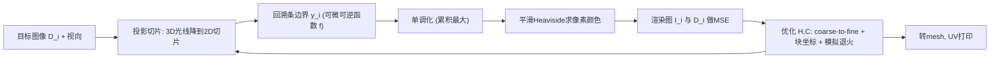

## 一句话总结

通过一个专为 3D 高度场设计的可微渲染器，优化"自遮挡彩色高度场"的条高与颜色，使同一块可直接 UV 打印的表面在不同视角下呈现不同的目标图像。

## 研究背景

- 领域现状：让单个物体表面随视角变化显示多幅图像，是数字制造与艺术交流的一个应用方向。当前代表性方案是"透镜物体"（Lenticular Objects），用 UV 打印机在物体表面覆盖微透镜，透镜下方排布彩色点阵，靠透镜折射让不同视角看到不同颜色。
- 核心痛点：透镜方案需要透明材料，打印后还需额外抛光涂层，且视觉效果对涂层类型极其敏感；透镜之间会留下暗色六边形网格伪影；更关键的是分辨率受限——每个透镜必须足够大以覆盖等于视角数量的若干色点。其他自遮挡方案（如加黑色挡墙的子格法）则会因挡墙与残余颜色可见而产生颗粒感，且无法在视角间共享像素颜色。
- 本文 idea：改用"自遮挡彩色高度场"——一排排高低不一、带颜色的条（bar）互相遮挡，从不同视角只露出特定的条，从而拼出不同图像。这种结构可被 UV 打印机直接制造，无需透镜或涂层，并能达到更高分辨率。核心是一个针对高度场量身定做的可微渲染算法，用它把"条的高度与颜色"作为可优化变量，最小化渲染结果与各视角目标图像之间的误差。

## 方法

整体框架：把表面参数化为高度矩阵 $$\boldsymbol{H}$$ 和颜色矩阵 $$\boldsymbol{C}$$，用若干台正交相机（各由一个视向向量定义）观察它。作者设计了一个完全可微的前向渲染算法 $$I_i = \mathrm{forward}(cam_i, \boldsymbol{H}, \boldsymbol{C})$$，把每个视角的渲染图像与目标图像 $$D_i$$ 的像素级 MSE 作为损失，然后用一套定制的优化策略搜索最优的高度与颜色。

关键设计：

1. **高度场专用可微渲染。** 对每条相机光线，先把 3D 光线投影到 $$xy$$ 平面，确定它穿过哪些条，构造出该切片的一维条高 $$\boldsymbol{H'}$$、累积宽度 $$\boldsymbol{W'}$$ 和颜色 $$\boldsymbol{C'}$$；再把光线重投到切片上得到 2D 光线 $$\boldsymbol{p}$$。用一个可逆函数把条高换成回溯边界参数 $$y_i$$：

   $$y_i = f(i) = h_i - \frac{d^p_x}{d^p_y}\,(i+1)\,w_i$$

   光线命中的条即满足 $$y_i \le o^p_y < y_{i+1}$$ 的那一条。作者用 Heaviside 阶跃函数 $$g$$ 把"命中判断"写成闭式，最终把一条光线看到的颜色表达为各条颜色的加权和：

   $$color(\boldsymbol{p}) = g(o^p_y - y_0)\,c_0 - g(o^p_y - y_{n+1})\,c_n + \sum_{i=0}^{n} g(o^p_y - y_i)\,(c_i - c_{i-1})$$

   由于同一台相机的每一列光线共享同一个切片，无需逐像素重新切片，计算开销很低。

2. **可微化与单调化处理。** Heaviside 阶跃不可导，作者用带平滑参数 $$k$$ 的平滑近似 $$\lambda(x,k)$$ 替代，并对比了 circle、erfc、tanh、log 等多种近似，实验发现 $$\tanh$$ 近似 $$\lambda(x,k)=\tfrac12+\tfrac12\tanh(kx)$$ 收敛最好。此外，当某条被完全遮挡时需要"跳过"它，作者用累积最大 $$\mathrm{monotonic}(y_i)=\max\lbrace y_0,\dots,y_i\rbrace$$ 把边界参数强制单调递增来处理。

3. **量身定制的优化流程。** 以 Adam 最小化 MSE，并叠加三项技巧：coarse-to-fine（每 50 步把每条细分为 $$2\times2$$，从 $$8\times8$$ 起步到 $$32\times32$$），交替块坐标下降（先更新高度 10 步、再更新颜色 20 步，比同时更新二者显著更好），以及模拟退火（起始及每 100 步执行一次，帮助跳出局部最优）。初始配置实验表明"十字交叉"初始化收敛最快。

4. **打印正则化与后处理。** 为保证可打印，加入 barrier loss 约束条高落在 $$[h_{min}, h_{max}]$$ 内，加入 neighbor loss 抑制相邻条的高度突刺。优化后再做一次投影：为每条建立多个竖直分段并把目标图像重投上去，在不额外优化的情况下提升分辨率。最后用 Blender 把高度场转成网格与材质模板库，交给 Stratasys J55 Polyjet UV 打印机制造。

## 实验结果

正则化项的消融（两视角优化 100 步后的 MSE，越低越好）显示：加入 barrier / smoothing 正则会略微牺牲表面精度，但换来的是可打印性（不越界、无易断的尖刺或过深沟槽）。

| 视角配置 (cam1 / cam2) | none | barrier | smoothing |
|------|------|---------|-----------|
| black / white | 0.066 | 0.092 | 0.087 |
| black / random | 0.086 | 0.105 | 0.127 |
| black / stripes | 0.156 | 0.162 | 0.168 |
| random / stripes | 0.198 | 0.249 | 0.209 |
| random / random | 0.116 | 0.131 | 0.113 |

其余实验用文字概述：优化方法消融表明 coarse-to-fine + 块坐标下降 + 模拟退火的组合在所有测试用例上都大幅优于朴素基线（如 black/white 从 0.136 降到 0.011）。视角兼容性研究发现，当方位角差超过约 60 度、仰角差超过约 40 度时，两视角能达到 MSE < 0.1。与透镜方案对比，本方法在捕捉锐利线条和高分辨率细节上定性更好，但视角间颜色串扰略多。实际打印可在小于 1cm 宽的表面上实现高分辨率视角相关效果，300dpi 无明显混叠。

## 亮点与局限

- 亮点：
  - 提出面向自遮挡高度场的专用可微渲染器，用简洁的闭式公式直接对条高与颜色求梯度，计算开销低。
  - 无需透镜、抛光涂层或黑色挡墙，可直接 UV 打印；能在视角间共享颜色、使用鲜艳色彩，并达到比透镜方案更高的分辨率。
  - 优化技巧（coarse-to-fine、块坐标下降、模拟退火）组合有效，并有合成与真实打印结果双重验证。

- 局限：
  - 结果质量高度依赖相机之间的相对方位角与仰角，视角差太小则难以区分——这点不如透镜方案灵活。
  - 未考虑环境光的自阴影效应。
  - 打印材料的半透明会导致跨视角颜色混合，目前只能靠降低分辨率缓解；高分辨率打印需加透明层，又会因折射改变所需高度。

## 延伸思考

这项工作把可微渲染从"逆向重建一致外观"翻转为"正向设计不一致外观"——目标恰恰是让物体在不同视角看起来不同，与 NeRF 等追求多视角一致的重建思路形成有趣对照。作者也指出，自阴影可借鉴 Alexa 和 Matusik 用阴影调制外观的思路加入渲染模型，从而把环境光效果一并纳入优化。另一个自然的方向是把 neighbor loss 从高度扩展到颜色，抑制相邻条的高色差以对抗材料半透明，从而在不牺牲分辨率的前提下减少串色。更广地看，这类"几何编码信息"的思路（QR 码、AprilTag、变色艺术）提示可微制造有望成为连接图形学与物理显示的通用工具。
