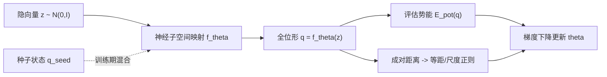

## 一句话总结

给定一个物理系统的可微势能函数和一个种子状态，本文用神经网络自动拟合出一个低维、高度非线性的降阶运动子空间，全程无需任何仿真轨迹数据。

## 研究背景

- 领域现状：弹性体、布料、刚体、连杆机构等物理系统都定义在高维位形空间上，但真正常见的低能量位形只集中在一个低得多的子流形上。传统降阶模型（reduced-order model）通过线性模态分析、模态导数（modal derivatives）在静止姿态附近展开来构造子空间，用于快速仿真。
- 核心痛点：一是线性方法只能刻画静止姿态附近的微扰运动，遇到大幅旋转、非线性变形，或带碰撞罚项的刚体/连杆这类势能地形极不规则的系统就完全失效；二是近年基于自编码器的神经降阶方法虽然能表达非线性，却依赖大量仿真快照数据，而收集高质量数据集费时费力、且往往需要人工介入。
- 本文 idea：把降阶子空间建模成一个从低维隐向量到全位形空间的神经网络映射，用势能函数本身作为监督信号来训练——直接对隐空间采样、评估势能并反传梯度，从而完全绕开数据收集。方法不针对任何特定系统假设，弹性体、布料、碰撞刚体、连杆机构乃至多物理耦合系统都适用。

## 方法

整体框架：定义一个映射 $$f_\theta: \mathbb{R}^d \to \mathbb{R}^n$$（$$d \ll n$$），把低维隐向量 $$z$$ 映射到系统的完整位形。训练时对 $$z \sim \mathcal{N}(0, I)$$ 采样，最小化一个"低能量"与"覆盖度"平衡的目标函数；训练完成后 $$f_\theta$$ 就是一个普通 MLP，前向一次不到 1ms，可用于探索、采样、动画乃至隐空间内的时间积分。

关键设计：

1. **自监督目标函数**。只最小化期望势能 $$\mathbb{E}_{z}[E_{\text{pot}}(f_\theta(z))]$$ 会让网络把所有隐向量都塌缩到唯一的最低能量位形（退化）。为避免塌缩，加入一个"等距到尺度"的软约束，要求 $$\lvert f_\theta(z) - f_\theta(z') \rvert_M \approx \sigma \lvert z - z' \rvert$$（配位空间距离按质量矩阵 $$M$$ 度量），用对数比的平方作为惩罚。合并后的目标为

   $$\min_\theta \; \mathbb{E}_{z,z' \sim \mathcal{N}} \left[ E_{\text{pot}}(f_\theta(z)) + \lambda \left( \log \frac{\lvert f_\theta(z) - f_\theta(z') \rvert_M}{\sigma \lvert z - z' \rvert} \right)^2 \right]$$

   直觉上这一项让映射的 Lipschitz 常数处处约等于 $$\sigma$$。$$\sigma$$ 控制子空间大小（小则贴近低能量、大则纳入更高能量状态），$$\lambda$$ 保证等距约束大致成立。实践中不额外采样 $$z'$$，而是在一个训练 batch 内对所有样本两两估计该项。

2. **与经典模态分析的统一**。当把 $$\sigma \to 0$$、$$\lambda \to \infty$$ 推向极限时，只要 $$f_\theta$$ 有表达仿射映射的能力，最优解退化为在最小能量状态 $$b$$ 处的线性化：$$f(z) = Az + b$$，其中 $$A$$ 正是质量矩阵 $$M$$ 与能量 Hessian $$H(b)$$ 的前 $$d$$ 个广义特征向量。也就是说经典线性模态分析是本方法的一个特例。

3. **种子驱动的子空间生长**。从随机初始化的网络采样会产生能量极高、单元翻转的位形，优化极难起步。为此训练期把映射写成 $$f_\theta(z) := \rho\, \text{MLP}_\theta(z) + (1-\rho)\, q_{\text{seed}}$$，调度参数 $$\rho$$ 从 0 线性增到 1，让子空间从种子状态"向外生长"；训练结束时 $$\rho=1$$，种子完全消失。种子状态无需是静止或最小能量位形，任意较低能量的初始状态即可，且结果对种子选择几乎不敏感。

4. **可微罚项与条件子空间**。碰撞、关节约束都用有界罚项（等式/不等式约束的平方惩罚）加进能量，无需特殊处理即可拟合；刚体状态用无约束的 3×4 变换矩阵表示，另加正交性罚项。此外映射可接受额外条件输入 $$c$$（材料刚度、边界条件位置等），$$f_\theta([z, c])$$ 使同一网络覆盖一族系统并在运行时动态调节。

实现上全部用 JAX 搭建并自动求导，网络为 5 隐层、宽 64–128 的 MLP，ELU 激活，Adam 训练 $$10^6$$ 步，单张 RTX 3090 上训练 1 分钟到 1 小时不等。子空间内也可用隐式欧拉在隐空间做前向积分。

## 实验结果

在一个单点悬挂的刚性可变形物体上拟合 $$d=3$$ 子空间，比较对非刚性变形应变的刻画能力。线性类方法无法表达旋转，只能对形状做剪切和缩放，而本文的神经子空间能拟合出真正的非线性旋转摆动。

| 方法 | 是否需要数据 | 能否表达低维旋转/大变形 | 带碰撞刚体链($$d=8$$)表现 |
|------|------|------|------|
| 线性模态分析 | 否 | 否（仅剪切+缩放） | 几乎无有效运动 |
| 模态导数 | 否 | 否（仍为线性子空间） | 几乎无有效运动 |
| PCA（交互采集小数据集） | 是 | 受限于线性基，需很大维度 | — |
| 本文神经子空间 | 否 | 能，低维即可 | 自动涌现大尺度连续体运动 |

在异质可变形杆和 24 段带碰撞罚项的刚体链上，施加相同外载并可视化子空间平衡响应：本文方法明显更贴近参考物理，而经典局部方法即便到 $$d=8$$ 也拿不出有用运动。此外方法还能作为下游监督式方法（如 AutoDef）的自动采样器，替代人工数据收集；并支持在隐空间选关键帧做 Catmull-Rom 样条插值来生成循环动画。方法覆盖了布料+球滚动、Klann 连杆、Stewart 平台、双稳态屈曲杆、悬挂布料、条件弹性杆、悬挂牛等多种系统。

## 亮点与局限

- 亮点：
  - 真正的数据无关（data-free）——仅凭可微势能和一个种子状态就能自监督地拟合非线性降阶子空间，绕开了神经降阶方法最大的数据收集瓶颈。
  - 极强的通用性，不做可变形体的特定假设，弹性体、布料、碰撞刚体、连杆机构、多物理耦合统一处理。
  - 理论上优雅：给出与经典线性模态分析的极限等价关系，把传统方法纳为特例。
  - 种子生长技巧巧妙化解了刚性能量下随机初始化难以起步的优化难题。
- 局限：
  - 继承了深度网络优化和刚性系统数值积分的双重困难，可能陷入局部极小（如两端固定杆意外拟合出 360° 扭转），也可能因容量不足产生伪影。
  - 主要适用于低维子空间；$$d>10$$ 时等距正则项效力下降，未必能捕捉更多效应。
  - 缺乏可量化"哪些效应被保留、哪些被截断"的物理理论，只有极限情形有分析；隐空间时间积分虽比全空间快，但不及专门的降阶积分器。

## 延伸思考

- 用 MLP 只是最朴素的选择，换成等变网络可内建刚体不变性、换成集合网络可建模粒子流体，都是自然的下一步。
- 对 MLP 施加 Lipschitz 正则以获得更光滑的子空间，可能让大步长隐式积分收敛更快。
- "用解析能量而非数据来训练 overfit 网络"的思路，与神经场、可微物理的潮流一脉相承；把它推广到跨多个物理系统泛化、或引入语义可控的隐空间，是很有价值的方向。
- 作为下游监督方法的采样器这一用法值得关注：它把"数据无关"的自动子空间与"数据驱动"的高质量专用仿真器桥接起来，既省去人工采样又保留后者的性能优势。
