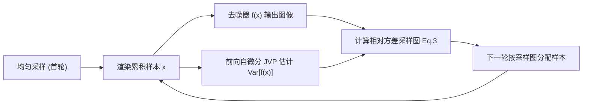

## 一句话总结

本文提出一种"去噪感知"的自适应采样方法：通过前向自动微分为任意预训练神经网络去噪器估计其输出方差，并据此把样本分配到"最能改善去噪后图像"的像素上，无需额外训练任何网络。

## 研究背景

- 领域现状：蒙特卡洛光线追踪是离线渲染的事实标准，但要得到无噪图像常需大量每像素采样（spp）。深度学习去噪器（如 KPCN、Intel OIDN）已能在低 spp 下大幅提升质量，自适应采样也在生产渲染中广泛用于把样本按方差分配。
- 核心痛点：把自适应采样和现代神经网络去噪器结合起来很别扭。传统方法能对闭式滤波器推导误差/方差估计来指导采样，但神经网络去噪器没有闭式解。已有的学习式方案（DASR 等）需要训练一个专门的采样图预测网络，其预测更多取决于训练数据分布，可能无法适应新场景或训练分布外的 spp，而且与"去噪后图像的真实方差"关系不紧。
- 本文 idea：跳过额外网络，直接对去噪器本身做统计估计——用一阶泰勒展开（误差传播定律）近似去噪器输出方差，并用前向自动微分的雅可比-向量积（JVP）在单次前向传播中算出来。用这个方差估计驱动迭代式自适应采样，让样本落在能改善去噪结果的地方。

## 方法

整体框架：迭代式渲染。首轮均匀采样；此后每轮渲染累积样本后，一边去噪一边用前向自微分算出去噪图像的方差估计，再把方差归一化成采样密度图，指导下一轮把样本投向去噪后方差高的区域。

关键设计：

1. **神经网络输出方差的 JVP 估计（核心贡献）。** 对函数 $$f_i:\mathbb{R}^N\to\mathbb{R}$$，以输入随机变量方差 $$\sigma_j^2$$ 作一阶泰勒展开得误差传播近似 $$\mathrm{Var}[f_i]\approx\sum_{j=1}^{N}\left(\frac{\partial f_i}{\partial x_j}\right)^2\sigma_j^2$$ 。作者构造随机向量 $$\boldsymbol{v}$$，其每个分量 $$v_j$$ 以等概率取 $$\pm\sqrt{\hat\sigma_j^2}$$，于是 $$\mathbb{E}[v_j]=0$$、$$\mathbb{E}[v_j^2]=\sigma_j^2$$。则雅可比-向量积平方的期望 $$\mathbb{E}\big[(\boldsymbol{J}_f(\boldsymbol{x})\boldsymbol{v})_i^2\big]$$ 恰好收敛到上式的方差近似。JVP 可在评估网络的同一次前向传播中完成，只需向每个输出传播一个标量，因而对神经网络可行——这正是相比需传播全部一阶泰勒系数的旧方法（Christianson & Cox）的关键突破。
2. **采样分布的构造。** 得到方差后，除以去噪辐亮度平方并除以已累积样本数，得到"每多一个样本预期带来的相对方差下降"，即 $$\dfrac{\mathrm{Var}[f_i(\boldsymbol{x})]}{(N_i+1)(f_i(\boldsymbol{x})^2+\epsilon)}$$ （$$\epsilon=10^{-2}$$ 防除零）。图像再裁剪到非负、用 $$5\times5$$、标准差 0.5 的高斯核轻微模糊（避免采样分布突变让去噪器失稳）、最后归一化。用相对方差是为了不过度偏向高亮区域。
3. **对接后校正去噪（NJS）。** 方法可直接套到 Gu 等人的 neural James-Stein 组合器：两路有偏去噪结果 $$f(\boldsymbol{x}_a),f(\boldsymbol{x}_b)$$ 各自用本文方差估计，再与无偏输入方差组合，代入采样公式分子 $$\rho_i^2(\alpha_i^2\mathrm{Var}[f_i(\boldsymbol{x}_a)]+(1-\alpha_i)^2\mathrm{Var}[f_i(\boldsymbol{x}_b)])+(1-\rho_i)^2\mathrm{Var}[\boldsymbol{x}]$$ ，实现对"一致性去噪"渐进渲染的去噪感知采样。
4. **色调映射感知。** 把色调映射算子 $$\mathcal{T}$$ 并入去噪函数 $$f_{\mathcal{T}}(\boldsymbol{x})=\mathcal{T}(f(\boldsymbol{x}))$$，用链式法则经自微分把映射一并纳入方差估计。此时输出已有界，直接用 $$\mathrm{Var}[f_{\mathcal{T}i}(\boldsymbol{x})]/(N_i+1)$$，无需相对方差。

实现基于 PyTorch 前向自微分，去噪器用 Intel OIDN 的预训练 U-Net，渲染用 Mitsuba 3。同时算 JVP 约为纯评估网络耗时的三倍；每轮固定 32 spp 作为质量与开销的平衡点。

## 实验结果

主实验：在 20 个公开场景上，与均匀采样对比不同自适应采样方法在 30 秒渲染后的等误差加速比（relMSE，路径追踪 + OIDN 去噪）。本文方法（Ours）平均加速最高。

| 方法 | 平均加速比↑ | 说明 |
|------|-------------|------|
| Uniform | 1.00 | 基线（均匀采样） |
| DASR (Kuznetsov 2018) | 1.30 | 学习式采样图，1 spp 后预测一次 |
| MC-SURE | 1.63 | 本文引入的 SURE 误差估计变体 |
| Ours | 2.01 | 基于去噪输出方差估计 |

其余实验用文字补充：结合 NJS 后校正去噪时，平均加速进一步拉开（Ours+NJS 约 3.79，DASR+NJS 约 1.92，Uni.+NJS 约 1.29，均相对无后校正的均匀采样）。色调映射实验中，把 ACES 曲线并入方差估计（$$\mathrm{Var}[\mathcal{T}(f)]$$）相比不并入（$$\mathrm{Var}[f]$$）把平均 RMSE 加速从 1.49 提升到 1.92。与"真值方差/误差采样"对比表明：按去噪后方差采样比按误差采样收敛更快，且本文方法性能已接近真值方差采样。

## 亮点与局限

- 亮点：
  - 免训练、通用——可直接套用任意已有预训练去噪器，无需额外网络或重新学习，落地成本低。
  - 核心的 JVP 方差估计单次前向即可算出，噪声远小于双缓冲估计和 MC-SURE，作为采样指导更稳。
  - 能自然并入后校正去噪（NJS）与色调映射，甚至可对色调映射后的观感优化采样。
- 局限：
  - 与所有自适应采样类似，会对小尺度细节欠采样。
  - 采样指导只看方差、忽略偏差；后校正虽能"以偏差换方差"缓解，但前提是该区域已有足够样本，可能因样本被分配到别处而漏掉，甚至形成潜在反馈回路（作者认为总体仍偏正面）。
  - 仅在 U-Net（OIDN）上验证，未测其他去噪架构，也未与 Salehi 等人 2022 的高 spp 学习式方法做实验对比。

## 延伸思考

- 该方差估计本质是深度学习不确定性量化里的"随机不确定性"（aleatoric uncertainty）估计，且不像 MC dropout 方法那样忽略隐层特征间的协方差——这条与不确定性量化的联系值得在其他任务上复用。
- 作者点名的未来方向很实际：并入随机化 QMC（需去噪器对相关采样鲁棒）、时序去噪（初步观察到能降低输出的时序方差）、以及在 KPCN 等自定义算子架构上实现前向自微分。
- "选对指导度量"是反复出现的结论：用 RMSE 作误差度量时方差比相对方差更合适，说明感知最优的采样离不开与目标误差度量匹配的 guiding metric，这对把方法迁到感知度量（如带 tone mapping 的显示空间）是关键抓手。
