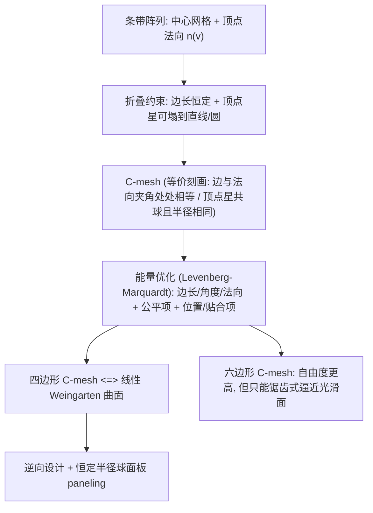

## 一句话总结

论文提出 C-mesh 这一新概念，用纯几何方式描述能从"平铺折叠态"展开成双曲率曲面的可展条带结构，并揭示它们与常高斯曲率曲面、线性 Weingarten 曲面之间的深刻联系，进而给出设计与逆向设计工具。

## 研究背景

- 领域现状：可展结构（deployable structures）从一个紧凑的初始态展开成目标形状，在建筑外壳、便携装置等场景中价值很高。已有工作多基于弹性杆（elastic rods）、弹性网格壳（gridshells）来做，形状很大程度由材料行为主导。
- 核心痛点：一旦形状依赖材料力学与制造误差，设计就必须绑定仿真，双曲率复杂形状"能否从简单平铺态展开"变成一个昂贵且不通用的计算问题，缺乏统一理论。
- 本文 idea：找到一类"由几何而非材料主导"的可展结构，把问题从仿真问题降维成纯几何问题。作者把展开态抽象成条带阵列的中心网格，要求它满足"边长恒定 + 顶点星可折叠到直线或圆"，由此定义 C-mesh，从而绕开仿真直接做设计。

## 方法

整体框架：把可展条带结构简化为一个"中心网格 + 顶点法向"的几何模型（strip arrangement），条带沿网格边、方向垂直于网格面，条带在贯穿顶点的铰链处相连。当整个结构能无扭曲地平铺到一条直线或圆上时，对应的中心网格就是 C-mesh。设计与建模只对这个网格做几何优化，最后用离散弹性杆仿真做验证。

关键设计：

1. **C-mesh 的等价刻画（几何核心）**。C-mesh 定义为等边长、且能展开到"直线态或圆态"的规则四边形/六边形网格。作者证明一个简洁的等价条件：网格是 C-mesh，当且仅当每个顶点处的法向 $$\boldsymbol{n}(v)$$ 与所有邻边的夹角都相等；再等价于每个顶点连同其近邻都落在同一半径 $$r$$ 的球面上。边长 $$\ell$$、球半径 $$r$$ 与夹角 $$\theta$$ 满足 $$\cos\theta(\ell)=\ell/2r$$（$$r=\infty$$ 时退化为平面）。这把"能否折叠"这件动力学的事，翻译成了每个顶点的静态几何条件。

2. **优化能量**。用一组二次能量表达 C 性质：边长约束 $$C_{\text{len}}=\lVert e\rVert^2-\ell^2$$、角度约束 $$C_{\text{angle}}=\langle w-v,\boldsymbol{n}(v)\rangle-\ell\cos\theta(\ell)$$、法向归一化，再加公平项（二阶差分）。展开时额外用扭曲能量约束条带扭转量，用刚度能量让顶点星形状保持一致；贴合参考面时加位置/邻近项。整体用 Levenberg-Marquardt 求解，20–50 次迭代。

3. **与光滑曲面的对应（理论亮点）**。四边形 C-mesh 要么离散化常负高斯曲率曲面（K-surface，对应直线折叠态），要么是其偏移即双曲型线性 Weingarten 曲面（对应圆折叠态）。一个反直觉结论：允许更一般（非直线非圆）的折叠态反而**大幅缩小**可实现形状——广义 C-mesh 若不是 C-mesh，就只能是回转面或柱面（Theorem 3.8）。六边形 C-mesh 自由度更高，但局部分析表明它只能以"锯齿状"逼近光滑面，不能像四边形那样切向光滑逼近。

4. **逆向设计与制造应用**。给定目标面，逆向设计三步走：先用 Pellis 等人的方法把设计面优化成双曲型线性 Weingarten 面；再沿 C-方向（表示常法曲率 Chebyshev 网的方向场）重新网格化（借整数四边形化）；最后优化到 C 性质。六边形情况则先做四边形 C-mesh，再通过砖墙式初始化、插对角线、顶点劈分等方式转成六边形网格。另有一个与展开无关但对建筑有价值的结论：四边形 C-mesh 的对角网格可用**恒定半径的球面板**铺装，且带有无扭支撑结构（Proposition 6.1）。

## 实验结果

论文以物理模型扫描来验证 C-mesh 性质：制作实际可展结构，激光扫描其中心网格的偏移边界，统计边长与顶点星球面度相对平均边长 $$\ell$$ 的标准差。四边形情形吻合度显著优于六边形（六边形因胶接工艺存在两种边长，偏差更大）。

| 验证对象 | 边长标准差 | 顶点星球面度标准差 | 结论 |
|----------|-----------|-------------------|------|
| 四边形 C-mesh | $$0.009\ell$$ | $$0.006\ell$$ | 令人满意地确认 C 性质 |
| 六边形 C-mesh（胶接、边长不等） | $$0.035\ell$$ | $$0.005\ell$$ | 确认程度弱于四边形 |

此外，用广义离散弹性杆仿真（椭圆截面）独立计算了从折叠态到展开态的过程，提取中心网格后测得相对边长偏差与角度偏差都很小，从力学侧佐证了"用 C-mesh 简化描述真实可展结构"是合理的。逆向设计流程的运行时间以 Python/C++ 实现分别统计，典型例子（数百到七百多顶点）单次优化约在秒级到几十秒量级，迭代 12–20 次。

## 亮点与局限

- 亮点：
  - 把可展性从依赖材料/仿真的问题，提炼成纯几何的顶点级条件（等角 / 共球），设计因此可交互、可优化、绕开仿真。
  - 揭示 C-mesh 与常高斯曲率曲面、双曲型线性 Weingarten 曲面的对应，理论优雅且能指导逆向设计。
  - "更一般折叠态反而减少可实现形状"是漂亮的反直觉结论，并与机构运动学中"能否活动取决于特殊几何而非组合"的现象呼应。
  - 恒定半径球面板铺装是对自由曲面建筑外壳有实际制造意义的副产品。
- 局限：
  - 四边形 C-mesh 无法表示任意形状，形状空间受限。
  - 六边形 C-mesh 缺乏与光滑曲面的干净对应（只能锯齿式逼近），其理论更难建立，本文未完整解决其一般逆向设计。
  - 完全忽略了材料属性；带组合奇点或非单连通的网格通常无法从单一平铺态展开，需要先切开。
  - 逆向设计中公平/邻近权重的退火速率难以自动化，需用户交互调节。

## 延伸思考

C-mesh 本质上是把"运动学可展"编码为"离散微分几何约束"，这与近年 geometric metamaterials（如可编程 auxetics）的思路一脉相承：让几何而非控制/材料决定形变结果。值得追问的方向包括：能否放松恒定边长约束、以更一般的参数化仍然离散化线性 Weingarten 面（作者猜测设计空间不会因此实质变大）；六边形结构的完整形状空间与更一般折叠态是否真能带来额外自由度；以及"同时是圆网格又是锥网格"的球面板铺装网格分类问题。对做建筑几何、可展/可折叠结构、或离散微分几何的研究者，这篇提供了一个可直接复用的几何优化框架和一批清晰的定理结果。
