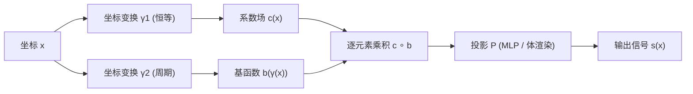

## 一句话总结
本文提出 Factor Fields 统一框架，把信号建模为若干"因子场在坐标变换下的乘积"，从而将 NeRF、Instant-NGP、TensoRF 等一众神经表示纳入同一公式，并据此设计出兼顾精度、紧凑性与训练速度的新表示 Dictionary Field（DiF）。

## 研究背景
- 领域现状：用神经场（neural field）表示图像、几何、辐射场等多维信号已成为主流，涌现出 NeRF、Plenoxels、Instant-NGP、TensoRF 等一批方法，各自在精度与效率上互有取舍。
- 核心痛点：这些表示彼此看似独立、缺乏统一视角，难以横向比较其设计原理；且大多是"单因子"设计——要么只用全局基函数（如 NeRF、Instant-NGP），要么只用局部系数场（如 DVGO、Plenoxels），难以同时兼顾全局共性与局部变化。
- 本文 idea：把信号统一写成"多个因子场的哈达玛积再经投影函数映射"的形式，用坐标变换区分不同因子的角色；在此框架下提出双因子的 DiF，用带周期变换的基函数刻画跨空间/跨尺度共享的模式，用恒等变换的系数场刻画局部空间变化。

## 方法
整体框架：把一个 $$D$$ 维信号 $$s: \mathbb{R}^D \to \mathbb{R}^Q$$ 分解成 $$N$$ 个因子场 $$\boldsymbol{f}_i$$ 的逐元素乘积，每个因子场先经各自的坐标变换 $$\boldsymbol{\gamma}_i$$ 再取值，最后由投影函数 $$\mathcal{P}$$ 映射到输出：

$$\hat{\boldsymbol{s}}(\boldsymbol{x}) = \mathcal{P}\left(\prod_{i=1}^{N} \boldsymbol{f}_i\left(\boldsymbol{\gamma}_i(\boldsymbol{x})\right)\right)$$

关键设计：

1. **统一公式与因子场的可替换性**：框架里每个因子 $$\boldsymbol{f}_i$$ 可以是多项式、MLP、2D/3D 特征网格或 1D 特征向量。通过选择不同的因子数量、因子表示与坐标变换，NeRF（单因子+正弦变换+MLP）、Instant-NGP（单因子+哈希变换+向量）、Plenoxels/DVGO（单因子+恒等变换+网格）、TensoRF（双/三因子+正交变换）都成为该框架的特例，从而可在同一坐标系下比较其归纳偏置与容量。

2. **Dictionary Field（DiF）**：作为框架的新成员，DiF 取两个因子——系数场 $$\boldsymbol{c}(\boldsymbol{x})$$ 用恒等变换 $$\boldsymbol{\gamma}_1(\boldsymbol{x}) = \boldsymbol{x}$$ 表达局部空间变化，基函数 $$\boldsymbol{b}(\boldsymbol{x})$$ 用周期变换 $$\boldsymbol{\gamma}_2$$ 表达跨位置、跨尺度共享的结构：

$$\hat{\boldsymbol{s}}(\boldsymbol{x}) = \mathcal{P}\left(\boldsymbol{c}(\boldsymbol{x}) \circ \boldsymbol{b}\left(\boldsymbol{\gamma}(\boldsymbol{x})\right)\right)$$

  默认设置 DiF-Grid 用可学习张量网格实现系数与基、用锯齿函数 $$\text{Sawtooth}(\boldsymbol{x}) = \boldsymbol{x} \bmod 1$$ 作基的坐标变换、用浅层 MLP 作投影。

3. **多尺度基与周期变换**：把坐标乘以逐层递增的频率 $$f_l$$ 再送入周期变换，并在各尺度上拼接，从而用同一套基函数覆盖信号的高低频谱段；投影函数 $$\mathcal{P}$$ 在辐射场重建时进一步内嵌可微体渲染（alpha 合成），把仅有的 2D 观测反演成 4D 密度与辐射场。

4. **稀疏正则与初始化**：训练时以概率 $$\mu$$ 随机把部分特征通道置零（类似 dropout），鼓励系数稀疏并防止特征共适应；基因子用离散余弦变换（DCT）初始化，系数与投影 MLP 随机初始化，实测能提升解的质量。多信号联合训练时共享投影函数与基因子、但每个信号各自保留系数场，从而学到可泛化的通用基。

## 实验结果
在辐射场重建 / 新视角合成任务上，与主流快速重建方法在 Synthetic-NeRF 与 Tanks and Temples 数据集上对比（时间与模型大小为 Synthetic-NeRF 平均值）：

| 方法 | 时间↓ | 模型大小(M)↓ | NeRF PSNR↑ | T&T PSNR↑ | T&T SSIM↑ |
|------|-------|--------------|------------|-----------|-----------|
| Plenoxels | 11.4m | 194.5 | 31.71 | 27.43 | 0.906 |
| DVGO | 15.0m | 153.0 | 31.95 | 28.41 | 0.911 |
| Instant-NGP | 3.9m | 11.64 | 32.59 | 27.09 | 0.905 |
| TensoRF-VM | 17.4m | 17.95 | 33.14 | 28.56 | 0.920 |
| DiF-Grid (本文) | 12.2m | 5.10 | 33.14 | 29.00 | 0.938 |

DiF-Grid 在质量上追平 TensoRF、超过 Instant-NGP，且模型仅 5.1 M 参数——不到 TensoRF-VM 的三分之一、Instant-NGP 的一半，兼具紧凑与较快训练（纯 PyTorch 实现、无定制 CUDA 核）。此外在 2D 图像回归中同参数量下 PSNR 全面优于 Instant-NGP；在 SDF 重建中以更少参数取得最高 gIoU（如 Dragon 达 0.9795）与最快速度。泛化实验里，采用 DiF-MLP-B 并在 FFHQ 上预训练共享基后，能从稀疏/带遮挡的观测中恢复出结构合理的未见像素，展示了跨信号共享基带来的先验价值。

## 亮点与局限
- 亮点：
  - 用一个简洁公式统一了 NeRF、Instant-NGP、TensoRF、Plenoxels、EG3D 等主流神经表示，为横向比较与设计新表示提供了共同语言。
  - DiF 同时建模全局基与局部系数，在精度、紧凑性、训练速度上达到很好的平衡，且纯 PyTorch 实现便于扩展。
  - 通过跨信号共享基，把原本只能逐场景优化的神经表示拓展到具备泛化/先验能力的设定（稀疏图像回归、少样本辐射场重建）。
- 局限：
  - 与高度优化的 CUDA 方案（Instant-NGP）相比，纯 PyTorch 实现训练更慢，速度优势主要体现在与同类 PyTorch 方法比较时。
  - 泛化实验仍属"初步"，规模有限（如仅在 800 张人脸上预训练），跨类别、大规模场景的泛化能力尚待验证。
  - 周期基 + 网格系数的组合引入了层数、频率、通道数等一系列超参，需要针对不同信号维度调参。

## 延伸思考
把众多神经场看作"因子 × 坐标变换 × 投影"的不同实例，这种视角类似于经典信号处理里的基展开与稀疏编码，也让人联想到张量分解家族（CP/VM）的推广。一个自然的追问是：既然框架允许任意因子表示与变换的组合，是否存在针对特定信号（如高动态范围、时变 4D 场景）自动搜索最优因子/变换组合的方法？此外，跨信号共享基所学到的"字典"若能进一步与生成式建模结合，或许能从重建先验走向可采样的生成先验，这与后续 3D Gaussian Splatting 等追求实时与紧凑的表示形成有趣的对照。
