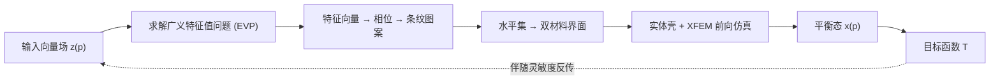

## 一句话总结

把 Knöppel 等人的"条纹图案"生成方法改造成端到端可微的管线，让用户能通过梯度优化自动设计出以条纹形式排布的双材料结构表面，从而按需控制其宏观力学行为（拉伸、弯曲、变刚度等）。

## 研究背景

- 领域现状：结构化材料（structured materials）能通过微观几何来调控宏观力学性能，图形学界已探索过晶格、体素、泡沫等微结构，以及可平铺的材料单元。条纹图案在自然界和日常中无处不在，其"生成"问题（在任意曲面上生成全局连续、等间距的条纹）也已被充分研究。
- 核心痛点：条纹图案作为一种"沿某方向近乎不可伸长、正交方向柔顺"的双材料排布，其调控力学性能的潜力几乎没人挖掘。已有工作大多只把条纹当作初始化手段，缺少一个能"反过来"求解的可微设计工具——即给定高层力学目标，自动算出最优条纹布局。
- 本文 idea：把条纹图案的整条生成管线（输入向量场 → 求解广义特征值问题 → 相位/水平集 → 双材料分布 → 弹性平衡态 → 目标函数）做成完全可微，用伴随灵敏度分析求梯度，从而用基于梯度的优化器直接在"条纹空间"里做逆向设计。

## 方法

整体框架：从一个初始输入向量场出发，先求解一个广义特征值问题（EVP）得到相位场并转成条纹图案；把条纹解释为软/硬双材料的分布，用"实体壳 + 扩展有限元(XFEM)"精确模拟其弹性平衡态；再对整条管线求导（特征向量对参数、材料界面、平衡态三段导数串联），用 GC-MMA 优化器最小化高层设计目标。

关键设计：

1. 可微的特征向量（解决多重性）。条纹图案由 EVP 的最小特征值对应的特征向量得到，但由于"整体相位旋转不改变能量"这一内在对称性，每个特征值的几何重数都是 2，特征向量落在一个二维特征平面内、不唯一，导数也无定义。作者把"从特征平面选最优向量"拆成两个子问题：先固定某个顶点 $$k$$ 的相位（令 $$\boldsymbol{v}_k = (a_k, 0)$$，即约束 $$b_k = 0$$）得到唯一的参考特征向量，使鞍点系统非奇异、导数良定义；再引入一个旋转参数 $$\theta$$ 表示当前特征向量相对参考向量在特征平面内的旋转，避免固定选择带来的偏置。

2. 实体壳 + XFEM（解决移动的材料界面）。条纹产生的分段线性材料界面一般会横穿网格单元，而软/硬材料刚度对比很大，简单插值材料参数不可行；共形网格又需要重网格化、不可微。作者用三角棱柱实体壳单元（沿顶点法向挤出三角形得到六节点棱柱），既符合标准有限元理论、又能与 XFEM 无缝结合；用水平集 $$\phi$$（由每顶点相位角经平滑三角波映射而来）定位界面，$$\phi>0$$ 为硬材料、$$\phi<0$$ 为软材料，$$\phi=0$$ 处为界面。XFEM 通过"脊函数"富集自由度 $$\hat{\boldsymbol{x}}$$ 允许界面两侧应变不连续，界面可连续移动而无需改网格；被界面横穿的单元被切成三个子棱柱做数值积分。

3. 正则化去奇异。取相位角需对复数相位做归一化，当相位向量趋近于零时该操作数值不稳定、灵敏度发散。作者用平滑截断的对数障碍函数 $$R_{\text{sing}}$$ 惩罚过小的相位模长 $$d = \lvert \boldsymbol{v}_i \rvert$$（截断值 $$\hat{d}=0.1$$），把设计参数从零相位区域排斥开。另加一个基于余弦/正弦差分的平滑正则项 $$R_{\text{sm}}$$，抑制输入向量场的高频噪声，得到更干净、连续的条纹。

4. 目标函数与优化。支持多种设计目标：目标形状匹配 $$T_{\text{match}} = \lvert \boldsymbol{x}(p) - \tilde{\boldsymbol{x}} \rvert^2$$、宏观力学（方向刚度）匹配 $$T_{\text{Mat}}$$、以及广义刚度。梯度按链式法则串起特征向量灵敏度、水平集灵敏度和仿真平衡态灵敏度，两处均用伴随法，每次梯度评估只需两次线性求解；优化器采用 GC-MMA（比最速下降和 L-BFGS 更高效）。

## 实验结果

壳单元模型对比（圆柱弯曲测试，以二次四面体为参考真值）显示：离散壳精度最高性价比最好，线性四面体最差（体积锁定），而实体壳/XFEM 在中等分辨率即可给出可接受精度且能与 XFEM 结合——这是选它的关键理由。

| 方法 | DOFs | 能量 (0.6mm) | 能量 (0.15mm) | 用时 [s] |
|------|------|--------------|---------------|----------|
| Quadratic Tets | 73764 | 0.0596 | 0.0009 | 10.86 |
| Linear Tets | 12381 | 0.3542 | 0.0483 | 0.74 |
| Solid Shells | 11884 | 0.1215 | 0.0164 | 0.70 |
| XFEM | 12126 | 0.1210 | 0.0161 | 0.83 |
| Discrete Shells | 5942 | 0.0598 | 0.0009 | 0.56 |

逆向设计示例覆盖广泛且都有物理样机验证：调控宏观力学（各向同性/正交异性/四方对称）、变刚度材料、柔顺夹爪（初始平行条纹闭合不足，优化后产生大侧向偏转可抓取小物体）、软气动执行器（充气后弯成 180°）、鞋垫（足跟/前掌软、足弓硬，法向位移由初始 −3.66/−6.31mm 变为 −4.67/−2.52mm）、运动衫（应变能降低超 25%）、以及薄壁花瓶的结构优化（加"筋槽"抗屈曲，载荷翻倍不失稳）。

## 亮点与局限

- 亮点：
  - 把条纹图案从"只能生成/初始化"提升为"可端到端逆向优化"的完整设计空间，思路新颖。
  - 系统性解决了三个硬骨头：特征值重数导致的导数不存在、移动材料界面的可微建模、归一化奇异，每个都有针对性且干净的解法。
  - 首次将实体壳引入图形学并与 XFEM 结合，兼顾精度、效率与可微性；大量真实样机验证了仿真-现实的一致性。

- 局限：
  - 假设双材料界面贯穿整个厚度，对"薄基布上贴 3D 打印条纹"这类非对称结构只是粗略近似。
  - 每个单元只允许一条线性切割，条纹的分叉（单元内两条切割形成内凹）被用凸包近似、忽略了非凸特征。
  - 实体壳对极薄壳（厚度 <1mm 量级）精度和性能都会退化，本文主要面向 >1mm 的问题。
  - 非凸优化存在多个局部极小，最终图案依赖初始猜测（径向对称初值往往比单向初值更易达到目标）。

## 延伸思考

- 实体壳这一"通过厚度方向线性应变获得弯曲响应"的单元，作者提到还可用于皮肤、人脸、充填服装等需要厚度方向形变的场景，值得在可微仿真里进一步推广。
- 从"被动条纹"走向"主动控制与传感"是明确的未来方向，例如做能反馈姿态的触觉服装，把结构设计与可穿戴交互结合。
- 方法本质是"把一个带对称性/奇异性的几何生成器改造成可微优化目标"，其中处理特征平面多重性的参数化技巧，对其他依赖特征向量（如振动模态、谱几何算子）的逆向设计问题应有借鉴价值。
