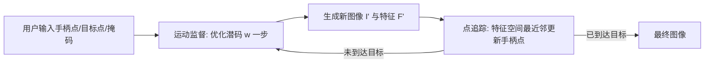

## 一句话总结
DragGAN 让用户在 GAN 生成的图像上点几对"手柄点—目标点"，就能把图像内容像拖拽一样精确地拉到目标位置，从而灵活控制姿态、形状、表情与布局。

## 研究背景
- 领域现状：GAN（尤其 StyleGAN2）能合成逼真图像，但对生成内容的可控编辑一直是难题。已有方法要么依赖手工标注数据或先验 3D 模型来找潜空间方向，要么走文本引导。
- 核心痛点：这些方法难以同时满足三个要求——灵活性（能控制位置/姿态/形状/表情/布局等多种空间属性）、精确性（能精准控制到具体像素位置）、通用性（不限于某一类物体）。文本引导缺乏空间精度，无法"把某个点移动指定像素"；最接近的拖拽方法 UserControllableLT 又只擅长单点、且手柄点常常到不了目标。
- 本文 idea：直接让用户"拖点"来编辑。关键洞见是 GAN 生成器的中间特征本身足够有判别力，既可以用来监督点的运动，也可以用来追踪点的位置——因此无需任何额外网络（如光流网络 RAFT）。

## 方法
整体框架：给定一张 GAN 生成图像及其潜码 $$\boldsymbol{w}$$，用户设定若干手柄点 $$\boldsymbol{p}_i$$、目标点 $$\boldsymbol{t}_i$$，并可选画一个可动区域掩码 $$\boldsymbol{M}$$。方法以优化方式迭代进行，每一步包含"运动监督"和"点追踪"两个子步骤，直到所有手柄点到达对应目标点（通常 30–200 次迭代）。

关键设计：

1. **基于特征的运动监督**：取 StyleGAN2 第 6 个 block 后的特征图 $$\boldsymbol{F}$$（分辨率与判别性折中最佳），在手柄点 $$\boldsymbol{p}_i$$ 周围一个半径 $$r_1$$ 的小块上施加"位移块损失"，鼓励该块朝目标方向 $$\boldsymbol{d}_i$$ 移动一小步：
$$
\mathcal{L} = \sum_{i=0}^{n} \sum_{\boldsymbol{q}_i \in \Omega_1(\boldsymbol{p}_i, r_1)} \lVert \boldsymbol{F}(\boldsymbol{q}_i) - \boldsymbol{F}(\boldsymbol{q}_i + \boldsymbol{d}_i) \rVert_1 + \lambda \lVert (\boldsymbol{F} - \boldsymbol{F}_0)\cdot(1 - \boldsymbol{M}) \rVert_1
$$
其中 $$\boldsymbol{d}_i$$ 是从 $$\boldsymbol{p}_i$$ 指向 $$\boldsymbol{t}_i$$ 的单位向量，第二项让掩码外区域保持不变。反向传播时对 $$\boldsymbol{F}(\boldsymbol{q}_i)$$ 做 detach（不回传梯度），从而只驱动 $$\boldsymbol{p}_i$$ 向目标移动，而非反向拉回。

2. **基于特征的点追踪**：运动监督只让点"挪了一点点"，但挪了多远并不确定，必须重新定位手柄点，否则下一步会监督错点。作者用最近邻搜索完成追踪——把初始手柄点特征 $$\boldsymbol{f}_i = \boldsymbol{F}_0(\boldsymbol{p}_i)$$ 作为模板，在新特征图上邻域 $$\Omega_2(\boldsymbol{p}_i, r_2)$$ 内找最匹配的位置：
$$
\boldsymbol{p}_i := \arg\min_{\boldsymbol{q}_i \in \Omega_2(\boldsymbol{p}_i, r_2)} \lVert \boldsymbol{F}'(\boldsymbol{q}_i) - \boldsymbol{f}_i \rVert_1
$$
这利用了 GAN 特征天然编码稠密对应关系的性质，省去了光流/粒子视频等额外模型，避免累积误差、也更高效。

3. **选择性潜码优化**：在更表达力强的 $$\boldsymbol{W}^+$$ 空间优化，且借鉴 style-mixing，只更新前 6 层的 $$\boldsymbol{w}$$（主导空间属性），固定其余层以保留外观，得到期望的"轻微内容移动"。

4. **交互与真实图像编辑**：单张 RTX 3090 上多数编辑仅需几秒，支持实时交互 GUI；配合 GAN inversion（如 PTI）把真实图像嵌入潜空间后，同样可编辑真实照片的姿态、发型、形状、表情。

## 实验结果
在 FFHQ 人脸关键点操控任务上，把第一张图的关键点拖到第二张图的关键点位置，用平均距离（MD，越低越好）衡量到位程度，并报告 FID 反映画质（基于"1 点"设置的时间）：

| 方法 | MD (1 点)↓ | MD (5 点)↓ | MD (68 点)↓ | FID↓ | 时间(s) |
|------|-----------|-----------|------------|------|--------|
| 不编辑 | 12.93 | 11.66 | 16.02 | - | - |
| UserControllableLT | 11.64 | 10.41 | 10.15 | 25.32 | 0.03 |
| Ours w. RAFT tracking | 13.43 | 13.59 | 15.92 | 51.37 | 15.4 |
| Ours w. PIPs tracking | 2.98 | 4.83 | 5.30 | 31.87 | 6.6 |
| Ours | 2.44 | 3.18 | 4.73 | 9.28 | 2.0 |

DragGAN 在各点数设置下的到位精度都大幅领先，且 FID 最低（画质最好）。虽然 UserControllableLT 更快，但精度远不及本文。在成对图像重建评测（Lion / LSUN Cat / Dog / LSUN Car）上，DragGAN 的 MSE 与 LPIPS 也全面优于所有基线；把追踪模块换成 RAFT 或 PIPs 都不如本文的特征最近邻追踪，说明 GAN 特征追踪更准。消融显示第 6 个 block 特征在运动监督与追踪上均表现最佳，且对 $$r_1$$ 的选择不敏感。

## 亮点与局限
- 亮点：
  - 不依赖任何额外网络，仅靠 GAN 自身特征就同时完成运动监督与点追踪，几秒完成一次编辑，适合实时交互。
  - 灵活、精确、通用三者兼得，可跨动物、人脸/人体、汽车、风景等多类别控制姿态、形状、表情、布局。
  - 编辑发生在 GAN 学到的图像流形上，能"幻想"出被遮挡内容（如狮子嘴内牙齿）、并遵循物体刚性做形变（如马腿弯曲）；还具备一定的分布外外推能力（如极度张嘴、放大车轮）。
- 局限：
  - 编辑质量受训练数据多样性限制，偏离训练分布过远的姿态会产生失真伪影。
  - 手柄点若选在纹理稀少区域，追踪偶有漂移。
  - 真实图像编辑质量依赖 GAN inversion 的重建保真度。

## 延伸思考
- 这一"拖点即编辑"范式随后被大量迁移到扩散模型上（如 DragDiffusion 等），思路的通用性得到验证，但本文揭示的"生成器特征即稠密对应"这一洞见仍是核心。
- 方法把编辑约束在 GAN 流形内，天然保证真实感，但也意味着无法编辑模型"想象不出"的内容；如何在保持真实感与允许分布外创作之间做可控权衡（如对潜码加正则）是值得追问的方向。
- 依赖 StyleGAN 的强先验与 inversion 质量，若要推广到更开放域的图像，如何获得同样判别性的特征空间是关键瓶颈。
