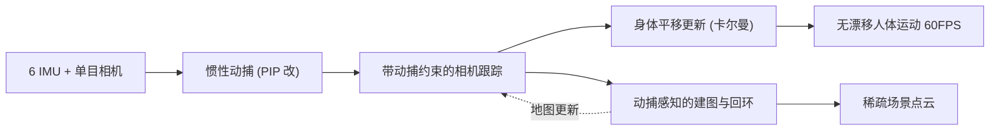

## 一句话总结

EgoLocate 用 6 个身上的 IMU 加一个头戴单目相机，把稀疏惯性动捕和视觉 SLAM 深度耦合在一起，第一次实现了实时、无漂移的人体动作捕捉、场景定位与稀疏地图重建三合一。

## 研究背景

- 领域现状：人体感知与环境感知长期是两条平行线。惯性动捕（IMU）能在不受空间约束的情况下估计准确的关节姿态，视觉/视觉惯性 SLAM 则能在未知环境里同时重建场景并定位相机。
- 核心痛点：两者各有致命短板。纯惯性动捕缺少全局定位信号，长时间运动后平移会严重漂移，人物位置越走越偏；SLAM 在纹理缺失、运动模糊、相机遮挡或快速旋转时会跟踪丢失甚至系统崩溃。定位是两个领域共同的关键难题。此前把两者结合的工作（HPS、HSC4D）要么依赖预扫描场景、要么需要 17 个密集 IMU 加 LiDAR，且都是离线运行。
- 本文 idea：这两种信息恰好互补——动捕提供"内部"运动先验（稳定但会漂），SLAM 提供"外部"环境观测（精确但易失效）。把动捕先验有机注入 SLAM 的多个关键模块，再把 SLAM 的定位结果反馈回动捕，就能达到双赢：视觉可靠时用环境校正动捕漂移，视觉失效时用动捕先验兜住 SLAM 不崩。

## 方法

整体框架：输入是同步的 6 路 60Hz IMU 信号和 30Hz 单目图像。系统先从惯性信号做动捕得到人体姿态与相机初始位姿，再用带动捕约束的相机跟踪优化相机位姿，随后把优化后的相机位置反馈回一个卡尔曼滤波器修正人体全局平移；并行地，用关键帧做带动捕感知的建图与回环闭合。整套流程实时约 60 FPS，且仅需 CPU。

关键设计：

1. **带动捕约束的相机跟踪**：在标准 SLAM 重投影误差之外，额外加一个动捕约束项，把相机位姿拉向动捕估计的位姿。约束项系数按焦距和 SLAM 尺度因子自动换算成像素单位，使优化与相机内参、尺度无关。优化目标为

$$\arg\min_{\boldsymbol{R},\boldsymbol{t}} E_{\text{proj}}(\boldsymbol{R},\boldsymbol{t}) + E_{\text{mocap}}(\boldsymbol{R},\boldsymbol{t})$$

其中动捕项

$$E_{\text{mocap}} = \lambda_R \lVert \mathrm{Log}(\bar{\boldsymbol{R}}^T \boldsymbol{R}) \rVert^2 + \lambda_t \lVert \bar{\boldsymbol{t}} - \boldsymbol{t} \rVert^2$$

强先验帮助分类正确/错误的 3D-2D 匹配，减少外点带来的误差。跟踪前还做一步相机位姿对齐：用动捕的相对运动叠加到上一关键帧的 SLAM 位姿上，消除初始化漂移。

2. **动捕相关的地图点置信度**：不再平等对待所有地图点，而是根据观测该点的关键帧基线长度 $$b_i$$ 与视差角 $$\theta_i$$ 计算置信度 $$c_i = k\, b_i\, \theta_i$$（$$k$$ 取 50）。基线长、视差大的点三角化更可靠、置信度更高。置信度在动捕坐标系中计算以保证对 SLAM 尺度不变。

3. **动捕感知的捆绑调整（BA）**：联合优化关键帧位姿与地图点，重投影误差按 $$c_i$$ 加权，再加旋转与平移两个动捕约束项。旋转用绝对约束（惯性旋转估计稳定），平移用相邻关键帧之间的相对约束（平移会漂）。置信度高的好点权重大、主导位姿细化，可疑新点权重小、被优化且影响小，让 BA 更稳定。回环时还做带动捕约束的位姿图优化，因结合了动捕不受尺度漂移影响，可在 $$SE(3)$$ 而非 $$Sim(3)$$ 上求解。

4. **身体平移更新器**：用预测-校正型卡尔曼滤波，只更新人体全局位置与速度。动捕加速度做 60FPS 预测，SLAM 相机位置做 30FPS 校正，校正噪声协方差由相机跟踪的内点数（置信度 $$n$$）决定 $$\boldsymbol{\Sigma}_{\text{cam}} = \frac{1000}{n+\epsilon}\boldsymbol{I}$$，内点越多越信任视觉。系统标定则通过让用户走一段曲线，自动对齐动捕与 SLAM 两条轨迹求出 $$Sim(3)$$ 外参。

## 实验结果

在 TotalCapture 与 HPS 数据集上，以逐帧平均的绝对根节点位置误差（米）衡量，与稀疏惯性动捕方法对比。EgoLocate 相比最优基线在两个数据集上分别取得约 41% 和 38% 的提升。

| 方法 | TotalCapture 平均↓ | HPS 平均↓ |
|------|--------------------|-----------|
| TransPose | 0.42 | 4.11 |
| TIP | 0.45 | 3.00 |
| PIP | 0.37 | 2.75 |
| Ours | 0.22 | 1.70 |

与 ORB-SLAM3 的相机定位对比中，纯单目/单目惯性 SLAM 在视觉退化场景大量跟踪失败（部分序列跟踪率不足 20% 甚至判为失败），而 EgoLocate 借助动捕先验保持了全序列稳定且误差最低。消融实验进一步表明：把动捕仅作初始化或仅融进相机跟踪都不够，只有在跟踪与建图两端同时融合（动捕感知 BA）才带来大幅提升，而地图点置信度使多次实验的标准差再降约 43%，显著减小定位不确定性。

## 亮点与局限

- 亮点：
  - 首个仅用 6 IMU + 单目相机、无需预扫描场景、实时完成动捕+定位+建图的系统，且纯 CPU 运行约 60 FPS。
  - 动捕与 SLAM 的深度双向耦合而非浅层拼接，把先验注入相机跟踪、BA、回环等多个核心模块，实现真正的互补双赢。
  - 动捕相关地图点置信度设计巧妙，用几何可靠性动态平衡视觉约束与动捕约束，兼顾精度与稳定性。
- 局限：
  - 在线回环闭合与在线动捕存在根本矛盾——回环需修改历史帧位姿，但已导出的动捕结果不可改，只能"瞬移"用户到正确位置而非生成平滑轨迹。
  - 假设平均体型而非测量真实身高，导致重建场景尺度可能与真实略有偏差。
  - 全局运动极少的动作（如 TotalCapture 的 rom）难以正确初始化 SLAM 与确定尺度因子，误差偏大。

## 延伸思考

这项工作把"人"与"环境"两条独立的感知线合到一起，作者也明确说这只是迈向联合动捕与稠密环境重建的第一步。当前重建的是稀疏点云，若换成稠密重建，就能进一步检测人-环境碰撞、施加接触力，反过来提升动捕物理合理性（PIP 里被移除的那部分）。另一个值得追问的方向是在线回环的平滑性问题——如何在不可修改历史输出的约束下做出既及时又平滑的漂移校正，可能需要引入延迟输出或轨迹重放机制。此外，尺度与体型的耦合提示：若能在线估计真实体型，定位与建图的绝对尺度精度都会受益。
