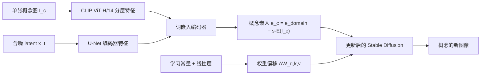

## 一句话总结
本文提出 E4T（Encoder for Tuning），通过在整个领域上预训练一个"图像→词嵌入"编码器和一组受正则约束的注意力权重偏移，把文本到图像扩散模型的个性化从几十分钟压缩到几秒，只需单张图片、5~15 步微调即可学会一个新概念。

## 研究背景
- 领域现状：以 Textual Inversion、DreamBooth 为代表的个性化方法，能让预训练扩散模型学会用户提供的新概念（某张脸、某只猫、某种画风），再用自然语言把它放进新场景。
- 核心痛点：现有方法难以规模化——每个新概念都要几十分钟到数小时的微调；全模型调优的权重文件动辄数 GB，存储和服务成本高；为避免过拟合背景等杂散细节，还需要精心采集多张不同姿态/背景的图片。
- 本文 idea：把训练目标从"学好单个概念"改成"学会如何对某个领域内的新概念快速个性化"。核心洞见是：在一个领域的大量概念上"欠拟合"训练，能得到一个泛化更好、更贴近每个概念的初始状态，从而让加入新概念变得又快又稳。思路与元学习（尤其是 Reptile 式联合训练）一脉相承。

## 方法
整体框架：在给定领域（人脸 FFHQ/CelebA-HQ、猫 LSUN-Cat、画风 WikiArt）上联合预训练两个组件——一个把概念图映射为词嵌入的编码器，和一组作用于扩散模型注意力投影矩阵的权重偏移。推理时，用单张目标图对这两个组件加扩散模型一起做极短微调（5~15 步），即可生成该概念的新图像。

关键设计：

1. **约束在可编辑区域的嵌入反演**：直接把概念反演到最精确的词嵌入会落在远离真实词分布的区域，导致难以再用新提示编辑。本文让编码器只预测一个相对领域粗描述词（如 "face"、"cat"、"art"）嵌入的小偏移，即 $$\epsilon_c = \epsilon_{domain} + s \cdot E(I_c)$$，缩放因子 $$s=0.1$$，并加 L2 正则 $$L_{reg} = \lVert E(I_c) \rVert_2^2$$，以保证可编辑性，把精度损失留给推理时的短微调去补。

2. **借扩散过程的迭代精修**：借鉴 GAN 反演里的迭代反演思想，但扩散过程没有干净的重建图可喂回。作者直接把含噪 latent 送进去噪 U-Net 的编码器，取其各块的池化特征，与 CLIP 主干的分层特征拼接后再送入编码器。于是编码器在每个去噪时间步都能同时看到目标图和当前含噪样本，为每一步预测一个不同的嵌入，从而在合成过程中随时纠错、逐步聚焦不同细节。

3. **低秩、平滑的权重偏移**：作者先分析 50 个已微调模型，发现交叉/自注意力层变化最剧烈，于是只调注意力的 $$W_q, W_k, W_v$$。但直接调这些权重仍太自由、易过拟合。因此用一个"深网络作先验"的方式生成偏移：学一个初始向量 $$v_0$$ 和四个线性层，先投影出 $$v_y \in \mathbb{R}^{M \times 1}$$ 与 $$v_x \in \mathbb{R}^{1 \times N}$$ 相乘成矩阵，再按行、按列各做一次线性投影。这限制了偏移的秩、鼓励低频平滑，抑制过拟合。最终用偏移式更新 $$W = W_0 \cdot (1 + \Delta W)$$。

4. **预训练与推理时微调**：损失是扩散去噪损失加嵌入正则 $$L = L_{Diffusion} + \lambda_r L_{reg}$$。预训练时 $$\lambda_r = 0.01$$；推理时用单张图微调（人脸 15 步、猫和画风 5 步），但关键是用 16 以上的大 batch，让模型在多个噪声尺度上观察同一概念；人脸域还借助人脸分割网络对损失做掩码。单概念微调仅需约 11 秒（A100）。

## 实验结果
作者在 LFW 数据集上做大规模身份保持实验：用编码器和两个基线（Textual Inversion、DreamBooth）为 232 个身份各训练模型，本文只用单张随机图，基线用单张或全部 3~10 张图。用生成图与训练集的成对身份相似度衡量身份保持，用 CLIP 空间相似度衡量提示贴合度。下表汇总各方法的训练开销对比，凸显本文的核心优势——数量级的加速：

| 方法 | 迭代步数 | 时间（秒）| 所需图片 |
|------|---------|----------|---------|
| Textual Inversion | 5,000 | 1,517 | 多张 |
| DreamBooth | 800–1,200 | 601–897 | 多张 |
| E4T（本文）| 5–15 | 11–30 | 单张 |

在身份保持—提示贴合的 Pareto 前沿上，本文单图结果显著优于其他单图方法，并与多图方法持平或更好，同时快 60~140 倍。消融实验验证：去掉嵌入正则或权重偏移正则、改用 HyperNetwork 都会因自由度过高而过拟合；去掉推理时微调会大幅降低身份保持；去掉迭代精修则损害可编辑性。

## 亮点与局限
- 亮点：
  - 把"个性化"重构为"领域调优 + 编码器反演"，实现数量级的加速，且只需单张图、无需为每个身份存储大模型。
  - 迭代精修让编码器耦合去噪过程、逐步预测嵌入，兼顾重建与可编辑性；权重偏移的低秩+网络先验设计是抑制过拟合的关键。
  - 对嵌入距离随去噪步变化的分析很有洞见：早期靠近真实词分布抓高层语义，后期增大以捕捉个体细节。
- 局限：
  - 编码器依赖领域大数据集预训练，只适用于人脸、画风等有大规模数据的类别，难以覆盖罕见的一次性物体；跨域（如猫模型用于狗尚可，用于木制玩具则失败）。
  - 仍需推理时微调，要求部署机器具备调模型的能力；且编码器与扩散模型需同时微调，比直接微调更耗显存。

## 延伸思考
本文是 encoder-based 个性化的早期代表，其"领域先验 + 短微调"的折中，介于纯优化（Textual Inversion/DreamBooth）和纯前馈编码器之间。它仍保留了推理时微调这一步，后续工作（如纯前馈的个性化编码器、以及作者展望的 HyperNetwork 方向）致力于彻底去掉微调、做到真正的一次前向个性化。值得追问的是：迭代精修中"每步预测不同嵌入"的思想是否能推广到风格、材质等更抽象概念的反演；以及低秩权重偏移的设计与后来的 LoRA 类方法在表达力—正则化权衡上的异同。
