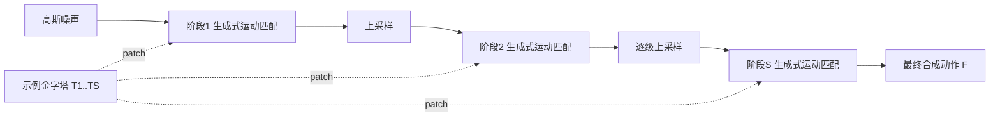

## 一句话总结
GenMM 是一个无需训练的生成框架，用双向视觉相似度作为代价函数把经典的运动匹配（Motion Matching）改造成生成模型，能在不到一秒内从单个或少量示例动作中"挖掘"出大量多样且高质量的新动作，并可扩展到运动补全、关键帧引导、无限循环等任务。

## 研究背景
- 领域现状：动作数据获取昂贵，数据集在风格、骨骼结构、生物类型上都很受限。深度学习方法（乃至只用单条序列训练的 GANimator）能合成多样动作，但代价高。
- 核心痛点：神经网络类方法有三大缺陷——训练时间长；容易产生抖动或过度平滑等视觉瑕疵；难以扩展到大而复杂的骨骼结构。而工业界标准的运动匹配虽然质量高、无需训练，却依赖庞大数据库、本质上只做检索回放，不具备"少样本生成多样动作"的能力。
- 本文 idea：借鉴图像合成里 GPNN（Granot 等 2022）的思路，把运动匹配升级为生成模型。用 Simakov 等提出的双向相似度当作运动匹配的生成代价函数，并用多阶段（coarse-to-fine）框架从高斯噪声逐级细化，从而在保留运动匹配高质量、免训练特性的同时注入生成多样性。

## 方法
整体框架：给定示例动作，先构建一个由粗到细的示例金字塔 $$\{T_1, \dots, T_S\}$$；合成时从最粗阶段的一段高斯噪声出发，每个阶段用"生成式运动匹配"模块把上一阶段的上采样结果当初始猜测，用该阶段示例中的运动 patch 反复细化，逐级输出更精细的序列，直到得到最终 $$F$$ 帧动作。

关键设计：

1. **运动表示**：每帧位姿由根关节局部位移 $$\boldsymbol{V}$$（相邻帧之差，具有时间不变性）和关节旋转 $$\boldsymbol{R}$$ 组成，旋转采用 6D 表示。因为示例 patch 内部结构（如末端执行器与根运动的强相关）被天然保留，方法无需像神经方法那样显式设计脚部接触损失，但也可选地加入接触标签供 IK 后处理消除滑步。

2. **骨骼感知的 patch 提取**：不把骨骼当整体，而是（可由艺术家手动）划分成若干有重叠的骨骼子部分，把全身动作拆成多组"部分身体动作"，再从每个部分中以步长 1 裁出 $$p$$ 帧的运动 patch。这样能在时间维之外获得空间维的多样性（例如从"双手同时挥"的示例里生成"只挥一只手"）。

3. **生成式匹配**：对合成序列 patch 集 $$X$$ 与示例 patch 集 $$Y$$，按骨骼部分逐个计算平方 $$L_2$$ 距离矩阵 $$D^b_{i,j} = \lVert X^b_i - Y^b_j \rVert_2^2$$。再用双向相似度对距离做归一化：$$\hat{D}^b_{i,j} = D^b_{i,j} / (\alpha + \min_\ell D^b_{\ell,j})$$，其中 $$\alpha$$ 控制完整性（越小越强制示例 patch 都被用上）。这同时鼓励"合成里每个 patch 都来自示例"（coherence）与"示例里每个 patch 都出现在合成里"（completeness），从而既不引入瑕疵也不丢关键动作。

4. **融合**：为 $$X^b$$ 中每个 patch 找到 $$Y^b$$ 中的最近邻，对重叠 patch 做平均投票得到各部分身体动作，再对骨骼部分之间的重叠关节取平均，拼装成整段全身动作。每个阶段迭代 $$E$$ 次。

扩展性：可无缝支持多条示例（把所有示例 patch 并进候选集，靠 $$\alpha$$ 保证各示例都被覆盖），甚至异构骨骼——通过在重叠区域桥接不同生物的部分身体动作，合成出"科学怪人"式的新造物。

## 实验结果
数据来自 Mixamo 与 Truebones，涵盖多样风格与最高 433 关节的复杂骨骼；约 1000 帧的动作在 Apple M1 CPU 上约 0.2s、V100 GPU 上约 0.05s 即可生成。主实验在单示例生成上，与统计模型 MotionTexture、RNN 方法 acRNN 及 GAN 方法 GANimator 对比（Coverage 与 Set Diversity 为主要判据，Patch Dist. 为中性的多样性指标）：

| 方法 | Coverage↑ | Set Div. | Global Patch Dist.↓ | Local Patch Dist.↓ | 训练时间 | 推理时间 |
|------|-----------|----------|---------------------|--------------------|---------|---------|
| MotionTexture | 84.12 | 0.05 | 1.12 | 1.13 | 32.3s | 0.03s |
| acRNN | 5.13 | 0.75 | 13.62 | 13.55 | 25 hrs | 0.21s |
| GANimator | 49.07 | 0.24 | 2.18 | 2.08 | 6 hrs | 0.12s |
| 本文 GenMM | 99.89 | 0.28 | 0.22 | 0.18 | N/A | 0.08s |

GenMM 在保持足够多样性的同时取得近乎满分的覆盖率，且免训练、推理极快。其余实验用文字补充：多示例设置下（2~5 条），随示例增多其他方法覆盖率骤降，GenMM 始终保持 99% 以上覆盖；复杂骨骼设置下，GANimator 在 433 关节仅 2.38 覆盖率，GenMM 达 86.90；超参消融显示 $$\alpha$$ 过小（如 0.0）会牺牲 coherence 导致 patch 距离飙升，验证了完整性旋钮的作用。

## 亮点与局限
- 亮点：
  - 完全免训练，单条示例即可在亚秒级生成高质量多样动作，继承运动匹配的高保真度。
  - 可平滑扩展到 433 关节等超复杂骨骼，这是神经网络方法难以企及的。
  - 天然支持多示例、异构骨骼，并可统一支撑补全、关键帧引导、无限循环、运动重组等多种任务。
- 局限：
  - 骨骼分部依赖用户手动指定重叠子部分，缺乏自动化。
  - 本质是基于 patch 的重排与融合，合成动作受限于示例已有的运动内容，难以创造示例中完全不存在的全新运动语义。
  - 大根运动示例仍可能出现滑步，需要接触标签配合 IK 修正；缺少物理约束保证。

## 延伸思考
GenMM 把图像领域"用双向相似度做无训练 patch 合成"（GPNN）的思路成功迁移到动作领域，再次说明经典最近邻/patch 方法在少样本生成上相对重型生成网络的竞争力。值得追问：能否把这套 patch 匹配框架与扩散模型或物理仿真结合，在保留免训练效率的同时引入更强的语义控制与物理合理性？以及自动化的骨骼分部（例如从运动相关性学习骨骼子集划分）是否能进一步提升空间多样性并减少人工介入。
