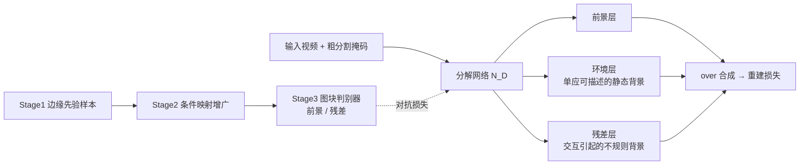

## 一句话总结

把视频抠图重新定义为"反事实视频合成"问题——将视频拆成若干相互独立、可各自替换的成分层（前景、环境、残差），从而支持带有复杂交互（水花、阴影、反射、形变）的重组编辑。

## 研究背景

- 领域现状：经典抠图基于合成方程 $$\boldsymbol{v}_p = \alpha_p \boldsymbol{F}_p + (1-\alpha_p)\boldsymbol{B}_p$$，把画面分解为前景/背景两层；近年的分层视频表示（Layered Neural Atlases、Deformable Sprites、Omnimatte 等）能把视频拆成可形变的多层，服务于重定时、重组等编辑任务。
- 核心痛点：经典抠图假设前景与背景**边缘独立**，即 $$P(\boldsymbol{B} \mid \boldsymbol{F}) = P(\boldsymbol{B})$$。但现实场景里存在大量**条件交互**——脚踩进水坑溅起的水花、物体投下的阴影、物体压变形的软垫。这些效应在边缘先验下概率极低，导致像素被随意归给某一层：基于颜色的方法把阴影归背景，基于运动的方法把阴影归前景，两种都会在重组时留下"串色"伪影。Omnimatte 因为不求解真正独立的分解，多层颜色高度相关，跨源合成时容易出错。
- 本文 idea：不再要求每层是"真实画面的一部分"，而是要求每层是一个**反事实版本的场景**——"如果冻结时间、把其他成分移走，这一成分会长什么样"。这样水花可以留在背景成分里（因为它由与脚的交互产生），前景成分只保留物体本身及其对外的贡献（如纯暗的阴影投射），得到可独立替换的干净分层。

## 方法

整体框架：从经典贝叶斯抠图出发，用链式法则把联合先验拆成边缘先验与**条件先验**的乘积，去掉"层间独立"这一有害假设；再用一个分解网络输出各层的颜色与 alpha，用一组基于图块的判别器充当条件先验，通过对抗训练把网络输出逼向"反事实分布"。训练分三阶段：先用传统先验拿到各成分的代表性样本，再用一组图像变换（增广）把边缘样本映射成条件样本，最后对抗训练判别器与分解网络。

关键设计：

1. **条件先验替代边缘先验（问题重构）**。对联合先验用链式法则 $$P(\boldsymbol{F}, \boldsymbol{B}) = P(\boldsymbol{F} \mid \boldsymbol{B})\,P(\boldsymbol{B})$$，得到等价但不再假设独立的目标。作者论证：条件先验 $$P(\boldsymbol{F} \mid \boldsymbol{B})$$ 等价于"把该成分冻结在当前状态、当作一个新的独立场景 $$\boldsymbol{B}'$$"的边缘先验，即 $$P(\boldsymbol{B}') = P(\boldsymbol{B} \mid \boldsymbol{F})$$。这就是"反事实"的数学含义——交互的痕迹被保留在冻结态里，从而能自由替换其他成分。最终损失写成重建项、经典边缘先验项、条件先验项的加权和 $$w_r \mathcal{L}_r + w_m \mathcal{L}_m + w_c \mathcal{L}_c$$。

2. **成分与分层结构**。默认把视频分成两个成分：前景成分（1 个前景层）与背景成分（1 个**环境层** + 1 个**残差层**）。环境层表示可用逐帧单应变换描述的静态背景，残差层则收纳交互引起的不规则变化（水花、形变、视差）。层带有各自的合成顺序，可交错叠放；水花这类"既在脚前又在脚后"的情形用共享颜色、前后两张 alpha 的残差层来表示。

3. **条件映射（数据增广近似条件分布）**。核心技巧是：跨成分交互对单个成分的影响，可用图像空间变换近似（扭曲、模糊、亮度调整）。前景增广模拟阴影（未监督区填暗灰）、反射与色偏（物体副本与纯黑插值）；背景增广对 Stage1 得到的背景画布做基于网格的随机形变、局部高斯变暗（模拟弯折与自阴影）。判别器工作在**图块空间**（多尺度 PatchGAN 结构），使得通用的简单变换就能覆盖各类形变，无需针对每个场景手工模拟。

4. **似然与正则**。重建损失用 over 合成算子把所有层按序叠合后与输入取 L1；此外用 RAFT 估计光流作为辅助任务，并**逐像素只监督误差最小的那一层**（应对交互处多模态光流），再加颜色/alpha 的时序一致性 warp 损失、alpha 稀疏正则、以及训练初期让前景 alpha 贴合输入掩码的引导损失。复杂场景可选：先在交互较弱的帧子集上求解，用干净结果为全视频提供更强先验与参考 alpha。

## 实验结果

在 CDW-2014 变化检测数据集上做背景减除评测（选取含阴影/反射、且有相机抖动与变焦的 10 个片段，alpha 以 0.8 二值化）：

| 方法 | Precision | Recall | F-Score | AUC |
|------|-----------|--------|---------|-----|
| FactorMatte | 0.767 | 0.773 | **0.770** | **0.934** |
| Omnimatte | 0.771 | 0.740 | 0.754 | 0.922 |
| FgSegNet-v2 | **0.896** | **0.778** | **0.830** | 0.932 |

FactorMatte 在 F-Score 与 AUC 上超过最接近的分层方法 Omnimatte（残差层能吸收不规则背景内容，避免背景元素窜入前景），召回与 AUC 与专门的背景减除方法 FgSegNet-v2 相当；精度偏低作者归因于人工标注把运动物体边缘标为"未知"较保守。其余为定性/应用验证：标准视频抠图（对比 BGM，发丝细节最准）、复杂交互场景（水花、滑雪、风筝冲浪、徒步视差）、After Effects 重组插件、物体移除（配合 FGVC 修复，掩码含阴影而不含软垫形变，得到最合理结果）、Color Pop 改光束颜色、冻结时间等。消融显示：去掉光流损失、alpha 一致性损失、残差层判别器时，前景 alpha 相对真值的平均 L1 误差从 0.007 分别升到 0.027、0.027、0.012。

## 亮点与局限

- 亮点：
  - 问题层面的重构——把"抠图"从"恢复真实图层"改为"反事实视频合成"，给阴影/反射/形变/水花等条件交互一个自洽的数学与直觉解释。
  - 逐视频优化，**不需要外部大数据集预训练，也不需要场景 3D 结构**；用通用的图块级增广就能近似复杂的条件分布。
  - 分解结果直接服务重组：配套 After Effects 插件，支持替换前景/背景、插入手绘层、改色、重定时等下游编辑。
- 局限：
  - 当不同成分**外观相似**时（前景背景颜色接近），条件分布难以区分，损失权重需要精细调参，属于较根本的限制。
  - 交互极复杂时难找到能覆盖其条件外观的映射，内容归层会变得任意甚至出错（水花结果仍有可见伪影，靠训练末期临时调低前景判别器损失缓解）。
  - 运行时开销大：多阶段训练加额外网络，平均耗时约为 Omnimatte 的 3.5 倍。

## 延伸思考

- 方法本质是"用对抗训练把边缘样本推向反事实分布"，条件映射的设计目前偏手工与启发式；若能用更大规模数据预训练先验，或用扩散模型学习条件外观分布，可能让成分分布更可分、减少调参负担。
- 默认只做"1 前景 + 2 背景层"的基本情形，多成分（多个交互物体）分解、以及把逐视频优化替换为可泛化的前馈网络以压缩 3.5 倍的运行时开销，都是自然的后续方向。
- "反事实成分"这一视角与因果推断中的干预/反事实概念相通，也和后来神经场/高斯泼溅里的场景分解、可编辑重光照工作形成呼应，值得作为视频层级可编辑表示的一条思路来对照。
