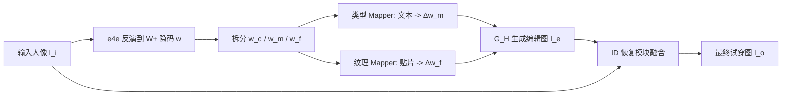

## 一句话总结
FashionTex 用"文本控类型 + 纹理贴片控图案"的多模态交互，在全身人像上做虚拟试穿，无需成对标注数据即可编辑衣服款式与局部纹理，同时保住原人像的身份、肤色和姿态。

## 研究背景
- 领域现状：虚拟试穿是在线购物的热门方向，已有方法能把参考图里的衣服迁移到目标人像上，效果不错；文本驱动的图像编辑借助 CLIP 等视觉-文本预训练模型也日趋成熟。
- 核心痛点：既有试穿方法几乎都要求用户提供一张"包含目标服装的、设计良好的参考图"，而这样的图往往并不存在。纯文本虽然自然易用，却只能改高层语义（衣服类型），改不动局部纹理细节；此外缺乏成对训练数据，且在真实图上用 StyleGAN 会有反演重建误差导致身份丢失。
- 本文 idea：把文本和纹理两种模态的优势结合起来——文本管款式类型这种高层结构，纹理贴片管局部图案，在 StyleGAN 的分层隐空间里分别编辑；再用一个基于 CLIP 的类型损失绕开成对数据的需求，并加一个身份恢复模块修复反演误差。

## 方法
整体框架是三段式流水线：先用 e4e 编码器把输入人像 $$I_i$$ 反演到 StyleGAN 的 $$W+$$ 隐空间得到隐码 $$w$$；再由"时尚编辑模块"根据文本 $$t$$ 和纹理贴片 $$P$$ 预测隐码偏移 $$\Delta w$$，用预训练的 StyleGAN-Human 生成器 $$G_H$$ 生成编辑后的时尚设计图 $$I_e$$；最后经身份恢复模块把编辑结果与原人像融合，得到最终试穿图 $$I_o$$。

关键设计：

1. **分层隐码解耦**：把 StyleGAN 的 18 层隐码分成 coarse（1~4）、medium（5~8）、fine（9~18）三组，即 $$w = [w_c, w_m, w_f]$$。通过 style mixing 验证发现 medium 层主要控制服装的形状/款式，fine 层控制纹理与颜色细节。编辑时冻结 coarse 层，只在 medium 层做类型编辑、fine 层做纹理编辑，从而把"改结构"和"改外观"天然分开。

2. **部件感知的时尚编辑模块**：文本经 CLIP 编码为 $$E_t$$、纹理贴片经预训练 VGG 编码为 $$E_p$$，分别送入类型 Mapper $$M_{tp}$$ 和纹理 Mapper $$M_{txr}$$ 预测偏移 $$\Delta w_m = M_{tp}(w_m, E_t)$$、$$\Delta w_f = M_{txr}(w_f, E_p)$$。由于上装（袖长、领型等细微形变）和下装（如裤子变裙子这种结构变化）分布差异大，每个 Mapper 内部再拆成上/下两个部件转换模块，用调制（AdaIN 风格）方式融合条件与隐码：$$\Delta w^i_m = \beta_i + \gamma_i \frac{w^i_m - \mu_{w^i_m}}{\sigma_{w^i_m}}$$，$$i \in [up, low]$$，再把上下偏移相加得到整体 $$\Delta w_m$$。

3. **CLIP 类型损失（免成对数据的核心）**：直接算编辑图与目标文本的余弦距离会忽略细节，加 mask 又会削弱 CLIP 的识别力。作者利用 CLIP 嵌入的线性可加性：用输入图像的 CLIP 嵌入减去其原类型标签的文本嵌入，得到"不可修改区域"的嵌入 $$E_{I_{un}} = E_{I_i} - E_{t_i}$$；再加上目标文本嵌入 $$E_t$$ 得到校准后的伪真值 $$\tilde{E}_t = E_{I_{un}} + E_t$$。类型损失即 $$L_{type} = 1 - \cos(E_{I_e}, \tilde{E}_t)$$，让模型只精确改动目标衣服区域而不动周边。

4. **纹理损失与身份恢复**：纹理损失用 VGG-19 后四层特征的 Gram 矩阵匹配随机裁剪块 $$I^{crop}_e$$ 与参考贴片 $$P$$ 的相关性。此外还有身份损失（ArcFace 余弦距离）、背景 $$L_2$$ 损失、LAB 空间的肤色损失和 $$\Delta w$$ 的正则损失。由于 PTI 反演在多样服装上仍有重建误差、且直接把编辑区域贴回会因款式形变产生残影，作者设计语义感知的 ID 恢复模块：先用语义 mask 融合出引导图 $$I'_e = P_{cloth}(I_e) \cdot I_e + P_{bg}(I_e) \cdot I_i$$，再以 LPIPS + $$L_2$$ 微调生成器得到既保留新款式又恢复身份的 $$I_o$$。

## 实验结果
在 DeepFashion-MultiModal 数据集（11,265 训练 / 1,136 测试）上评测。类型编辑与两个文本驱动图像编辑方法比较，用 FID 衡量真实度、Accuracy（人体解析网络判目标类型是否出现）衡量编辑成功率：

| 方法 | FID ↓ | Accuracy ↑ |
|------|-------|-----------|
| StyleCLIP | 90.25 | 22.25% |
| TediGAN | 95.44 | 15.25% |
| 本文 | 69.22 | 82.75% |

类型编辑上本文大幅领先，尤其在"裤子→裙子"这类大结构变化时基线几乎无法改变原类型。纹理迁移任务上，与 TextureGAN、Texture Reformer、DiOr 对比，本文在 FID（184.85）和 LPIPS（0.3257）上均取得最优。消融实验表明：去掉类型损失 Accuracy 从 82.75% 掉到 58.75%，去掉文本上下拆分则骤降到 10.75%，说明这两个设计对精确的款式编辑至关重要。

## 亮点与局限
- 亮点：
  - 首次提出全身人像上"文本 + 纹理贴片"多模态虚拟试穿任务，交互简单，人人可用来设计个性化服装。
  - CLIP 类型损失巧妙利用嵌入线性可加性，绕开了成对标注数据的硬约束，能精准编辑目标区域而不动其余部分。
  - 分层隐码解耦 + 上下部件拆分 + ID 恢复模块，较好兼顾了款式/纹理可控性与身份、姿态、肤色的保持。
- 局限：
  - 强依赖预训练 StyleGAN-Human 的表达能力与 PTI 反演质量，ID 恢复需要对每张图微调生成器，推理开销大、不易实时。
  - 类型控制受限于数据集中的服装标签词表，对罕见/超出分布的款式组合泛化有限。
  - 纹理迁移的 FID 绝对值仍偏高，纹理细节保真度还有提升空间；评测依赖人体解析网络，只能反映粗类别而非细粒度属性。

## 延伸思考
这项工作处在 StyleGAN 隐空间编辑的技术脉络上，与 StyleCLIP、HairCLIP 一脉相承。当下扩散模型在文本驱动图像编辑与试穿上已成主流，若把这里的"文本控结构 + 纹理贴片控局部"多模态交互思想迁移到扩散模型或结合 ControlNet/IP-Adapter，或许能在保真度和泛化性上进一步突破，同时摆脱逐图微调的负担。此外，免成对数据的 CLIP 线性校准损失思路，对其他缺乏配对监督的局部编辑任务也有借鉴价值。
