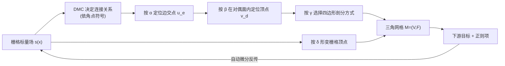

## 一句话总结

FlexiCubes 是一种专为"基于梯度的网格优化"设计的等值面表示方法，通过在 Dual Marching Cubes 上引入若干可微的额外自由度，让提取出的每个网格顶点都能被独立、灵活地调整，从而在优化中同时兼顾"可微好优化"与"能贴合尖锐特征"两个通常互斥的目标。

## 研究背景

- 领域现状：把三维表面表示成一个标量场（或 SDF）的 0 等值面，再用等值面提取算法抽出三角网格，已成为逆向渲染、生成式三维建模、逆物理仿真等任务里可微网格生成的通用范式。现有实现大多直接套用 Marching Cubes（MC）、Dual Contouring（DC）等为"固定已知标量场"设计的经典算法。
- 核心痛点：一个好的可微网格提取器需要同时满足两个性质——**可微好优化（Grad.）**：对网格的微分定义良好、梯度下降能稳定收敛；**灵活（Flexible）**：顶点能被单独局部调整以贴合特征、用少量元素表达高质量网格。但两者天然冲突：MC 顶点被钉死在栅格边上、无法对齐非轴向尖锐特征，还会产生细长退化三角形；DC 虽能抓尖锐特征，但其定位顶点的二次误差方程（QEF）在法向共面时会退化、把顶点甩到很远处，导致自交与数值不稳定，梯度优化失败；DMTet 允许栅格形变但顶点仍不能独立移动，产生星形细长三角形。
- 本文 idea：基于拓扑性质更好的 Dual Marching Cubes（DMC），在其"顶点位于对偶单元内"的框架上，**精心引入三组额外参数**（顶点定位插值权重、四边形剖分权重、栅格形变向量）。这些参数被约束为凸组合等安全形式以保证流形、水密、几乎无自交，同时又赋予每个顶点独立的局部调整能力，并随标量场一起用自动微分优化。

## 方法

FlexiCubes 的骨架是"栅格上的标量场 → Dual Marching Cubes 提取三角网格"。核心贡献是在这条管线里塞进三组可微参数，让提取出的网格几何与连接关系可以被下游目标端到端地调整。

关键设计：

- **柔性对偶顶点定位（α, β）**：普通 DMC 先在栅格边上取零交点，再把对偶顶点放在原始面的形心。FlexiCubes 给每个单元的 8 个角点配权重 $$\boldsymbol{\alpha} \in \mathbb{R}^{8}_{>0}$$、给 12 条边配权重 $$\boldsymbol{\beta} \in \mathbb{R}^{12}_{>0}$$，把边交点改写为加权形式 $$u_e = \frac{s(x_i)\alpha_i x_j - s(x_j)\alpha_j x_i}{s(x_i)\alpha_i - s(x_j)\alpha_j}$$，把对偶顶点改写为加权平均 $$v_d = \frac{1}{\sum_{u_e \in V_E}\beta_e}\sum_{u_e \in V_E}\beta_e u_e$$。用 $$\tanh(\cdot)+1$$ 把权重限制在 $$[0,2]$$。由于两式都是凸组合，顶点必落在单元凸包内，天然避免绝大多数自交，也让微分行为良好。每单元 20 个标量、彼此独立不共享。
- **柔性四边形剖分（γ）**：DMC 输出的是非平面四边形，直接沿固定对角线三角化会在弯曲区产生瑕疵。每个单元配权重 $$\gamma \in \mathbb{R}_{>0}$$；优化阶段把每个四边形插入一个中点、分成 4 个三角形，中点位置按两条对角线中点的 $$\gamma$$ 加权组合 $$v_d = \frac{\gamma_{c1}\gamma_{c3}(v^{c1}_d + v^{c3}_d)/2 + \gamma_{c2}\gamma_{c4}(v^{c2}_d + v^{c4}_d)/2}{\gamma_{c1}\gamma_{c3} + \gamma_{c2}\gamma_{c4}}$$，使剖分方式成为可连续优化的量；推理阶段则直接沿 $$\gamma$$ 乘积更大的那条对角线剖分。
- **柔性栅格形变（δ）**：沿袭 DefTet / DMTet，给每个栅格顶点一个位移 $$\boldsymbol{\delta} \in \mathbb{R}^{3}$$ 以对齐薄特征，位移限制在半个栅格间距内以防单元翻转。
- **扩展与正则**：可进一步输出与表面边界精确一致的四面体网格（供物理仿真），以及基于八叉树的自适应分辨率网格（对粗细单元交界处约束 SDF 符号一致以避免裂缝/非流形）。此外引入两个内部正则项——$$L_{\text{dev}}$$ 惩罚对偶顶点到其所在面各边交点距离的平均绝对偏差、鼓励顶点居中留有"活动余量"；$$L_{\text{sign}}$$ 惩罚无监督区域（如内部空腔）栅格边上的符号翻转以抑制杂散几何。

## 实验结果

在 Myles 等人收集的 79 个多样化形状上做理想化的三维重建（深度+轮廓+SDF 监督），与可微方法（MC、DMTet）及从真值 SDF 直接提取的非可微方法（MC/DC/NDC）对比。下表为 $$64^3$$ 分辨率下的重建质量（DMTet 用更高分辨率以匹配三角形数）：

| 方法 | IN>5°(%)↓ | CD(1e-5)↓ | F1↑ | ECD(1e-2)↓ | EF1↑ |
|------|-----------|-----------|-----|------------|------|
| MC (可微) | 52.37 | 6.33 | 0.66 | 1.25 | 0.25 |
| DMTet(80) | 48.66 | 5.17 | 0.66 | 3.59 | 0.29 |
| NDC (真值SDF) | 55.22 | 6.16 | 0.57 | 1.22 | 0.26 |
| FlexiCubes | 34.87 | 4.87 | 0.70 | 0.71 | 0.43 |

FlexiCubes 在几何保真度（法向误差、Chamfer、边缘指标）上全面领先其他可微方法，网格内在质量（细长三角形比例、角度分布）也与最优的 NDC 相当。消融显示三组参数逐一加入都带来提升（法向误差从 DMC-centroid 的 53.02% 降到 34.87%）。加入等边三角形正则时，MC/DMTet 的几何指标明显恶化，而 FlexiCubes 只有轻微下降就把细长三角形比例压到极低。在真实应用上，把 nvdiffrec/nvdiffrecmc 逆向渲染管线中的 DMTet 直接替换为 FlexiCubes，即可在等三角形数下得到更均匀的三角化、更少的细长三角形、更好的 UV 展开（NeRF 合成数据集上 PSNR 相当、可见三角形 Chamfer 距离多数场景显著更低，如 Ship 从 55.8 降到 10.5）；还展示了骨骼动画网格端到端简化、可展性等基于网格自身的正则优化。

## 亮点与局限

- 亮点：
  - 抓住"可微 vs. 灵活"这一核心矛盾，用凸组合约束的额外自由度优雅地同时满足两者，理论上保证流形水密、绝大多数情况无自交。
  - 即插即用——在现有逆向渲染/生成管线里可直接替换 DMTet，无需改动其余部分即获提升。
  - 通用性强：支持三角面/四面体/自适应八叉树网格，能承接几何、视觉乃至物理目标与任意基于网格的正则项。
- 局限：
  - 额外自由度带来的灵活性在极端配置下仍可能产生极少量自交、非流形顶点或八叉树交界处的小孔洞（论文靠约束与正则将其压到极低但未完全消除）。
  - 属过参数化表示，需要专门的内部正则项来维持非退化，正则权重与优化流程需一定调参。
  - 输入形状需为水密、非极细的可等值面化几何；实验也剔除了非水密与细线状形状。

## 延伸思考

FlexiCubes 已成为可微网格提取的事实标准之一，被大量后续文本到三维/图像到三维生成工作（把它接在扩散或神经场之后做网格化）采用。值得追问的是：其"凸组合保证落在凸包内"的思路能否推广到更高阶单元或非规则栅格；在与神经隐式场联合训练时，α/β/γ 这些逐单元离散参数与连续神经场之间的优化耦合是否会引入新的局部极小；以及在需要严格无自交（如仿真、制造）的场景下，如何从"绝大多数无自交"进一步做到硬保证。
