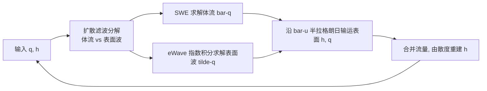

## 一句话总结

本文把浅水方程（SWE）和 Airy 线性波理论统一进同一个高度场模型：每帧把水波拆成"低频体流 + 高频表面波"分别用最合适的求解器处理再合并，从而首次在单个高度场方法里同时再现深水干涉波纹（船尾波）与大尺度非线性运动（洪泛、涡街），并且实时运行。

## 研究背景

- 领域现状：图形学里大体积水面通常降维成高度场来算，主流有两套简化——Airy 线性波理论（假设势流、小振幅 $$ka \ll 1$$）能给出正确的色散关系 $$\omega=\sqrt{gk\tanh(kh)}$$，擅长深水干涉/船尾波；浅水方程 SWE（假设 $$kh \ll 1$$）色散关系退化为 $$\omega=k\sqrt{gh}$$，擅长洪泛、翻涌和涡旋。
- 核心痛点：两套方法各自的假设都很苛刻，且恰好在对方擅长的场景失效。Airy 波无法让水面漫过斜坡海滩或翻过堤坝改变水域形状；SWE 所有波长同速传播，做不出船尾那种签名式干涉纹，短波表现也差。此前的耦合工作要么依赖昂贵的全 3D 求解器，要么只做单向耦合、把表面波降格成高频贴图，无法把水真正输运到新区域。
- 本文 idea：不做二选一，而是每个时间步把水动力**分解**成两个物理区间——包含大部分质量与动量的低频体流（用 SWE 解，可洪泛、可生涡），和剩余的高频表面细节（用 Airy 解，负责干涉纹）。每步重新分解，让波可以随位置、频率、水深在深浅两种行为间平滑切换，水域边界也能随之变化。

## 方法

整体框架：把水高 $$h=\bar h+\tilde h$$、流量 $$q=\bar q+\tilde q$$ 分解为低频"体"分量（上划线）与高频"面"分量（波浪线）。把 $$h=\bar h+\tilde h$$、$$u=\bar u+\tilde u$$ 代入连续性方程可得四项：体流项、表面项、输运项，以及一个被作者按 Airy 假设置零丢弃的非线性项 $$\nabla\cdot(\bar h\tilde u)$$。于是一个时间步的流程是：分解 → SWE 解体流 → Airy 解表面波 → 沿体流速度输运表面量 → 合并重建水高（由流量散度重建以精确守恒体积）。

关键设计：

1. **基于扩散的波分解**：不直接滤原始水深，而是对"水面高度 $$H=h+\tau$$"（含地形 $$\tau$$）跑一个扩散方程当低通滤波器。扩散把高频从 $$\bar H$$ 里滤掉，Fourier 分析给出衰减 $$\hat H(k,T)=\hat H(k,T_0)e^{-k^2\alpha T}$$。滤波强度须随水深单调增长：对某水深存在浅水波速恰等于深水波速的临界波长 $$\lambda_{\text{cutoff}}=2\pi h$$，据此取扩散系数 $$\alpha=\tfrac{h^2}{64}$$，让深水里的短波不被当成浅水处理。为防止陡波（如溃坝阶跃）被误分类成高频表面波，再乘一个梯度惩罚项：$$\alpha=\tfrac{h^2}{64}\,e^{-d\lvert\nabla h\rvert^2}$$（$$d=\tfrac{1}{100}$$）。这一步是整个算法的性能瓶颈（占 87% 耗时），显式积分每个时间步需要 128 个子步。

2. **体流：守恒型 SWE 求解器**。采用 Stelling & Duinmeijer 的有限体积交错网格格式积分浅水方程，$$h$$ 存于格心、流量/速度存于格边，用一阶迎风取值。当把分解强制设为 $$\bar h=h,\ \bar q=q$$ 时，本方法精确退化为纯 SWE。

3. **表面波：eWave 指数积分器 + 多水深采样**。对表面波用 eWave 的指数积分器在 Fourier 空间更新流量。由于空间变化的水深 $$\bar h$$ 无法直接进 Fourier 空间，作者在 $$N=4$$ 个固定水深（1m、4m、16m、64m）分别求解再按最近两档线性插值近似。当 $$\bar h$$ 恒定、$$\bar q=0$$ 时，本方法退化为与 Tessendorf 的 Airy 求解器无异。

4. **精确消除数值色散**：末端由流量散度重建水高会引入数值色散，使表面波偏离目标色散关系。作者推导出修正因子 $$\beta$$，令 $$\omega=\tfrac{1}{\beta}\sqrt{gk\tanh(k\bar h)}$$，从而在恒定水深下得到理论上完美的波速——即便到 $$\lambda=2\Delta x$$ 的 Nyquist 极限也几乎无误差。

5. **表面波输运与合并**：沿体流速度 $$\bar u$$ 半拉格朗日输运 $$\tilde h,\tilde q$$；其中 $$\nabla\cdot\bar u$$ 项对应波的浅化放大/衰减（用闭式指数积分，并加可调阻尼 $$\gamma$$ 抑制会聚流中的过度放大，因为模型不处理破碎）。最终 $$q=\bar q+\tilde{\bar q}$$，再由 $$h_{t+3\Delta t/2}=h_{t+\Delta t/2}+\Delta t\,\nabla\cdot(q+\breve q)$$ 重建水高，靠散度构造保证体积精确守恒。

## 实验结果

在 NVIDIA RTX 2080 Max-Q 笔记本上用 CUDA 实现，512×512 网格、$$\Delta x=1\text{m}$$。含渲染稳定 40fps 以上，不含渲染约 100fps。核心验证是"有效色散关系"的精度，用矩形池驻波数周期测量波速（相对理论值）：

| 配置 | 相对波速误差 | 说明 |
|------|--------------|------|
| 未做数值色散修正 | 明显偏离（偏慢） | 重建散度引入数值色散 |
| 加入 $$\beta$$ 修正 | 几乎完美（至 Nyquist 极限） | 恒定水深下理论精确 |
| 水深离散 2 档采样 | 最大误差偏大 | 仅 1m/16m |
| 水深离散 4 档采样 | 最大 8% 误差 | 实际中通常更小 |

其余实验以定性场景为主：双船以不同速度航行产生不同尾迹并漫上海滩形成新水塘；三孔溃坝在窄道加速、扩张处自然形成尾迹、涡旋与大量反射波；圆柱绕流以 0.45 柱径/秒背景流产生冯·卡门涡街叠加 Kelvin 尾迹，涡与表面波双向作用。时间步越小越能保留高频短波、洪泛速度更准；扩散迭代越多滤波越彻底、波速越准。

## 亮点与局限

- 亮点：
  - 首个能在单一高度场里同时表现 Airy 干涉纹与大尺度非线性运动（洪泛、2D 对流涡）的方法，且实时。
  - 分解框架优雅地"包含"了两个经典模型——退化设置下分别精确还原纯 SWE 与纯 Airy 求解器。
  - 由流量散度重建水高，体积精确守恒；并给出可证明的数值色散修正，恒定水深下波速理论完美。
- 局限：
  - 刻意丢弃非线性项 $$\nabla\cdot(\bar h\tilde u)$$，意味着表面波扰动不触及海底，无法建模由此产生的涡脱落与破碎。
  - 体流求解器的空间离散在极陡波（如溃坝）处仍有非物理数值色散；模型基于小振幅假设，陡波下不准。
  - 波分解是最贵的一步（占 87% 耗时，需 128 个显式子步），性能受限于此。
  - 表面波在 Fourier 空间用指数积分，假设一个时间步内波不穿越边界；CFL 限速在大时间步下会导致洪泛偏慢、局部波高偏大。

## 延伸思考

这项工作把"分解—分治—重组"的思路用在波区间划分上，颇具启发：与其追求一个统一但昂贵的求解器，不如按物理尺度把问题拆给各自最合适的经典方法，再用守恒性约束把它们缝合。最直接的改进方向是替换掉扩散式分解这个瓶颈——用更高效的隐式扩散或其它频率分离算子，可能大幅提速。丢弃的非线性耦合项是效率与真实感的取舍点，若要做破碎、卷浪或与海底耦合的涡脱落，需要引入超出线性理论的机制（如与稀疏 3D 或波包方法的局部耦合）。此外，固定水深离散采样（4 档）留下最多 8% 波速误差，用优化过的采样点或可微方式选点或能进一步压误差，这对需要精确尾迹角的应用（如船舶仿真）有意义。
