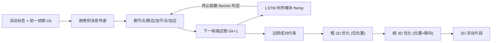

## 一句话总结

给定一个活动标签，先用序列化的深度图生成模型生成一串"关键帧描述"图（谁在跟谁/什么发生交互），再用两阶段优化把这些抽象图落地成 3D 场景里多角色、多物体的具体摆放与姿态，从而合成一段可播放的"活动片段"（activity snippet）。

## 研究背景

- 领域现状：给虚拟场景填充合理的人物行为是图形学的长期课题。已有方法能在给定场景里摆放单个或多个虚拟人、或合成与特定动作标签相关的运动，但大多只考虑**单个虚拟人**与**静态场景**的交互。
- 核心痛点：真实活动往往是**多角色、多物体**、随时间推进的复杂交互（如餐厅里服务员为两位顾客点单、上菜、离场）。这类场景交织着空间关系（谁挨着谁、谁看着谁）和时间关系（动作的先后因果），现有工作缺少对这种高层符号级交互序列的生成能力。
- 本文 idea：把问题拆成两层。上层做**符号级的高层规划**——用图表示每个关键帧里的抽象交互，并用序列图生成模型捕捉相邻帧之间交互的增删变化；下层做**几何实例化**——用优化把抽象图翻译成 3D 里角色与物体的位置和朝向。这样既学到了活动的语义逻辑，又能生成具体可视的场景。

## 方法

整体框架分两阶段：第一阶段的关键帧描述生成器以空图或前一帧图为条件，反复"删节点/删边/加节点/加边"地产出下一帧描述图，由一个 LSTM 时序模块维持序列的时间连贯并决定何时终止；第二阶段的实例化模块把每个描述图里的边转成成对约束，用"粗 2D + 细 3D"两轮模拟退火优化求解所有角色与物体的摆放。

关键设计：

1. **把活动表示成"关键帧描述图序列"**。一段活动片段定义为 $$\Gamma = \{(G_k, \Phi_k)\}_{k=1,\dots,T}$$，其中 $$G_k = \langle V_k, E_k \rangle$$ 是第 $$k$$ 帧的抽象交互图，节点分角色/物体两类，边分交互边（位置型、朝向型、附着型三种子类）、其反向边（仅用于图上消息传递）和自环边（描述自身状态如"行走"）。$$\Phi_k$$ 则是该帧所有实例的 3D 参数：物体为 $$(p_o, \theta_o)$$，角色为 $$(p_c, \theta_{cb}, \theta_{ch})$$（位置、身体朝向、头部相对朝向）。

2. **支持增删的序列图生成器**。基于 DGMG 扩展。原始 DGMG 只能不断加节点/加边，而生成活动序列需要能"删"——对话结束要删掉 talk 边、角色离场要删掉整个节点。因此生成器按固定顺序触发四个模块：删节点 → 删边 → 加节点 → 加边（先删是因为删节点会连带删边，先加节点是因为新边可能挂在新节点上）。候选选择用缩放点积注意力：$$p_k = \mathrm{att}(q,k) = \mathrm{softmax}_k\!\left(\tfrac{1}{\sqrt{d}}(qW_q)(kW_k)^{T}\right)$$，统一用增广图摘要 $$h^{*}_{G} = [h_G, s]$$ 作查询，其中 $$s$$ 是编码序列时间历史的生成信号。

3. **时序模块维持连贯并自动终止**。用 $$s_{k+1} = f_{\text{temp}}(f_t(h^{k}_{G}, c), s_k)$$ 把当前图摘要与活动条件向量 $$c$$ 融合进 LSTM，产出下一步生成信号；再由 $$f_{\text{termin}}(s_{k+1})$$ 判断序列是否该结束。初始帧从空图开始，也可给定"部分图"作初始化——这正是后面混合现实应用的接口。训练数据来自 MOMA 数据集（多角色多物体活动的超图标注），只取抽象图、并补上"归属"关系边（如某盘菜属于哪位顾客）。

4. **两阶段优化做实例化**。直接一次性优化整段片段里所有实例很难，因为约束数量随节点/边变化且跨帧耦合。于是：粗 2D 阶段把场景投到平面、用包围圆表示实例，**只管位置型约束**，并用"渐进式松弛"——松弛因子 $$\lambda$$ 从 2 逐步降到 1，早期约束松、允许大步跳出局部最优，后期收紧；细 3D 阶段用更精确的碰撞体，**同时优化位置和朝向**。两阶段都用带 Metropolis-Hastings 的模拟退火，目标为玻尔兹曼式 $$f(\Gamma) = e^{-\frac{1}{t}C(\Gamma)}$$，接受概率 $$\alpha(\Gamma' \mid \Gamma) = \min\!\left(e^{\frac{1}{t}(C(\Gamma)-C(\Gamma'))}, 1\right)$$。位置型约束形如 $$C_p(u,v) = \max(1 - e^{\lambda D - d(u,v)}, 0)$$，朝向型约束形如 $$C_o(u,v) = \tfrac{1 - s(u,v)}{2}$$（$$s$$ 为两朝向向量的点积），附着型多为硬约束（如 sit on、hold）。对交互跨多帧保持一致的实例，还强制"跨帧同步移动"以保证时间连贯。

## 实验结果

主评估是一项招募 300 名 Amazon Mechanical Turk 参与者、对 10 段生成活动片段打分的感知研究，每段先播放同活动标签、初始关键帧最接近的真实视频作参照，再用 5 分 Likert 量表（1 最低、5 最高）从四个维度评分，每个维度汇总 3000 条评分：

| 指标 | Reasonable（合理性） | Intuitive（易理解） | Placement P.（摆放可信度） | Overall P.（整体可信度） |
|------|------|------|------|------|
| 均值 Mean | 3.89 | 3.77 | 3.89 | 3.88 |
| 中位数 Median | 4 | 4 | 4 | 4 |
| 标准差 SD | 0.92 | 0.90 | 0.88 | 0.90 |

四个维度均值都接近 3.9、中位数均为 4，说明在真实录像作参照的条件下，参与者普遍认为生成结果体现了预期的活动模式，且实例化与动画较好地还原了抽象描述里的交互关系。其余实验以文字呈现：作者还验证方法能从合成数据学习——用多人游戏 Overcooked 的规则合成烹饪活动数据，生成的 19 帧"做汉堡"片段到最近训练样本的图编辑距离（GED）为 0.32；交互式生成让玩家实时参与、21 帧"做蛋糕"片段的 GED 为 0.48；此外还演示了在 HoloLens 2 上把真实场景图作为部分图、增补虚拟实例的混合现实应用。与一次性联合优化的消融对比则表明两阶段设计对复杂时空约束更稳。

## 亮点与局限

- 亮点：
  - 提出"活动片段"这一新概念，把多角色多物体、随时间演进的交互显式建模为**关键帧描述图序列**，填补了以往只关注单人-静态场景的空白。
  - 高层符号规划与低层几何实例化解耦，思路清晰、可解释性强；序列图生成器引入删节点/删边能力，天然契合"交互随时间增减"的需求。
  - 渐进式松弛的两阶段优化有效缓解了长序列、变数量约束下模拟退火易陷局部最优的问题。
  - 应用面广：可学合成数据、支持玩家交互式共创、可迁移到混合现实。
- 局限：
  - 生成关键帧时**偶有无因果的节点加入**（物体凭空出现），作者归因于 2D 视频训练数据中物体因遮挡/视野受限而"迟到"出现。
  - 时序模块只是简单 LSTM，作者自己指出可换更强的 Transformer。
  - 只生成离散关键帧、帧间动画靠插值，交互粒度受边标签粒度限制，不够连续平滑。
  - 依赖预定义的符号动画与约束类型，几何层面并非端到端学习。
  - 真实人类活动数据（尤其未来元宇宙场景）涉及隐私与偏见等伦理问题。

## 延伸思考

- 这套"先生成抽象图、再优化落地"的两段式范式，本质是把难学的连续几何交给可解释的优化、把难写规则的语义逻辑交给生成模型，与布局合成、场景图驱动动画等工作一脉相承；随着 3D 交互数据（姿态跟踪、元宇宙录制）增多，作者设想的端到端"一步生成活动片段"值得追问——能否用更强的时序生成器直接产出带姿态的连续交互，省去插值？
- 用图编辑距离衡量与训练样本的接近程度只能说明"像不像学过的模式"，并不能证明生成活动的**新颖性或任务正确性**；把它接入更具任务语义的评价（如烹饪流程的可执行性校验）会更有说服力。
- 作为交互式创作/AR-VR 训练工具的雏形，若把玩家动作、场景约束都统一进同一套图表示，理论上能做到"边玩边生成"的协作式活动编排，这在游戏 NPC 行为、培训模拟等场景有直接价值。
