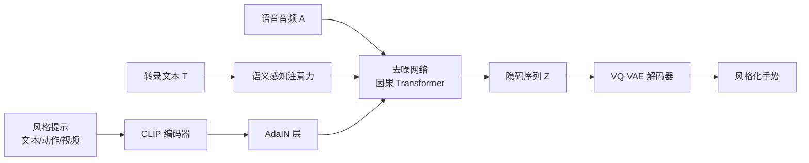

## 一句话总结
借助 CLIP 的多模态共享隐空间，用一个隐扩散模型生成与语音同步的风格化协同手势，用户可用文本、动作片段或视频三种任意提示灵活指定风格。

## 研究背景
- 领域现状：深度网络已能从语音生成自然的协同手势（co-speech gesture），支撑数字人动画；风格控制此前主要分两类——基于预定义标签（说话人身份、情绪等）和基于示例（动作片段或视频模仿）。
- 核心痛点：标签法受限于标签数量与粒度、且标注昂贵；示例法给出的风格往往模糊、难以准确传达用户意图，常需反复试错。此外语音到手势是多对多映射，语义手势与对应词语在时间上并不严格对齐，端到端模型容易学成"平均手势"、丢失语义对应。
- 本文 idea：利用 CLIP 学到的图文（可扩展到动作、视频）共享隐空间作为统一的风格接口，把任意模态提示编码成风格向量，再通过 AdaIN 注入到扩散生成器；同时用对比学习建立手势—文本联合嵌入空间提供语义线索，用自监督方式绕开对细粒度风格标签的依赖。

## 方法
整体框架分两大块：一个以语音音频与文本转录为输入、基于隐扩散模型的手势生成器；一个从任意风格提示中抽取 CLIP 风格嵌入、经 AdaIN 注入生成器的编码器。另外单独学习一个手势—文本联合嵌入空间，为生成器提供语义引导与语义损失。

关键设计：

- **紧凑动作表示（VQ-VAE）**：先用类似 Jukebox 的 1D 卷积 VQ-VAE 把原始姿态序列（角色位移 + 各关节 6D 旋转）编码成下采样的隐码序列，扩散在这个压缩隐空间里进行，保证动作质量与多样性并加速推理。扩散生成用未量化的 $$\boldsymbol{Z}$$，联合嵌入用量化后的 $$\hat{\boldsymbol{Z}}$$。

- **手势—文本联合嵌入 + 语义感知注意力**：训练手势编码器与转录编码器（T5-base），经 max pooling 聚合后用 CLIP 式对比损失拉近配对手势与文本、推远错配对：

$$\boldsymbol{p}_{\text{g2t}}(\boldsymbol{z}^g_i) = \frac{\exp(\boldsymbol{z}^g_i \cdot \boldsymbol{z}^t_i / \tau)}{\sum_{j=1}^{B}\exp(\boldsymbol{z}^g_i \cdot \boldsymbol{z}^t_j / \tau)}$$

  针对真实数据中"一句话可能没有对应手势、一个语义可对应多种手势"的噪声对应，引入动量蒸馏（MoD）用动量模型生成的伪目标做 KL 约束稳定训练。由此还能算出每个词的语义显著度 $$\boldsymbol{s}_t = \mathrm{softmax}(\boldsymbol{Z}_t \cdot \boldsymbol{z}_t)$$，在去噪网络的语义感知注意力里对语义重要的词加权，引导生成语义正确的手势。

- **分层多模态条件注入的去噪网络**：去噪网络是带因果注意力的多层 Transformer（可自然改写成自回归推理，逐帧生成并利用 $$\delta_a$$ 帧未来音频）。三类条件按层级融合——低层音频特征（节奏、重音）与噪声隐码拼接；高层转录语义经语义感知注意力注入；风格提示经 CLIP 引导的 AdaIN 层控制整体风格。文本、动作、视频分别用 CLIP 文本编码器、MotionCLIP 动作编码器、以及自建的 CLIP 视频编码器映射到同一 CLIP 空间。

- **自监督训练与损失**：不假设数据带风格标签，训练时把包含当前片段的一段随机长度动作 $$\boldsymbol{M}_P$$ 当作风格提示，让系统重建自身，从而零样本泛化到文本/视频提示。总损失含噪声估计损失、联合嵌入空间里的语义损失、以及 CLIP 动作编码器上的风格感知损失：

$$\mathcal{L}_{\text{net}} = w_{\text{noise}}\mathcal{L}_{\text{noise}} + w_{\text{semantic}}\mathcal{L}_{\text{semantic}} + w_{\text{style}}\mathcal{L}_{\text{style}}$$

  配合无分类器引导（10% 概率丢弃风格条件），推理时用尺度因子 $$s$$ 调节风格强弱。进一步通过为每个身体部位独立学 VQ-VAE、推理时按掩码融合各部位噪声（加平滑项），实现分部位细粒度风格控制。

## 实验结果
在 ZeroEGGS 和 BEAT 两个语音—手势数据集上，用成对偏好的用户研究评估（分数为相对偏好，越高越好，含 95% 置信区间）。系统在人类相似度、恰当性、风格正确性上均领先各基线；其中"无转录输入"消融在恰当性上明显下降，印证语义模块的作用。

| 数据集 | 系统 | 人类相似度 ↑ | 恰当性 ↑ | 风格正确性(数据集标签) ↑ | 风格正确性(随机提示) ↑ |
|--------|------|------|------|------|------|
| BEAT | GT | 0.47 | 0.73 | - | - |
| BEAT | CaMN | −0.99 | −1.06 | - | - |
| BEAT | 本文(无转录) | 0.23 | −0.33 | - | - |
| BEAT | 本文 | 0.31 | 0.51 | - | - |
| ZeroEGGS | ZE | −0.25 | −1.33 | - | - |
| ZeroEGGS | MD-ZE | - | - | −1.65 | −1.62 |
| ZeroEGGS | 本文 | 0.25 | 1.33 | 1.65 | 1.62 |

定量指标（FGD、SRGR、SC 在 BEAT 上）本文全面优于 CaMN；风格识别准确率 SRA（ZeroEGGS）本文达 71.5%，显著高于 MD-ZE 的 47.5%，且消融显示去掉风格损失（64.3%）或改用拼接融合替代 AdaIN（68.2%）都会下降，验证各组件必要性。

## 亮点与局限
- 亮点：
  - 首个支持文本/动作/视频多模态提示统一控制风格的跨模态动作生成系统，CLIP 隐空间提供灵活自然的用户接口。
  - 自监督蒸馏 CLIP 知识，零样本泛化到训练未见的文本、视频提示与合成语音，摆脱对细粒度风格标签的依赖。
  - 手势—文本对比学习 + 语义感知注意力有效解决多对多映射下的语义对应问题，可结合 ChatGPT 自动为每句生成风格提示做"演讲增强"。
- 局限：
  - 受限于 vanilla CLIP 文本编码器，无法处理过长文本提示，部分描述解释不准；偏离数据集分布的姿态（如瑜伽姿势）难以复现，非人类视频的语义连接易含糊。
  - 生成动作存在轻微脚部滑动，IK 后处理可缓解但可能引入接触状态的不自然过渡。
  - 基于隐扩散模型、推理需大量去噪步，实时生成困难（约 1.5 秒生成 1 秒手势）。

## 延伸思考
- 把"风格特征"与"动作约束"统一在一个提示里处理，配合强语言模型可支持组合式描述（如"高兴且右手拿咖啡杯"），也可让文本 + 视频/动作提示组合更精确地定义风格。
- 用物理仿真替代纯运动学生成，或许能从根本上消除脚滑；采样加速（如 PNDM）是走向实时的可行方向。
- 对比学习框架随数据规模扩展潜力大，更大规模的手势—文本数据可能进一步增强语义理解与风格泛化。
