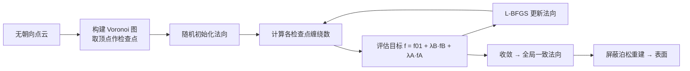

## 一句话总结

给定一堆无朝向的点云，本文把"法向定向"重新表述为"正则化缠绕数场"的优化问题：从完全随机的法向出发，反复调整每个点的法向，直到由它们诱导的缠绕数场变得干净的二值化（内部为 1、外部为 0），从而得到全局一致的法向朝向。

## 研究背景

- 领域现状：为原始点云估计出全局一致朝向的法向是众多几何处理任务（表面重建、配准、内外判定、形状分析）的关键前置步骤。传统方法多先局部估计无朝向的法向张量，再靠最小生成树等传播策略统一朝向；近年的 iPSR、PGR 等则更强调全局一致性并取得更好效果。
- 核心痛点：现有方法在面对各种"不完美"数据时仍然脆弱——数据稀疏且伴随近距离缝隙、薄壁结构、相邻表面、尖锐特征、复杂拓扑时容易出错。局部传播方法不满足空间连贯性；iPSR 会把薄结构断开，PGR 会在管状形体上鼓包，且 PGR 在大模型上显存超线性增长。
- 本文 idea：缠绕数本是强大的内外判定工具，但它高度依赖可靠的法向。作者反过来利用这一点：只有当法向全局一致时，缠绕数场才会近似二值化。于是把"缠绕数场是否规整"当作优化目标去反推法向。

## 方法

整体框架：在点云的 Voronoi 图顶点处采样"检查点"，构造一个关于所有法向的光滑目标函数，用三项分别约束缠绕数场的三种性质，再用 L-BFGS 从随机初始法向开始无约束优化，通常 30–50 次迭代收敛，最后把点与法向一起喂给屏蔽泊松重建（SPR）得到表面。

关键设计：

1. **在 Voronoi 顶点处检查缠绕数**。广义缠绕数在查询点 $$\boldsymbol{q}$$ 处按面积加权求和：
$$w(\boldsymbol{q}) = \sum_{i=1}^{N} a_i \frac{(\boldsymbol{p}_i - \boldsymbol{q}) \cdot \boldsymbol{n}_i}{4\pi \lVert \boldsymbol{p}_i - \boldsymbol{q} \rVert^3}$$
作者观察到：对无噪点云，缠绕数在 Voronoi 顶点处天然接近 0 或 1；即便加入位置噪声，其直方图仍呈现靠近 0 和 1 的两个峰。由于大多数 Voronoi 顶点远离表面、对噪声不敏感，因此用全部 Voronoi 顶点（Voronoi 极点的超集）作检查点最稳。

2. **0-1 项 $$f_{01}$$：把缠绕数逼向二值**。借用量子力学里的双阱函数
$$f_{DW}(x) = 4(x-0.5)^4 - 2(x-0.5)^2$$
它在 $$x=0$$ 与 $$x=1$$ 处各有一个谷。但随机法向会让缠绕数普遍趋于 0，因此加入一个剪切修正项 $$-w_j/D$$ 来鼓励 1 的出现（经验取 $$D=4$$）。

3. **平衡项 $$f_B$$：让每个点周围的 0 与 1 均衡**。若点密度满足局部特征尺寸标准，一个点的 Voronoi 单元应约有一半在内、一半在外。于是通过最大化该单元各顶点缠绕数的方差来抑制"全在内或全在外"的退化情形。

4. **对齐项 $$f_A$$：法向对齐 Voronoi 极点**。当某 Voronoi 顶点位于外极点时，$$\boldsymbol{q}_k^i - \boldsymbol{p}_i$$ 应与 $$\boldsymbol{n}_i$$ 同向；内极点则反向。利用重排不等式，转化为最小化 $$\sum_k w_k^i\, \boldsymbol{n}_i \cdot (\boldsymbol{q}_k^i - \boldsymbol{p}_i)$$，使法向尽可能贴近 Voronoi 方法的精度。

三项合成为单一光滑目标函数：
$$f(\boldsymbol{n}) = \frac{f_{01}(\boldsymbol{n}) + \lambda_B f_B(\boldsymbol{n}) + \lambda_A f_A(\boldsymbol{n})}{N}$$
把单位法向用球坐标 $$\boldsymbol{n}_i = (\sin u_i \cos v_i,\ \sin u_i \sin v_i,\ \cos u_i)$$ 参数化后即为无约束优化。此外，面积权重 $$a_i$$ 采用无参数策略：用垂直于"最远 Voronoi 顶点方向"的平面切分 Voronoi 单元，以切出的凸多边形面积定义，避免了 KNN 中对 $$k$$ 的依赖。

## 实验结果

在 18 个模型、多种采样与噪声条件下评测，指标为"正确朝向法向的百分比"（预测法向与真值夹角小于 90° 视为正确）。下表选取几何上更具挑战性的模型，在最难的 0.5% 高斯噪声下对比各方法的正确率（%）：

| 模型 (0.5% 噪声) | Hoppe | König | PCPNet | Dipole | PGR | iPSR | 本文 |
|------|------|------|------|------|------|------|------|
| cup-22 | 55.93 | 60.10 | 67.70 | 57.90 | 99.35 | 98.73 | 99.85 |
| sheet | 51.10 | 51.05 | 81.13 | 59.55 | 99.88 | 97.23 | 99.98 |
| mug | 68.23 | 68.00 | 76.93 | 66.15 | 99.05 | 99.70 | 100.00 |
| vase | 86.43 | 88.83 | 82.70 | 90.70 | 97.88 | 98.55 | 99.65 |
| mobius | 55.98 | 55.13 | 82.03 | 53.65 | 94.90 | 68.23 | 85.78 |

在蓝噪采样下，本文方法对 88.9% 的测试模型达到 100% 正确率，显著高于对比方法。另一项重建质量实验中，把预测法向送入泊松重建并用 Chamfer Distance 衡量重建面与真值面误差，本文在薄壁、管状、尖锐特征区域优势明显；法向角度 RMSE 的统计也支持这一结论（细节在补充材料）。mobius 这类单侧不可定向曲面对基于缠绕数的方法本身不友好，是本文相对偏弱的少数情形之一。

## 亮点与局限

- 亮点：
  - 视角新颖——把法向定向反过来表述为缠绕数场的正则化，用一个统一光滑目标函数同时约束"二值化 / 局部均衡 / 极点对齐"三种性质。
  - 无需训练数据，全流程用同一套参数即可跑遍合成数据与真实扫描，对噪声和稀疏性稳健，能处理复杂几何/拓扑，甚至可用于编码开曲面的不完整点云。
  - 面积权重采用无参数的 Voronoi 切分估计，避免了缠绕数计算中对邻域 $$k$$ 的敏感。

- 局限：
  - 依赖点云的 Voronoi 图，需满足一定的局部特征尺寸假设；极端稀疏或严重缺失时前提可能失效。
  - 对不可定向曲面（如 mobius）这类"内外/二值"假设不成立的形体，正确率明显下降。
  - 优化是逐点法向的非凸问题，需 30–50 次 L-BFGS 迭代，规模增大时计算量随 Voronoi 顶点数增长。

## 延伸思考

- 该工作与 iPSR、PGR 同属"以全局一致性为核心"的定向思路，但把监督信号从"重建残差/参数化高斯公式"换成了更几何直观的"缠绕数直方图应二值化"，值得对比三者在稀疏/薄壁下的失败模式差异。
- 缠绕数正则化的目标函数是否可微地嵌入端到端的神经重建管线（例如作为无监督法向一致性损失），可能是把该几何先验带入学习方法的一个方向。
- 对不可定向或多层嵌套曲面，若把"缠绕数取 0/1"放宽为"取整数集合"，能否用类似的多阱函数处理更一般的拓扑，是值得追问的点。
