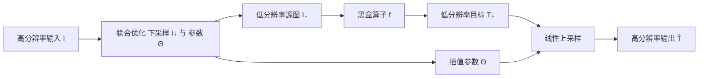

## 一句话总结

提出一种极简的引导式上采样方法（GLU）：把高分辨率图像每个像素表示为两个低分辨率像素的线性插值，并联合优化下采样与插值参数，从而以很小的误差、几乎无伪影地把低分辨率处理结果放大回原分辨率，加速各类高分辨率图像处理。

## 研究背景

- 领域现状：引导式上采样是加速高分辨率图像处理的通用手段——把图像操作施加在大比例下采样后的小图上，再借助原图作引导放大结果，即便对线性复杂度的算子，8× 下采样也能带来约 64× 的提速。经典方法有联合双边上采样（JBU）和双边引导上采样（BGU）。近年的方法多为学习式，质量更好但需针对每个任务单独训练，难以通用。
- 核心痛点：JBU 继承了双边滤波的缺陷，大比例放大时会过度模糊低对比度边缘、产生梯度反转；BGU 依赖局部变换的空间/双边空间平滑约束，容易在不同区域间产生颜色渗色（bleeding），且在去除细节类操作（如平滑）中会把已被抹去的源图细节又带回来。二者参数敏感，难以作为"一套参数通吃"的通用上采样器。
- 本文 idea：回到经典路线，追求一个对各种图像算子都适用的通用上采样器。核心观察是——依据 color line 模型与局部颜色变换假设，只用两个低分辨率像素的线性插值就足以表达自然图像的渐变边缘；把插值参数（像素对索引与权重）逐像素优化到最小化重建误差，并联合优化下采样以免丢失细小结构，即可在保细节的同时抑制伪影。

## 方法

整体框架：给定图像算子 $$f$$ 和高分辨率输入 $$I$$，先把 $$I$$ 下采样为 $$I_\downarrow$$，用黑盒算子得到低分辨率结果 $$T_\downarrow = f(I_\downarrow)$$，再借助原图引导把 $$T_\downarrow$$ 线性上采样为高分辨率输出 $$\hat{T}$$。关键是联合优化下采样图 $$I_\downarrow$$ 与上采样参数 $$\Theta$$，使自上采样误差最小；且该优化只依赖源图、与目标图无关。

关键设计：

- 线性插值表示。假设高分辨率目标图每个像素 $$p$$ 都可由低分辨率邻域 $$\Omega_{p\downarrow}$$ 内一对像素 $$(a,b)$$ 线性插值得到：$$\hat{T}_p = \omega_{ab} T_\downarrow^a + (1-\omega_{ab}) T_\downarrow^b$$。参数 $$\Theta_p = \lbrace a, b, \omega_{ab}\rbrace$$ 逐像素独立优化。由于同一组参数对源图和目标图都最优（局部仿射 + 尺度不变假设下可证），故只需在源图上求解 $$\Theta = \arg\min_\Theta \lVert \hat{I}(\Theta) - I \rVert$$，再套用到目标图。

- 参数闭式解与加速。在 $$3\times3$$ 小邻域内枚举像素对，对每一对 $$(a,b)$$，最优权重使插值结果成为 $$I_p$$ 在 $$I_\downarrow^a, I_\downarrow^b$$ 决定的 color line 上的投影，有闭式解。进一步先把 $$a$$ 固定为邻域内与 $$I_p$$ 颜色最接近的像素，再只优化 $$b$$ 与权重，把复杂度从与 $$\lvert \Omega_{p\downarrow} \rvert$$ 平方降为线性；每像素仅需检查 9 对。若把权重固定为 1，则退化为"引导最近上采样"（GNU），但 GNU 无法恢复渐变边缘、会产生块状伪影与假轮廓，说明线性插值权重是必要的。

- 下采样联合优化。大比例下采样时规则网格采样会整体丢失孤立细线与小区域，上采样也无从恢复。为此把下采样也纳入优化 $$I_\downarrow, \Theta = \arg\min \lVert I - \Psi(I_\downarrow, \Theta) \rVert$$，且要求 $$I_\downarrow$$ 每个像素来自 $$I$$ 的恰好一个像素（不做多像素滤波，避免收缩 color line 端点而模糊细节）。交替迭代：固定 $$I_\downarrow$$ 解 $$\Theta$$，再对误差大的连通区域用"试错-回滚"策略把大误差像素替换进 $$I_\downarrow$$，只接受能降低总误差的替换。通常 1~2 次迭代即收敛，额外计算很少。

- 与既有方法的关系。更一般地 $$\hat{T}_p = \sum_{q \in \Omega_{p\downarrow}} \omega_q T_\downarrow^q$$ 正是 JBU 的形式，但 JBU 的权重未经优化；GLU 与 GNU 都可看作"权重被优化"的 JBU 特例。区别在于 GLU 只取两像素且不要求变换在图像/双边空间平滑，因而能更好保细节、避免过平滑导致的渗色。

## 实验结果

在多种图像算子上与 JBU、BGU 对比（PSNR，↑ 越高越好），下表取 8× 下采样、几个代表性应用：

| 方法 | Alpha Matting | Colorization | $$L_0$$ Smoothing | Dehazing |
|------|--------------|-------------|------------------|----------|
| JBU | 25.6 | 20.9 | 22.3 | 25.9 |
| BGU | 28.3 | 30.7 | 27.0 | 26.8 |
| GLU⁻（无下采样优化） | 31.4 | 29.7 | 23.6 | 27.6 |
| GLU（完整） | 31.5 | 31.3 | 28.8 | 27.6 |

多数应用上 GLU 的 PSNR 优于 JBU 和 BGU；下采样优化对所有任务都能进一步提升 PSNR/SSIM，尤其能保住猫须等细结构。BGU 因强调保留源图结构，在 Colorization、Unsharp Masking 等保结构任务的 SSIM 上占优（Colorization 因仅改色度通道而 SSIM 满分），但在需要去除源图细节的 Matting、Smoothing 上会把已抹掉的细节带回，明显逊于 GLU。速度方面（GTX1650，CUDA 实现 GLU⁻）2K 图约 5ms、4K 图约 14ms，可用于实时视频处理；且联合优化"与目标图无关"，可预计算或与算子并行执行。方法仅 3 个易设参数（窗口 $$3\times3$$、误差阈值 $$30/255$$、最大迭代 3），在 32×/64× 乃至 128× 大比例下仍能取得优于 JBU/BGU 小比例的结果。

## 亮点与局限

- 亮点：
  - 极简且通用——把每个高分辨率像素表示为两个低分辨率像素的线性插值，闭式权重、逐像素独立、易实现、参数少且一套设置通吃各类算子。
  - 联合优化下采样有效防止细小结构丢失，且优化"目标无关"，可预计算/缓存/并行，天然支持交互式编辑的即时反馈与 4K 实时视频处理。
  - 有 color line 模型与局部颜色变换的理论支撑，能把 JBU/GNU 统一为其特例来解释。
- 局限：
  - 基本假设是源图与目标图局部亲和度（affinity）几乎一致；当目标图引入源图中不存在的新边缘时无法恢复，可能产生不平滑伪影（如物体与背景同色时 matting 边界不准）。
  - 因此不适用于会剧烈改变局部结构的应用（如基于学习的风格迁移 CycleGAN），这也是 JBU/BGU 等通用引导上采样器的共性局限。
  - 缺乏显式平滑约束，当源/目标亲和度差异大时可能出现不平滑。

## 延伸思考

- 方法把"上采样"重构成"在局部 color line 上找投影"的低维几何问题，这与基于采样的抠图思路一脉相承；是否能把两像素插值推广到分段/树状 color line 以覆盖更复杂的局部颜色分布，同时不陷入过拟合与外插，值得探索。
- "目标无关的可预计算参数张量"是很实用的工程性质：对同一图施加多个算子时参数可共享，天然契合交互编辑与流水线渲染，可考虑与神经网络推理管线结合，把上采样从网络中剥离以省算力。
- 对新边缘无能为力是硬伤——若能廉价检测目标图中的新边缘并局部切换到学习式或更强的引导策略，或许能弥补通用上采样器在风格迁移类任务上的短板，同时保住其余区域的高效与保真。
