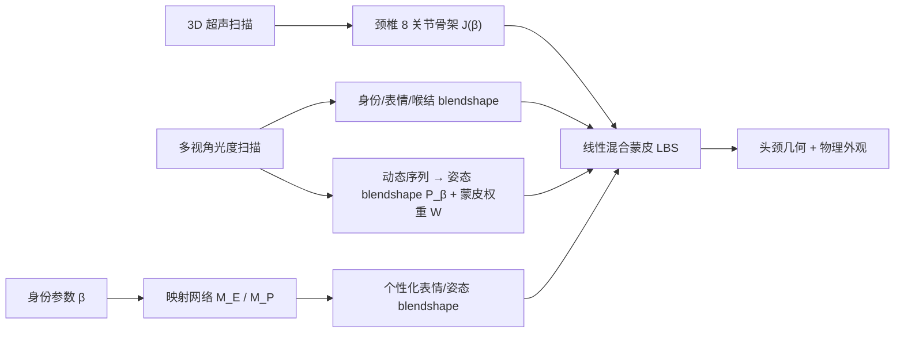

## 一句话总结

HACK 是首个把头部与颈部作为一个整体来建模的参数化模型，它融合了颈椎（7 节椎骨）的解剖学骨架先验与基于物理的外观，能对颈部姿态、喉结滑动、面部表情和身份外观做出个性化且解剖一致的可控驱动。

## 研究背景

- 领域现状：数字人参数化建模（3DMM 及其后续工作）在人体、手、脸上已相当成熟，普遍采用"身份 + 表情 + 姿态"的 blendshape 分解框架（如 FLAME、SMPL、ICT-FaceKit）。
- 核心痛点：作为连接下颌、头部与肩部的"连接件"，颈部长期被忽视。已有少数扩展到颈部的方法几乎都用**单个经验性关节**来近似头颈运动，忽略了颈椎这类内部解剖结构，导致大幅度姿态下出现生物力学上荒谬的形变；同时缺乏能同时覆盖面部与颈部、且含丰富运动的多模态数据集。
- 本文 idea：采集一套涵盖内部解剖结构（超声）与外部外观（多视角光度扫描）的多模态头颈数据集，训练一个解剖一致的参数化模型 HACK，用 8 关节的颈椎骨架取代单关节，并显式建模喉结滑动，实现可微、兼容标准 CG 引擎的高保真头颈动画。

## 方法

整体框架：HACK 沿用人脸/人体建模的 blendshape 分解思路，把头颈几何 $$G$$ 拆解为均值模板、身份、表情、姿态、喉结几项 blendshape 之和，再经线性混合蒙皮（LBS）驱动；外观 $$A$$ 由 PCA 纹理空间生成。模型形式为 $$\text{HACK}(\boldsymbol{\beta}, \boldsymbol{\psi}, \boldsymbol{\theta}, \eta, \tau, \boldsymbol{\alpha}) = \{G(\boldsymbol{\beta}, \boldsymbol{\psi}, \boldsymbol{\theta}, \eta, \tau), A(\boldsymbol{\alpha})\}$$，其中 $$\boldsymbol{\beta}, \boldsymbol{\psi}, \boldsymbol{\theta}, \boldsymbol{\alpha}$$ 分别控制身份、表情、姿态、外观，$$\eta, \tau$$ 分别控制喉结大小与竖直滑动位置。

个性化模板在静止姿态下写作 $$T = \bar{T} + B_S(\boldsymbol{\beta}) + B_E(\boldsymbol{\psi}; E_{\boldsymbol{\beta}}) + B_P(\boldsymbol{\theta}; P_{\boldsymbol{\beta}}) + L(\boldsymbol{\beta}, \eta, \tau)$$。关键设计有四点：

1. **解剖感知骨架**：不再用单关节，而是设计对应 7 节颈椎（C1–C7）加颅骨的 $$K=8$$ 个关节。用便携式 3D 超声成像扫描颈部，由放射科医生标注椎骨特征点，据此优化关节回归器 $$J(\boldsymbol{\beta})$$ 从身份参数预测每个人的关节位置，让旋转中心与椎骨旋转都被准确建模。

2. **个性化表情/姿态 blendshape**：传统模型对所有人共用一套通用 blendshape，会丢失个体细节。HACK 为每个采集对象构建 person-specific 的表情/姿态 blendshape（表情绑定到 FACS 动作单元以便艺术家控制），再对这些集合做 PCA，训练浅层 MLP 映射网络 $$M_E$$、$$M_P$$ 从身份参数 $$\boldsymbol{\beta}$$ 预测其 PCA 权重，从而在保持泛化性的同时生成个性化形变。

3. **喉结建模**：喉部由两组肌肉控制——一组改变喉结大小、一组使其沿颈部竖直滑动。作者把喉结建模为在去喉静止网格上叠加的顶点位移，并在 UV 空间中约束其只能竖直移动：$$L(\boldsymbol{\beta}, \eta, \tau; \mathcal{L}) = \eta \cdot \sum_{i=1}^{\lvert \boldsymbol{\beta} \rvert} \beta_i \mathcal{L}_i(\tau)$$，其中 $$\mathcal{L}_i$$ 是可沿竖直方向平移的喉结 blendshape 基（存为 2D 位移图）。这样既能模拟吞咽、说话时喉结上下滑动，又保证鲁棒性。

4. **带解剖/物理正则的两阶段学习**：先用静止姿态数据学身份、表情、喉结 blendshape 与关节回归器；再用动态序列联合优化姿态 blendshape、喉结函数与蒙皮权重。训练中加入多项先验正则：关节旋转角度限制 $$E_{\text{rot}}$$（依据颈椎解剖调查限定各关节屈伸/侧弯/轴向旋转范围）、相邻椎骨旋转一致性 $$E_{\text{sim}}$$、颈椎与颈部皮肤的碰撞惩罚、以及运动参数的时间平滑项。

## 实验结果

在多个公开数据集上做中性姿态网格配准（registration），以点到面误差（mm，越小越好）对比 FLAME 与 ICT-FaceKit：

| 数据集 | FLAME ↓ | ICT-FaceKit ↓ | HACK ↓ |
|--------|---------|---------------|--------|
| FaceScape | 2.401 | 2.194 | **1.929** |
| VOCASET | 1.406 | 0.958 | **0.913** |
| ICT-3DRFE | 0.397 | **0.366** | 0.376 |
| Multiface | 0.943 | 0.901 | **0.842** |
| 平均 | 1.298 | 1.132 | **1.035** |

HACK 在四个数据集里三个取得最低误差、平均误差最低。空间紧致性方面：形状空间前 50 主成分覆盖 95.5%、200 个覆盖 99.5%；喉结形状空间前 10 个覆盖 95.2%；表情空间前 30 个覆盖 86.4%；姿态空间 6 个成分覆盖 87.9%。消融实验表明，用个性化表情/姿态 blendshape 相比通用 blendshape，在未见表情和姿态上的几何重建都更准确、更能还原个体特征（如颈部肌肉与脂肪的相互遮挡关系）。

## 亮点与局限

- 亮点：
  - 首个把头与颈作为统一实体、并引入颈椎解剖骨架先验的参数化模型，避免了单关节近似导致的生物力学失真。
  - 采用无辐射、低成本的便携 3D 超声获取内部椎骨结构，构建了含 624 个身份、16078 次网格配准的多模态数据集。
  - 通过身份到 blendshape 的映射网络实现个性化控制，同时保留通用模型的泛化性；模型可微、兼容标准 CG 管线。
  - 支持从头部姿态/表情到颈部骨架与喉结运动的相关性合成，甚至能跨物种（人→长颈鹿）迁移颈部运动。

- 局限：
  - 动态姿态 blendshape 仅由 12 个身份的序列学得，个性化姿态空间的数据规模偏小，作者也承认需要更多动态采集才能充分发挥个性化建模能力。
  - 超声关节标注依赖放射科专家手工标点，喉结去除也需专业艺术家介入，数据处理流程较重、难以完全自动化。
  - 喉结滑动被约束为 UV 空间竖直方向的简化运动，对更复杂的喉部形变可能不够精细。

## 延伸思考

HACK 把"内部解剖先验 + 外部光度外观"结合进经典 blendshape 框架，思路上与近年强调解剖约束的人体/手部建模一脉相承，同时保留了 3DMM 系模型可微、可编辑、易接入生产管线的优点，比纯神经渲染的头部模型更实用。值得追问的是：超声获取的椎骨骨架先验能否推广到其它需要内部结构的连接部位（如肩、腰）；映射网络从身份到个性化 blendshape 的范式，是否能与如今的隐式/高斯表征头像结合，在保持可控性的同时进一步提升外观真实度；以及跨物种迁移是否能扩展到骨骼结构差异更大的动物。
