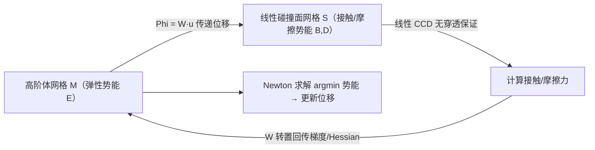

## 一句话总结
把高阶有限元（高阶几何 + 高阶基函数）引入 IPC（Incremental Potential Contact）弹性动力学求解器：让碰撞在一张便宜的线性碰撞代理网格上处理，而弹性势能在昂贵的高阶体网格上求解，两者通过一个线性算子来回传递位移与接触力，从而在保留 IPC 无穿透强保证的同时享受高阶基的效率与鲁棒性。

## 研究背景
- 领域现状：可变形体的弹性动力学模拟广泛用于图形、机器人、力学工程与生物力学。图形领域几乎清一色用线性四面体 + 线性（帽状）基函数，因为位移施加后网格仍是分片线性的，便于高效鲁棒地做连续碰撞检测（CCD）。
- 核心痛点：线性基/线性网格有两大限制。其一，粗线性网格会引入人为刚度（locking，锁死），无法正确弯曲；其二，高阶基本可以用更少自由度达到同等精度，但曲面网格之间、或线性网格沿曲线轨迹之间的碰撞检测又极其昂贵，难以做到保守（不漏检）。因此高阶基在带接触的动力学问题中几乎无人使用，或干脆在接触计算里忽略高阶位移。
- 本文 idea：作者的关键观察是——即便基函数 $$\varphi_i$$ 是非线性的，某个 IPC 优化步内位移的更新仍然是节点位移的线性组合，因而在一个精心设计的碰撞代理上，表面顶点的轨迹依然是直线。于是可以用一个线性算子 $$\Phi$$ 把高阶体网格的位移映射到一张线性碰撞面网格上，在那里沿用标准的线性 CCD，接触力再映射回体网格。

## 方法
整体框架：把原始 IPC 的单一网格解耦成两张网格——负责弹性势能 $$E$$ 的高阶体网格 $$\mathcal{M}$$，和负责接触/摩擦势能 $$B, D$$ 的线性碰撞面网格 $$\mathcal{S}$$。一个线性传递算子 $$\Phi$$（矩阵 $$\boldsymbol{W}$$）在两者间搬运位移与力。因为 $$\Phi$$ 线性，碰撞代理顶点在单步优化中的轨迹保持直线，标准线性 CCD 得以复用。

原始 IPC 每步求解一个无约束非线性能量最小化：

$$u^{t+1} = \arg\min_u \; E(u, u^t, v^t) + B(x+u, \hat{d}) + D(x+u, \epsilon_v)$$

本文将其改写为让 $$E$$ 依赖体网格 $$\mathcal{M}$$、而 $$B, D$$ 只依赖面网格 $$\mathcal{S}$$：

$$u^{t+1} = \arg\min_u \; E_{\mathcal{M}}(u, u^t, v^t) + B_{\mathcal{S}}(V_{\mathcal{S}} + \Phi(u), \hat{d}) + D_{\mathcal{S}}(V_{\mathcal{S}} + \Phi(u), \epsilon_v)$$

关键设计：

1. **线性传递算子 $$\Phi$$ 的核心洞察**：位移场写成基函数展开 $$f_{\mathcal{M}} = \sum_i f^i_{\mathcal{M}} \varphi^i_{\mathcal{M}}$$，一步更新为 $$\sum_i \Delta u_i \varphi_i$$——无论基阶数多高，更新量都是节点位移的线性组合。因此把体网格系数向量映射到面网格系数向量只是一次矩阵乘 $$\boldsymbol{f}_{\mathcal{S}} = \boldsymbol{W}\boldsymbol{f}_{\mathcal{M}}$$，与基的阶数无关。更妙的是 $$\Theta_{\mathcal{S}}$$ 不必是 $$\Theta_{\mathcal{M}}$$ 的子空间——碰撞网格分辨率可以远高于体网格。

2. **升采样构造 $$\mathcal{S}$$**：对高阶体网格 $$\mathcal{M}$$ 的边界做升采样，得到一张稠密的分片线性近似作为 $$\mathcal{S}$$。每个面顶点 $$v^j_{\mathcal{S}}$$ 在参考四面体里有坐标 $$\hat{v}^j$$，全局坐标由几何映射 $$v^j_{\mathcal{S}} = g_i(\hat{v}^j)$$ 得到；传递权重直接取 $$W_{ji} = \varphi^i_{\mathcal{M}}(\hat{v}^j)$$。

3. **任意三角网格代理**：也允许用一张与 $$\mathcal{M}$$ 完全不同的三角网格当碰撞代理（对近刚性物体很有用）。此时需为每个面顶点求几何映射的逆——先在线性化的四面体里找最近元素与重心坐标做初值，再用 L-BFGS 优化 $$\arg\min_{\hat{v}} \lVert g_i(\hat{v}) - v^j_{\mathcal{S}} \rVert_2^2$$ 反演 $$g_i$$。这一步只需在静止几何上做一次，因为 $$\boldsymbol{W}$$ 只依赖静止形状。

4. **对 IPC 求解器的最小改动**：只需改装配阶段的梯度与 Hessian。表面势能梯度写成 $$\nabla_u B_{\mathcal{S}} = \boldsymbol{W}^\top \nabla_{\mathcal{S}_u} B_{\mathcal{S}}$$，Hessian 为 $$\boldsymbol{W}^\top [\nabla^2_{\mathcal{S}_u} B_{\mathcal{S}}] \boldsymbol{W}$$。表面项本身的公式与原 IPC 完全一致，因此现有实现只需极小修改。

## 实验结果
方法在多个场景验证，核心结论是：粗高阶网格能以远低的计算成本得到与稠密线性网格几乎无异的动力学结果。下表汇总各代表场景下相对稠密线性基线的加速比与效果。

| 场景 | 本文配置 | 相对基线加速 | 效果说明 |
|------|----------|--------------|----------|
| 弯曲梁 | 粗 $$P_3$$（52 四面体） | 约 10× | 与稠密 $$P_1$$ 参考解几乎不可区分；等时预算的粗 $$P_1$$（1124 四面体）仍明显偏离 |
| 弹跳球 | 曲面网格 + $$P_2$$ | 38.4 vs 3.9 帧/秒 | 接近稠密线性的正确弹跳轨迹，且维持实时 |
| 滚球 | 立方体 FE 网格（26 $$P_1$$ 四面体） | 7.5× | 与 8.8K 四面体球网格动力学相近，仅接触点略偏硬 |
| 垫子扭转 | 粗网格 + $$P_2$$ | 约 10× | 无粗线性网格的截面伪影，效果媲美稠密网格 |
| Armadillo 滚压 | 高阶/代理组合 | 8×–60× | 不同代理策略在速度与精度间取舍 |

其余场景（微结构压缩、螺母-螺栓、垃圾压缩机、平衡 armadillo）用文字佐证：任意三角代理与各向异参数（形状与基阶数不同）配置均可行；对刚性物体做极端粗化可在无可见差异下提速约 2×；粗化改变质心时可像 [Prévost et al. 2013] 那样调密度重新平衡。

## 亮点与局限
- 亮点：
  - 用一个线性算子巧妙地把"高阶弹性 + 线性碰撞"解耦，保住了 IPC 的无穿透强保证与大时间步，代价是对现有实现的改动极小。
  - 碰撞网格与体网格解耦后，可在效率与精度间做细粒度调节；还能用任意碰撞代理，方便近刚性材料模拟。
  - 本质是"弹性用 $$p$$-加密、接触用 $$h$$-加密"，绕开了昂贵的曲面连续碰撞检测这一开放难题。
  - 开源实现基于 PolyFEM，降低了社区采用门槛。
- 局限：
  - 接触面始终是曲面几何的近似，误差可通过加密减小但无法归零；对需要精确建模高阶曲面的工程应用可能不适用（会漏检曲面 FE 网格的碰撞）。
  - 高阶单元的鲁棒正定性检查仍是开放问题，实现里只在积分点检查，内部其他点可能出现负行列式导致非物理结果。
  - 任意三角代理的最近点反演映射不够鲁棒，可能产生错误对应；作者建议未来用双射映射解决。

## 延伸思考
- $$\Phi$$ 的选择并不唯一，作者试过均值坐标与线性化 $$L^2$$ 投影，但全局映射会产生稠密权重矩阵拖慢速度；更局部的算子（如有界双调和权重）值得探索。
- 三条明确的未来方向：更可靠的高质量曲面网格生成器；扩展到六面体单元、样条基与等几何分析框架；结合高阶时间积分器进一步压低数值阻尼。
- 这项工作是把高阶 FEM 引入带 IPC 接触的弹性动力学的第一步，思路上与减模型（C-IPC、刚体 IPC、affine body、medial elastics）形成互补——后者面向特定场景做极致加速，本文则在通用可变形体框架内提供效率与精度的平滑权衡。
