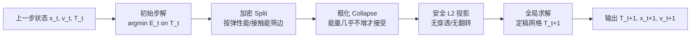

## 一句话总结

提出 In-Timestep Remeshing（ITR），把网格加密/粗化的判据、操作和量的映射全部**紧耦合进每一步时间积分的隐式求解内部**，用物理能量的真实下降来驱动自适应，从而在接触主导的弹性动力学里做到既省自由度又保证无穿透、无翻转的稳定轨迹。

## 研究背景

- 领域现状：大变形弹性动力学要抓住冲击波、压痕这类瞬态细节，往往需要极密的网格，代价高昂。自适应网格（AM）通过在需要的地方局部增删自由度来缓解，但现有做法几乎都是**在两步时间积分之间**进行重网格。
- 核心痛点：这种"解算—重网格—映射"的解耦流水线有三大结构性问题。其一，判据只能在当前固定离散化下用几何或物理量的快照做**间接代理**，无法直接衡量重网格对物理解的影响，且换个材料/速度/边界就得重新调参；其二，局部操作和量的映射会**破坏无穿透、无翻转这两个关键不变量**，只能靠事后修补，而修补会引入误差、注入能量、带来抖动与不稳定；其三，映射本身把物理量投到新离散空间必然有误差，还会让"解"与"它所在的网格"不一致。接触场景把这些问题放大到极致。
- 本文 idea：既然问题源于"解耦"，那就**彻底耦合**。借助 Incremental Potential Contact（IPC）这一光滑、可收敛的摩擦接触模型，把整步求解写成对一个增量势能（merit function）的最小化；于是能量下降本身就是判据——加密要能显著降能、粗化要几乎不增能，全过程还始终维持不变量。

## 方法

整体框架：每个时间步不再是"先解、再改网格、再映射"，而是把加密、粗化、映射都塞进这一步的隐式最小化里。ITR 先在当前网格上求一个初始步解，再依据能量做加密，接着做粗化，中间所有量都用"安全投影"搬到新网格，最后在定稿网格上做一次全局收敛求解。

关键设计：

1. **物理能量作为统一判据。** 在连续设定下，整步解就是在所有合法变形里最小化增量势能 $$E_t(x)$$，其中含弹性势、IPC 接触屏障与摩擦伪势。给定网格 $$\mathcal{T}$$ 的"网格质量"直接用 $$m_t(\mathcal{T}) = \min_x E_t(x, \mathcal{T})$$ 度量。谁能让这个值更低，谁就是更好的离散化——这是一个天然贴合当前时间步、且同时考虑接触与材料力平衡的判据，不再需要几何代理和逐例调参。

2. **安全约束 $$L_2$$ 投影。** 改网格就换了有限元函数空间，量必须投影过去。作者首次把力学界常用的 $$L_2$$ 投影引入图形学自适应网格（比最近点采样、重心插值误差都小），再在其上加约束：把无穿透（IPC 接触屏障）和无翻转（一个作用在四面体体积上的对数屏障 $$I_{\mathcal{T}}$$）写进最小化，得到一个既最小化映射残差、又保证不变量的**全局单射映射**。一个便利之处：加密时重心插值恰好等价于零误差的 $$L_2$$ 投影，所以边分裂可以廉价地直接插值。

3. **局部操作 + 贪心块坐标下降 + 剔除启发式。** 只用边分裂和边坍缩两类操作（2D/3D 通用）。由于离散优化找全局最优序列不现实，改成贪心：对候选操作做**局部小范围重解**（固定除局部补丁外的所有节点，以初始解 warm start），分裂满足足够降能 $$\delta E > \delta_s$$ 就接受、坍缩只在能量增幅小于容差 $$\delta_c$$ 且不破坏不变量时接受。为控制每步开销，先按单元的弹性能/接触能排序，只取能量最集中的前 $$\epsilon_S\%$$ 边做分裂候选、后 $$\epsilon_C\%$$ 做坍缩候选，把大概率无效的操作提前剔除。所有连通性改动都能预览、检查不变量并回滚（借助 Wildmeshing-toolkit 的声明式重网格）。

4. **收尾全局求解。** 因为前面已经通过一系列局部解把解"松弛"得很接近了，最后在定稿网格上的整域再求解迭代次数很少、开销低，输出即是在新网格上收敛、且相对上一步时间一致的无穿透无翻转解。

## 实验结果

主实验是与"逐级均匀加密（UR 0–3）"的效率对比：在质量可比、无瑕疵的前提下，ITR 用远少的自由度（DOF）达到同等效果，从而大幅缩短占主导的稀疏线性求解时间。下表取自五个基准场景，列出 ITR 的平均 DOF 与最细均匀网格 UR 3 的对比，以及两者的平均线性求解时间（秒）。

| 场景 | Ours DOF(avg) | UR 3 DOF | Ours 线性求解(s) | UR 3 线性求解(s) |
|------|--------------|----------|-----------------|-----------------|
| Ball on spikes | 43k | 6M | 0.25 | 201.77 |
| Masticator(3D) | 16k | 476k | 0.22 | 9.39 |
| Gorilla rollers | 22k | 5M | 0.17 | 245.44 |
| Bar-twist | 24k | 476k | 0.21 | 8.77 |
| Impacting ball | 50k | 1M | 0.37 | 126.68 |

综合所有场景，ITR 相对可比的均匀加密基线实现 2.6×~185× 的 DOF 缩减、对应 2.7×~1,444× 的线性求解加速。不过由于重网格开销目前未做并行/优化，端到端墙钟时间**有增有减**：像需要强局部加密的 ball-on-spikes 快 3.3×，而结构简单的 bar-twist 反而慢 9.6×。此外能量分析显示：加密步显著降低增量势能，粗化步在去掉自由度的同时几乎不增能；ITR 在高速冲击（球以 67 m/s 撞墙）、自接触扭转屈曲、驱动波传播等极端算例中均保持稳定、无抖动。

## 亮点与局限

- 亮点：
  - 首个把重网格判据/操作/映射**全部耦合进时间步隐式求解**、并与 IPC 接触模型兼容的自适应方法；判据由真实能量下降驱动，天生 physics-aware，免去几何代理和逐例调参。
  - 提出"安全约束 $$L_2$$ 投影"，在最小化映射误差的同时保证全局单射，从根上避免了传统流水线的穿透/翻转与事后修补带来的误差和不稳定。
  - 在自由度和线性求解时间上收益巨大（最高 185× / 1,444×），且在跨越极大材料刚度差、大时间步、尖锐接触、高速冲击等硬算例中稳定可靠。
- 局限：
  - 重网格开销当前是线性但未优化、未并行，导致部分简单场景端到端反而更慢（最多慢 9.6×）；作者列出并行化、局部化碰撞检测、时空相干性、高阶基等改进方向。
  - 缺少正式的收敛性研究：悬臂梁收敛测试显示 ITR 的收敛行为**强依赖初始离散化**，且与网格质量控制密切相关。
  - 仅针对无断裂的弹性动力学，断裂/切割/表面追踪等留作扩展。

## 延伸思考

- ITR 把"离散化"当成一个和位移并列的"构型自由度"来优化，这个视角与可微仿真、r-adaptive 移动网格、以及层次化求解器（如针对 IPC 的多分辨率求解）天然互补——把层次化求解嵌进 ITR 有望解决其最大短板（重网格墙钟开销）。
- 判据从"几何代理"转向"真实能量增益"是核心思想，可迁移到壳、布料、断裂乃至流固耦合等其它需要自适应的物理问题；难点在于为这些模型构造同样光滑、可收敛的 merit function。
- 收敛性对初始网格敏感这一点提示：把网格质量度量显式纳入接受判据、或结合 r-adaptive 平滑，可能是让该方法从"经验有效"走向"可证明收敛"的关键一步。
