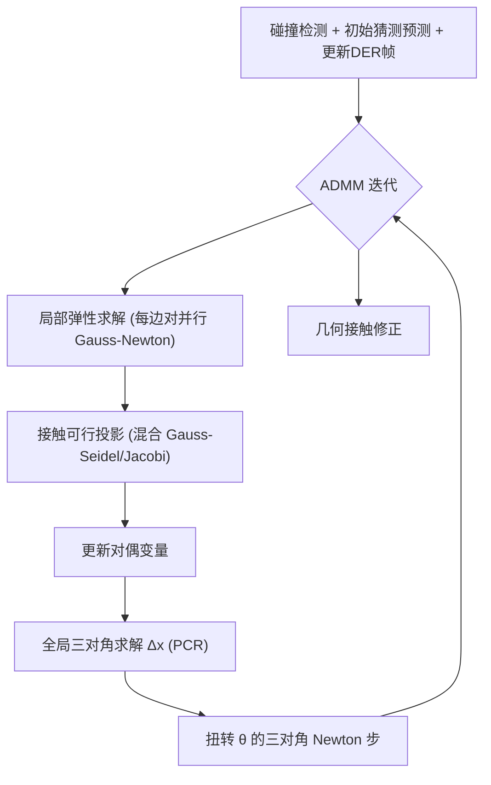

## 一句话总结
本文提出一个专为 GPU 大规模并行架构设计的 ADMM 局部-全局求解器，用来实时模拟带库仑摩擦的离散弹性杆（DER）头发，把高分辨率发型的迭代时间从"以天计"压到"以分钟/实时计"，从而打开了物理驱动的交互式发型编辑这一新工作流。

## 研究背景
- 领域现状：头发的整体行为不仅由单根发丝的弹性决定，更由发丝之间大量的摩擦接触主导，这对数值模拟器是巨大挑战。DER 模型已被证明既能复现解析结果、也能匹配物理实验，是描述发丝的成熟离散化方案；同时 ADMM/投影动力学这类局部-全局积分器为可并行求解提供了思路。
- 核心痛点：传统方法要么用全局 Newton 迭代（左端矩阵稠密或带状、条件数差、常需双精度、GPU 上访存低效），要么用纯局部方法如 XPBD（可高度并行但应变每次迭代只传给直接邻居，长链条收敛慢，且弯曲/扭转项无法用 follow-the-leader 等长程约束加速）。高保真头发模拟因此算力开销极大。此外数字发型编辑通常只做几何操作、不含物理信息，加入重力后会出现非预期的"下垂"，而事后反推物理参数的问题既欠定又超定。
- 本文 idea：不去事后反推物理量，而是让发型编辑过程本身运行在一个完整的物理模拟里。为此需要一个介于纯全局与纯局部之间的求解器——左端矩阵能在 GPU 上高效求解、又能全局传播应变。作者用 ADMM 精心拆分 DER + 摩擦接触的隐式时间积分问题，把它化归为可并行的**三对角**全局系统 + 令人尴尬地并行的局部弹性/接触投影步。

## 方法
整体框架：以后向 Euler 隐式积分写出增量优化问题（弹性能 + 外力能 + 接触约束），再用 ADMM 引入辅助变量做目标拆分——但只引入达成"三对角系统"所需的最少辅助变量。每个 ADMM 迭代依次在各变量上求解：局部弹性 proximal 算子（对边对 $$\boldsymbol{y}$$）、接触可行投影（对辅助位置 $$\boldsymbol{z}$$）、对偶变量的显式梯度步、全局位置 $$\boldsymbol{x}$$ 的三对角求解、扭转 $$\theta$$ 的单步 Newton 三对角求解，每次更新位置/扭转后用时间平行传输更新 DER 参考帧与材料帧。

关键设计：

1. **ADMM 目标拆分成三对角系统**：引入两个原变量 $$\boldsymbol{y}$$（相邻边对，承载弯曲与拉伸能）和 $$\boldsymbol{z}$$（跟踪原位置、承载碰撞约束），以及对应的对偶变量。外力能与固定约束仍留在原始变量上。作者刻意不对每个能量项都做 ADMM 处理（ADMM 用收敛速度换取更简单的全局系统），从而让全局步中 $$\boldsymbol{B}^T \boldsymbol{W}_y \boldsymbol{B}$$ 可重排为三个独立的对称正定三对角系统（每个欧氏坐标轴一个），扭转步同理。

2. **GPU 友好的并行三对角求解（PCR）**：不用串行的 Thomas 算法，改用并行循环缩减（Parallel Cyclic Reduction），只需 $$\log m_\infty$$ 个串行步、访存模式好。工作缓冲放进 GPU 共享内存，在 64KB 共享内存下可求解 $$m_\infty \le 1024$$ 的系统而无需跨 block 同步，足够覆盖所有头发任务。PCR 无独立的分解/求解步，因此在迭代间**动态调整 ADMM 约束权重零成本**——这被用来动态更新碰撞权重。

3. **合并弯曲+拉伸的局部弹性 proximal 算子**：不像常规做法把每个能量项分开解，而是把弯曲 $$E_b$$ 与拉伸 $$E_s$$ 合并处理。直觉上拉伸抵抗沿边方向的形变、弯曲抵抗垂直于边的形变，合并后能量在 $$\mathbb{R}^6$$ 上强制（coercive），局部问题条件数良好，可用单精度 LDLT 无主元分解高效解 $$6\times6$$ 系统（单步 Gauss-Newton 近似）。此外在旋转不变的局部帧（取每根杆的根部附着帧）中做局部解，缓解 ADMM 对旋转收敛慢的问题；还支持应变率阻尼。

4. **混合 Gauss-Seidel/Jacobi 的摩擦接触求解**：纯 Gauss-Seidel 所需串行步数不小于每顶点最大接触数（本场景可达数百），在 GPU 上负载不均。作者把接触启发式地分成少量批次（实现里 8 个），批次间按 Gauss-Seidel 顺序处理、批次内用完全并行的 Jacobi 求解。为保证 Jacobi 的收敛性（避免重复接触导致过冲），借鉴"顶点虚拟拆分"思想——把顶点按其接触数拆成多个虚拟顶点、各分一份权重，等价于修改 Delassus 算子对角。碰撞检测用稀疏哈希网格 + 18-dops 宽相剔除，连续碰撞用 ACCD 估计撞击时刻。

## 实验结果
性能主实验（24fps、每帧 4 个时间步、每步 10 次 ADMM 迭代；CT 表示启用连续时间碰撞）：

| 场景 | 顶点数 | 接触数 | 每帧时间 (s) | 峰值显存 (GB) |
|------|--------|--------|--------------|----------------|
| Hairball 16k | 480k | 1.41M | 0.18 | 1.1 |
| Hairball 16k, CT | 480k | 2.10M | 0.29 | 1.3 |
| Hairball 128k | 3.8M | 27M | 5.6 | 9.8 |
| Hairball 128k, CT | 3.8M | 34M | 6.78 | 2×9.4（双卡） |
| Long 10k, CT | 339k | 1.7M | 0.28 | 0.9 |
| Long 47k, CT | 1.4M | 10M | 3.5 | 5.4 |
| Curly 24k, CT | 617k | 1.5k | 0.25 | 1.4 |

在单张 GeForce 3080 Ti 上，16k 发丝的毛球可跑到交互帧率；全分辨率 128k 毛球约 40 分钟跑完一段序列——相比之下 Daviet [2020] 的 CPU 实现需要约半周，而 Kaufman 等人的求解器显存需求已不可行。

验证实验方面，作者在 Romero 等人提出的三个解析基准（悬臂 cantilever、弯扭 bend–twist、粘滑 stick–slip）上复现了理论结果：悬臂实验中通过修正边界 Voronoi 长度定义显著改善了与解析纵横比的吻合；粘滑实验复现出摩擦系数临界值 $$\mu_c \approx 0.36$$（超过该值无法再滑动）。应用上，物理驱动发型编辑可对约 86,000 根渲染曲线（其中 8,600 根被模拟、约 120k 顶点）做实时反馈编辑，每帧 10 次 ADMM 迭代平均 17ms。

## 亮点与局限
- 亮点：
  - 核心贡献是精巧的 ADMM 拆分，把 DER + 摩擦接触的隐式积分变成**大规模并行、单精度友好**的三对角全局解 + 并行局部步，真正契合现代 GPU。
  - 用 PCR 求三对角系统 + 共享内存布局，且 PCR 无预分解开销，使动态调整约束权重零成本。
  - 混合 Gauss-Seidel/Jacobi 接触求解 + 顶点虚拟拆分，在保证收敛性的同时最大化 GPU 吞吐；还支持跨双卡处理超大场景。
  - 性能相对 CPU 方案有数量级提升，并落地为可实时预览的物理发型编辑工具（含引导发丝 + 蒙皮）。
- 局限：
  - ADMM 收敛性不如 Newton 那样被充分理解；权重靠启发式缩放，对非典型人发材料（如各向异性、边长/弹性模量方差大、拉伸与弯曲刚度差异大）的表现不明确。
  - 在小型解析基准上的验证能否推广到"迭代次数受限的大场景"尚不清楚，缺乏大规模接触杆组的验证实验。
  - 基于互补性的接触求解**不具备**近期 barrier 方法的无穿透保证，纯 proximity 的 128k 场景会出现非预期缠结。
  - 尚未建模发用产品、空气交互、与软体的双向耦合；物理发型编辑要实用还需解决触觉反馈、智能选择等 UX 问题。

## 延伸思考
- 与 barrier/IPC 类方法（Li et al. 2020/2021）的结合值得关注：把本文高可扩展的求解器与 barrier 的时间步 clamping 思路融合，可能兼得吞吐与无穿透保证。
- 引导发丝 + 线性混合蒙皮的做法为"少量模拟 + 大量插值"提供了范式，可替换为更先进的实时/神经插值来提升视觉一致性。
- ADMM 全局系统被刻意压成三对角，这种"为并行硬件反向设计离散化/拆分"的思路，对其他细长结构（绳、布的经纬纱、血管等）的 GPU 模拟有借鉴意义。
- 作者提到在准静态设定下引入"数值动量"或可加速长钩状构型收敛，是一个具体且可操作的后续方向。
