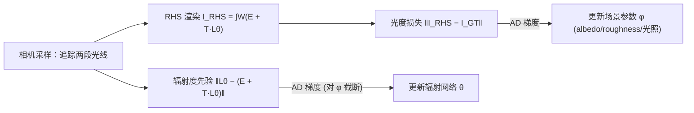

## 一句话总结

用一个满足渲染方程的神经辐射场作为"辐射度先验"（正则项），把带全局光照的逆渲染变成可以用标准自动微分求解的单次弹射问题，从而在不构建多弹射路径积分的前提下，以更低的时间和显存成本恢复出与路径重放反传（PRB）相当甚至更好的场景参数。

## 研究背景

- 领域现状：逆渲染（从 2D 图像反推 3D 场景参数）近年发展迅速，考虑全局光照的方法越来越流行。要做到这一点，核心是一个可微渲染器加一套把损失梯度传到场景参数的算法。
- 核心痛点：直接对路径积分做标准自动微分（AD）会构建一张巨大的运算图，显存开销随弹射次数急剧膨胀，实际只能退化到直接光照或单次间接光照，被忽略的多次互反射会被"烘焙"进恢复的材质里。为缓解显存问题，辐射反传（RB）及其加速版 PRB 用伴随方法回避了存储运算图，能准确重建全局光照，但实现复杂、依赖精巧的路径采样策略，尚未被"平民化"。
- 本文 idea：与其构建并微分完整的路径积分，不如把渲染方程本身当作一个物理约束加进优化目标。借助 Neural Radiosity 的思路，用神经网络表示辐射函数，并把渲染方程残差的范数作为"辐射度先验"损失项。这样每步只需一次弹射，即可用标准 AD 高效求梯度，同时仍正确体现全局光照。

## 方法

整体框架：同时优化两组参数——一组神经网络 $$\boldsymbol{\theta}$$ 表示场景中的辐射场 $$L_{\boldsymbol{\theta}}(x, \omega_o)$$，另一组 $$\boldsymbol{\phi}$$ 表示待恢复的场景参数（空间变化的 albedo、roughness，或环境光照）。总损失由两部分组成：让渲染结果贴合输入图像的光度损失，以及强制辐射场满足渲染方程的辐射度先验。

关键设计：

1. **辐射度先验作为物理正则项**。先验定义为渲染方程左右两边之差的范数
$$L_{\text{prior}}(\boldsymbol{\theta}) = \lVert L_{\boldsymbol{\theta}}(x, \omega_o) - (E(x, \omega_o) + \mathcal{T}(L_{\boldsymbol{\theta}})(x, \omega_o)) \rVert$$
其中 $$\mathcal{T}$$ 是渲染方程里的半球传输算子。最小化该残差等价于让神经网络"自训练"地解出满足全局光照的辐射场，无需任何真值监督。逆渲染的联合目标为
$$\boldsymbol{\phi}^*, \boldsymbol{\theta}^* = \arg\min_{\boldsymbol{\phi}, \boldsymbol{\theta}} \; L(I(\boldsymbol{\phi})) + L_{\text{prior}}(\boldsymbol{\theta})$$

2. **RHS 渲染：绕开路径积分的成像模型**。像素不再用蒙特卡洛路径追踪估计，而是直接用受先验约束的辐射场评估渲染方程右端：
$$I_k = \int_A \int_{H^2} W_k \, (E + \mathcal{T}(L_{\boldsymbol{\theta}})(x, \omega)) \, dx \, d\omega^{\perp}$$
由于只涉及一次传输算子评估、不含长路径积分，光度损失对 $$\boldsymbol{\phi}$$ 的梯度可用标准 AD 直接算出，无需伴随法。

3. **梯度流的定向切断**。虽然先验和光度损失都同时依赖 $$\boldsymbol{\theta}$$ 和 $$\boldsymbol{\phi}$$，但作者在实践中发现：先验的梯度只用来更新辐射网络 $$\boldsymbol{\theta}$$（对场景参数 $$\boldsymbol{\phi}$$ 截断），场景参数只由光度损失更新。这样辐射场对"任意"场景参数都保持满足渲染方程的约束，若让先验反过来影响 $$\boldsymbol{\phi}$$ 反而损害结果。

4. **采样与增强项**。默认复用相机采样得到的主命中点与两段光线来估计先验（one bounce prior）；追加一段光线可在次级命中点也施加先验（extra bounce prior），覆盖相机不直接可见的位置。此外还可用真值图像直接约束辐射场（LHS loss $$\lVert I_{\text{LHS}}(\boldsymbol{\theta}) - I_{\text{GT}} \rVert^2$$），带来额外的小幅提升。方法用 Mitsuba 3 与 PyTorch 混合实现，辐射场是带 hash grid 的 3 层 256 宽 MLP，albedo/roughness 各用一个更小的 MLP，采用 Burley BRDF。

## 实验结果

在多个合成室内场景与 NeRF 数据集场景上恢复 albedo 与 roughness，对比直接光照 AD（AD-Direct）、PRB，以及只用真值图像训练辐射场不加先验的消融（w/o Prior）。下表取 Staircase 场景（强间接光照）单一视角的 PSNR（越高越好）及全场景总运行时间：

| 指标 | AD-Direct | w/o Prior | PRB | AD-Ours |
|------|-----------|-----------|-----|---------|
| Rendering PSNR↑ | 11.72 | 29.04 | 30.34 | 33.00 |
| Albedo PSNR↑ | 8.65 | 20.89 | 24.93 | 27.03 |
| Roughness PSNR↑ | 7.54 | 16.37 | 17.25 | 16.38 |
| 总运行时间↓ | 760 min (AD-PT) | — | 970 min | 260 min |

结论：本文方法在大多数场景恢复精度与 PRB 相当、部分更优，而运行时间约为 PRB 的四分之一、AD 路径追踪的三分之一（同一张 RTX3090）。直接光照因忽略互反射产生明显烘焙伪影；不加先验只拟合像素的方案收敛更差（Staircase 场景甚至发散）。在 Cube 场景中，随墙面 albedo 增大（平均路径长度从 1.43 涨到 32.89），AD-PT 的显存与耗时随之膨胀直至爆显存，而本文方法与 PRB 保持常数显存，且本文方法耗时恒定、更快。

## 亮点与局限

- 亮点：
  - 概念简单——把渲染方程当正则项，配合标准 AD 即可，避开了 RB/PRB 那套复杂的伴随路径采样，工程门槛低。
  - 时间与显存开销独立于全局光照所需的路径长度（每步只追一次弹射），在强互反射场景优势明显。
  - 神经辐射场的预测本身无噪声，梯度更平滑、收敛更稳。
- 局限：
  - 梯度是有偏的：一是神经辐射场只是真值的近似，二是方法假设 $$\partial_{\boldsymbol{\phi}} L = 0$$（不对辐射场关于场景参数求导）。可通过截断级数保留 $$k>1$$ 个可微弹射来减小偏差，但论文所有结果用 $$k=1$$ 已够用。
  - 不建模镜面材质的出射辐射，遇到镜面链仍退化为微分路径积分，若场景大量镜面则重回 AD-PT 的大运算图困境。
  - 只做了材质或光照的单独恢复，几何重建与联合优化不在范围内；也未显式处理可见性不连续（仅寄望网络的平滑性缓解）。

## 延伸思考

- 本文是 Neural Radiosity 系列的逆渲染延伸：前作用残差先验解正向渲染，此处把同一先验搬到逆问题里当物理约束，思路优雅。相比"先跑一个现成 NeRF 再估全局光照"的做法，本文把物理约束直接嵌进优化，精度不再受制于预训练辐射场的质量。
- "把控制方程残差当损失"与 PINN（物理信息神经网络）一脉相承，辐射场在这里扮演了可微、常数开销的全局光照缓存。一个自然的追问是：这种有偏但廉价的梯度在联合几何/材质/光照优化、或存在大量可见性不连续的真实场景中，能否仍收敛到物理正确的解。
- 常数显存/耗时的特性对复杂室内场景的可微渲染很有吸引力；若能把镜面链也纳入神经表示，或与近期可微可见性处理结合，应用面会更广。
