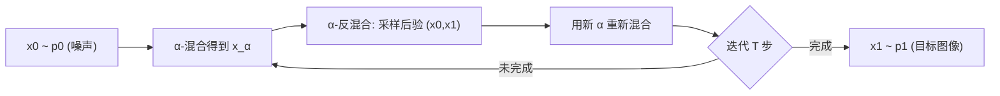

## 一句话总结

只用本科水平的微积分和概率，把"随机采样的混合与反混合"迭代起来，就能推导出一个与 DDIM 等价、却更简单、更数值稳定、效果更好的确定性扩散模型。

## 研究背景

- 领域现状：扩散模型已成为主流生成工具，先有随机扩散（用 Langevin 动力学 / SDE 描述噪声注入与去除的平衡），后有确定性扩散（把 SDE 的随机项置零得到 Probability Flow ODE，如 DDIM 是 DDPM 的 ODE 版本）。确定性版本迭代次数少、样本由初始噪声唯一确定，便于编辑与插值。
- 核心痛点：确定性扩散是作为随机扩散的特例被"事后"提出的，因而继承了 Langevin 动力学、score matching、SDE 等研究生级别的数学包袱。要理解它，门槛过高，对非专家不友好。
- 本文 idea：换一个思路。只考虑两个分布的样本被线性插值（混合）后会发生什么，再把"混合—反混合"迭代起来。作者证明这个过程会收敛到一个确定性映射，且这个映射恰好等价于 DDIM，但推导只需最基础的采样概念。

## 方法

整体框架：把生成看成在两个分布 $$p_0$$（如高斯噪声）与 $$p_1$$（如猫图）之间建立映射。核心积木是两个采样操作——「$$\alpha$$-混合」把两分布的独立样本线性插值成中间样本，「$$\alpha$$-反混合」是它的逆操作（给定中间样本，反推出可能生成它的一对原始样本）。把反混合与再混合交替迭代，随机路径在步数增大时会平均收敛成一条确定性轨迹，这条轨迹用一个神经网络来预测。

关键设计：

1. **混合与反混合作为采样操作**。定义混合样本 $$x_\alpha = (1-\alpha)\,x_0 + \alpha\,x_1$$，其分布记为 $$p_\alpha$$。反混合是反过来：给定 $$x_\alpha$$ 采样能生成它的后验 $$(x_0,x_1)$$。关键性质来自全概率公式——若把 $$x_\alpha$$ 固定为某个点，其后验并不等于原始分布；但若 $$x_\alpha \sim p_\alpha$$ 是随机抽取的，那么对它反混合就等价于直接从 $$p_0 \times p_1$$ 采样。这一点是整套推导的地基。

2. **迭代 α-(de)Blending 的两个版本**。随机版（算法 1）每步真的采样一对随机后验样本，沿它们连成的线段走一小步；确定性版（算法 2）把随机后验替换成它们的期望 $$(\bar{x}_0, \bar{x}_1)$$。作者证明：当步数 $$T \to \infty$$，两个版本收敛到同一个极限。直觉是随机小步在多次迭代后互相平均掉，无穷小步由如下 ODE 描述：

$$\mathrm{d}x_\alpha = (\bar{x}_1 - \bar{x}_0)\,\mathrm{d}\alpha$$

这个极限映射本质上是一个保面积的传输映射（transport map），与图形学里的参数化、采样、点画等应用天然相关。

3. **用神经网络学习期望后验**。要落到机器学习里，只需训练网络 $$D_\theta$$ 去预测期望差向量 $$\bar{x}_1 - \bar{x}_0$$。由于最小化分布均值的 $$l_2$$ 范数等价于最小化所有样本的 $$l_2$$ 范数，再结合"先采 $$x_\alpha$$ 再采后验 等价于 直接采 $$(x_0,x_1)$$ 再混合"这一性质，最终训练目标极其简洁：

$$\min_\theta\; \mathbb{E}_{\alpha, x_0, x_1}\,\lVert D_\theta((1-\alpha)x_0 + \alpha x_1,\ \alpha) - (x_1 - x_0)\rVert^2$$

采样时逐步更新 $$x_{\alpha_{t+1}} = x_{\alpha_t} + (\alpha_{t+1} - \alpha_t)\,D_\theta(x_{\alpha_t}, \alpha_t)$$。

4. **选对参数化变体是数值稳定的关键**。理论上等价的四种变体在实践中差别巨大：直接学 $$\bar{x}_0$$ 和 $$\bar{x}_1$$（变体 a）会累积网络误差而发散；只学 $$\bar{x}_0$$（变体 b，也就是 DDIM 惯用的"预测噪声"）在 $$\alpha \to 0$$ 处因除法而不稳；只学 $$\bar{x}_1$$（变体 c）在 $$\alpha \to 1$$ 处不稳。作者推荐变体 d——学差向量 $$\bar{x}_1 - \bar{x}_0$$，它是 ODE 的直接转写，更新时不含任何除法，训练和采样都最稳。

## 实验结果

在相同条件下（同架构、同训练时长、一阶求解器、均匀调度、高斯 $$p_0$$），用 FID 对比 IADB（变体 d）与 DDIM（对应变体 b），在多个数据集上 IADB 一致更优，且在采样步数很少时更稳定。

| 数据集 | 分辨率 | 对比对象 | 结论 |
|--------|--------|----------|------|
| CelebA | 64×64 | IADB vs DDIM | IADB 的 FID 一致更低 |
| LSUN Bedrooms | 64×64 | IADB vs DDIM | IADB 的 FID 一致更低 |
| AFHQ Cats | 128×128 | IADB vs DDIM | IADB 的 FID 一致更低 |

作者分析 IADB 更好的原因：变体 b 需在 0 附近做除法（其实现里采样要从 $$\epsilon > 0$$ 起步以避开除零），而变体 d 无此问题；且变体 d 的优化目标在 $$\alpha$$ 上更均衡——学 $$\bar{x}_0$$ 的 $$l_2$$ 误差在 $$\alpha=0$$ 附近小、$$\alpha=1$$ 附近大，学差向量则更平衡。此外在 1D/2D 解析分布上验证了映射的正确性；非高斯 $$p_0$$ 实验表明理论上任意有限方差分布都可作为起点（DDIM 必须假设高斯），但用真实图像作 $$p_0$$ 时质量下降，且映射"正确但不忠实"（灰度脸能映到彩色脸，却不是对应的上色），需引入条件化才能得到忠实的图到图翻译。

## 亮点与局限

- 亮点：
  - 推导极简，只用本科微积分与概率，绕开了 Langevin/score matching/SDE 的全部包袱，可读性极高。
  - 与 DDIM 定义完全相同的映射，却带来实际收益：更数值稳定、FID 更好、少步采样更稳。
  - 理论上的推广——不要求初始分布是高斯，任意有限方差、Riemann 可积的分布都可作为 $$p_0$$，并揭示 DDIM 的高斯假设在理论上并非必需。
  - 与图形学的传输映射 / 保面积参数化天然联系，思路可迁移到采样、点画等场景。

- 局限：
  - 当 $$p_0$$ 是复杂真实图像分布时采样质量明显下降（网络容量被 $$p_0$$ 与 $$p_1$$ 两个流形分摊）。
  - 无条件映射"正确但不忠实"，图到图翻译等用户期望的任务必须额外加条件才能实现。
  - 论文本身只验证了 vanilla 设置（一阶求解、均匀调度），更强的调度和高阶求解器留给正交改进（文中给出了二阶 Runge-Kutta + cosine 调度的示例）。

## 延伸思考

- IADB 提供了理解确定性扩散的一条"平民路径"，非常适合教学与工程落地；它说明很多看似深奥的扩散理论其实有更朴素的采样解释。
- 作者指出其 ODE 也可从 Peluchetti 更一般的 SDE 框架里，把随机项置零后推得——所以结果本身不完全新，新的是这套简单的推导视角。这提示"表述方式"本身也是一种贡献。
- 把生成建模等价成两分布之间的确定性传输映射，与 Flow Matching / Rectified Flow 等后续工作在思想上高度相通，可作为理解这一系列"插值式生成模型"的入口。
- 值得追问：既然任意有限方差分布都可作 $$p_0$$，能否有意识地选择结构化的 $$p_0$$（而非纯噪声）来加速采样或引入可控性？以及如何系统性地缓解真实图像作 $$p_0$$ 时的质量退化。
