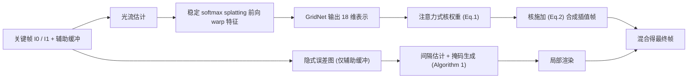

## 一句话总结
面向离线渲染内容，用"核预测 + 图像 splat"的方式合成插值帧，保证输出是输入的线性组合（可一致地插值任意通道、避免颜色伪影），并配一个只看辅助缓冲的隐式误差预测模型，实现按像素/图块动态决定"渲染还是插值"的时空自适应策略，从而在同等质量下大幅减少需要渲染的像素。

## 研究背景
- 领域现状：Monte Carlo 渲染成本高昂，除去噪、自适应采样外，近年出现利用多帧冗余的帧插值/外推方案。渲染场景可以低成本获得 albedo、深度、法线、运动矢量等辅助缓冲，用它们做插值能显著优于纯图像方法（如 NFIRC）。
- 核心痛点：一是插值方法本身——生产环境需要插值的不只是最终颜色，还有 alpha、各光照分量等通道，且各通道结果必须彼此一致才能用于后续合成；主流做法用直接（或残差）预测网络合成最终帧，需为每种通道组合重训、无法保证对齐，且无约束输出范围易产生颜色伪影。二是自适应插值——插值质量随跳帧数增加而下降，但误差往往集中在小而快的运动物体上，静态背景插得很好，因此整帧统一插值并非最优。
- 本文 idea：用共享系数的核（kernel）从前向 warp 后的关键帧合成输出，使结果天然是输入的凸组合；同一套核可施加到任意数量的附加通道，保持分解一致、也无需重训。再用只依赖辅助缓冲的隐式误差图，在时空上按像素/图块选择最优插值间隔。

## 方法
整体 pipeline 沿用面向渲染内容的插值框架：对每个关键帧估计到目标时刻的光流，用数值稳定的 softmax splatting 把神经网络提取的上下文特征前向 warp 到中间时刻；再用注意力启发的核预测网络从这些 splat 特征合成最终帧；同时一个仅吃辅助缓冲的误差网络产出隐式误差图，据此为整段序列生成渲染掩码，最后把局部渲染结果与插值结果混合。

关键设计：

1. **核权重预测（注意力启发）**。GridNet 不直接输出 3 维 RGB，而是输出 18 维表示：其中 16 维作为查询 $$\boldsymbol{q}$$，另 2 维作为每个关键帧的缩放 $$a_i$$。键 $$\boldsymbol{k}_i$$ 和偏置 $$b_i$$ 由 splat 后的特征金字塔用两层 1×1 卷积单独估计。每个输出像素 $$\boldsymbol{y}$$ 对候选像素 $$\boldsymbol{x}$$ 的相关权重为 $$w^i_{\boldsymbol{y}\boldsymbol{x}} = -(a^i_{\boldsymbol{y}})^2 \lVert \boldsymbol{q}_{\boldsymbol{y}} - \boldsymbol{k}^i_{\boldsymbol{x}} \rVert_2^2 + b^i_{\boldsymbol{x}}$$。缩放取平方使权重与特征距离成反比，偏置用来压低可视为离群的 splat 贡献。为什么这么做：作者发现"对称特征图"的亲和度方案（Işık 等）在插值任务上表现很差，需要非对称的键/查询设计。
2. **核施加与凸组合性质**。输出 $$\hat{I}_t[\boldsymbol{y}]$$ 是邻域 $$\mathcal{N}(\boldsymbol{y})$$ 内各 splat 像素按 $$\exp(w)$$ 归一化加权（带表示空洞的二值掩码 $$M_i$$）。由于是加权平均，结果落在输入颜色的凸包内，从构造上就不会产生越界颜色伪影；同一套权重可施加到 alpha、逐光照分量等任意通道且保持一致，无需重训。
3. **动态偏移核**。只在 splat 有空洞的区域才需要大偏移核。定义 $$\gamma$$ 为使邻域内至少有 $$\Gamma$$ 个有效贡献像素的最小偏移；训练时用固定 $$\gamma=5$$，推理时动态调整以保证 $$\Gamma=112$$ 个贡献像素，从而修补更大的空洞——这是固定尺寸核难以做到的。实现上把逐帧加权和拆开、借助自动微分并做最大值减法保证数值稳定。
4. **隐式误差预测与时空自适应**。误差网络只吃辅助缓冲（albedo、法线、深度、速度），在 1/16 分辨率回归隐式误差图 $$\delta^m_t \in (0,1)$$，训练损失为 $$\mathcal{L}_{\text{Error}} = \mathcal{L}_{\text{image}}(\hat{I}_t\cdot(1-\delta^m_t)+I_t\cdot\delta^m_t,\ I_t) + \lambda\lVert\delta^m_t\rVert_2^2$$。"隐式"意味着不直接回归误差数值（误差通常依赖颜色，而颜色对该网络不可得），而是让网络学会在何处该用真值。据此为每个像素求最大可插值间隔（误差低于阈值 $$p$$），$$p$$ 作为艺术家平衡质量与速度的旋钮；再经二分递归的区域选择（Algorithm 1）、Gaussian 模糊扩边、64×64 图块化，生成渲染掩码。整个流程只需两次渲染调用：第一次只出辅助缓冲，第二次按掩码渲染局部像素。

## 实验结果
在 75 组电影帧三元组上评测（不含训练集，25 组为难例、50 组随机）。下表为核心插值方法（不启用自适应、整帧比较）与代表性方法的对比，本文在所有指标上均领先，并略胜此前面向渲染内容的 SOTA（NFIRC）。

| 方法 | PSNR↑ | SSIM↑ | LPIPS↓ | SMAPE↓ | VMAF↑ |
|------|-------|-------|--------|--------|-------|
| FILM（纯图像最优） | 28.66 | 0.883 | 0.1006 | 6.557 | 60.16 |
| VFIFormer（纯图像） | 27.99 | 0.886 | 0.1405 | 7.019 | 50.40 |
| NFIRC（渲染内容 SOTA） | 35.62 | 0.952 | 0.0547 | 3.492 | 88.94 |
| 本文 | 35.73 | 0.953 | 0.0537 | 3.171 | 89.56 |

其余结论用文字补充：消融显示缩放项 $$a_i$$ 必不可少（去掉会发散），完整模型优于直接预测、亲和度核、直接核及多尺度核等所有替代方案。多通道方面，插 10 个附加 3 通道层时本文耗时 1.15s，而直接预测因需逐层重跑线性膨胀到 5.39s。把光流网络的颜色输入换成零或随机噪声，质量仅微降，说明可仅凭辅助缓冲估计运动（支撑"两次渲染"流程）。自适应策略在相同（或更少）渲染像素、以及相同 CPU 墙钟时间下，PSNR 均显著优于等间隔整帧关键帧的基线。

## 亮点与局限
- 亮点：
  - 核预测保证输出为输入的线性/凸组合，从构造上杜绝越界颜色伪影，且同一套核可一致插值任意数量通道（alpha、逐光照分量），无需重训——直接服务于生产合成流程。
  - 动态偏移核以尺寸无关方式修补大空洞，兼顾大运动与核方法的稳健性。
  - 隐式误差图仅依赖廉价辅助缓冲，配合两次渲染调用即可实现按像素/图块的时空自适应，在同等预算下显著提质。
- 局限：
  - 对需要"细节幻觉"（无中生有补细节）的插值仍力不从心。
  - 流体、反射、阴影等复杂元素尚未专门处理，作者建议按分量分别插值。
  - 需要额外一次辅助缓冲渲染 pass 与误差图估计（每帧每间隔约 0.30s）带来一定开销；插值单帧本体约 0.76s，略慢于直接预测的 0.52s。

## 延伸思考
- 与 NFIRC（同组前作）一脉相承，把"直接/残差合成"替换为"核合成"，是把 Monte Carlo 去噪里成熟的核预测思想（KPCN）迁移到帧插值的自然一步，凸组合约束带来的鲁棒性在生产渲染中价值很高。
- 隐式误差预测 + 自适应渲染掩码，本质是把"算力花在最难的地方"，与自适应采样、时域去噪思路相通；作者也点出把自适应插值与 SOTA 时域 MC 去噪最优结合是值得探索的方向。
- 可延伸思考：核方法的凸包约束虽避免伪影，但也限制了对高频/新出现内容的表达（细节幻觉难题），未来或需在"线性可控"与"生成式补全"之间寻找折中，例如仅对空洞区域引入受约束的生成先验。
