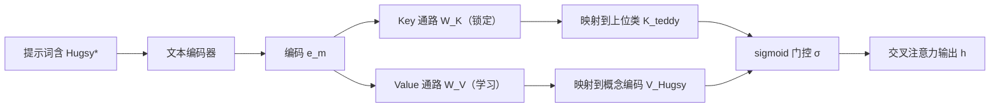

## 一句话总结

Perfusion 通过对文生图扩散模型交叉注意力层做「门控秩一编辑」，把新概念的 Key 锁定到其上位类别、只在 Value 通路上学习概念外观，从而用仅 100KB 的模型实现高保真、可大幅形变、且可在推理时自由组合多概念的个性化生成。

## 研究背景

- 领域现状：文生图（T2I）个性化让用户用几张示例图教会扩散模型一个新概念，再用自由文本把它放进新场景。主流方法分两派——一派优化文本编码器输入端的词嵌入（如 Textual Inversion），一派微调整个去噪网络权重（如 DreamBooth）。
- 核心痛点：两派都容易过拟合。词嵌入法难以泛化到新提示词，文本对齐分数偏低；微调法泛化稍好但表达力不足，且模型动辄数百 MB 到数 GB。更棘手的是，两者都难以把各自单独训练的概念（比如一只泰迪熊和一个茶壶）组合进同一张图。
- 本文 idea：作者把交叉注意力的 Key 通路看作决定「物体放在哪里」的 Where 通路，把 Value 通路看作决定「物体长什么样」的 What 通路。过拟合的根源在于 Where 通路——新词的注意力会漫溢到整张图之外。于是把新概念的 Key 锁定到其上位类别（如把某只泰迪熊的 Key 锁到 "teddy"），个性化只交给 What 通路完成。

## 方法

整体框架：Perfusion 建立在冻结的 Stable Diffusion 之上，对 U-Net 每一层交叉注意力的 $$\boldsymbol{W}_K$$ 与 $$\boldsymbol{W}_V$$ 施加一个门控秩一编辑。当输入编码含有新概念时，Key 被强制映射到上位类别的 Key，Value 则映射到一份可学习的概念专属编码；一个 sigmoid 门控决定该编辑对每个编码施加多强，从而在推理时既能调节概念强度、又能干净地叠加多个概念。

关键设计：

1. **Key-Locking（Where 通路锁定）**：作者观察到，从少量样本学概念时 $$\boldsymbol{W}_K$$ 极易过拟合示例图的布局，让新词「霸占」整张注意力图，压制提示词里的其它词。解决办法是借鉴语言模型的秩一编辑（ROME）思想，把新概念的 Key 目标输出直接设成上位类别的 Key：对每个 K 层预计算并冻结 $$\boldsymbol{o}^{K}_* = \boldsymbol{W}_K \boldsymbol{e}_{\text{superclass}}$$（用 "A photo of a <superclass>" 得到）。这样新概念继承了上位类的构图能力与创造力，能被自由形变。

2. **What 通路作为多分辨率隐空间**：个性化交给 Value 通路。受 Image2StyleGAN 的分层隐码启发，作者把 U-Net 各分辨率交叉注意力层的 V 激活当成一个紧凑的多分辨率隐空间，把每层的目标输出 $$\boldsymbol{o}^{V}_*$$ 与概念词嵌入一起端到端优化，用来精确保留身份。

3. **端到端秩一更新，消除训练-推理错配**：原始 ROME 分三步、只对单个词索引优化目标输出，但秩一更新在推理时会影响其它词，造成训练-推理不一致、损伤重建保真度。作者把 ROME 的第二、三步合并，改写层的前向传播为
$$h = W \boldsymbol{e}^{\perp}_m + \boldsymbol{o}_* \, \mathrm{sim}(\boldsymbol{i}_*, \boldsymbol{e}_m) / \lVert \boldsymbol{i}_* \rVert^2_{C^{-1}}$$
其中 $$\mathrm{sim}(\boldsymbol{i}_*, \boldsymbol{e}_m) = \boldsymbol{i}_*^{T}(C^{-1})^{T}\boldsymbol{e}_m$$ 度量编码与目标输入在 $$C^{-1}$$ 度量下的相似度，$$\boldsymbol{e}^{\perp}_m$$ 是编码中与 $$\boldsymbol{i}_*$$ 正交的分量。训练与推理用同一套表达式，$$\boldsymbol{i}_*$$ 用指数滑动平均在线估计（$$\boldsymbol{i}_* := 0.99\,\boldsymbol{i}_* + 0.01\,\boldsymbol{e}_{\text{concept}}$$）。

4. **Sigmoid 门控与多概念组合**：式中的线性相似项对相似度较低的编码衰减不够，于是用带偏置 $$\beta$$ 与温度 $$\tau$$ 的 sigmoid 包裹：
$$h = W \boldsymbol{e}^{\perp}_m + \boldsymbol{o}_* \, \sigma\!\left( \frac{\mathrm{sim}(\boldsymbol{i}_*, \boldsymbol{e}_m) / \lVert \boldsymbol{i}_* \rVert^2_{C^{-1}} - \beta}{\tau} \right)$$
这带来两个好处：其一，推理时改 $$\beta$$、$$\tau$$ 即可在视觉保真与文本对齐间滑动，单个模型就能横跨整条帕累托前沿，无需为每个操作点重训；其二，把编码正交到所有概念 $$\lbrace \boldsymbol{i}^{j}_* \rbrace$$ 张成的子空间后对各概念门控响应求和，即可把独立训练的多个概念干净地组合进一张图。此外还用零样本分割 mask 加权扩散损失，抑制背景的伪相关。

## 实验结果

在 Stable Diffusion v1.5 上，用取自前作的 11 个概念、86 条提示词评测。核心指标是「图像相似度（概念保真）」与「归一化文本相似度（提示对齐）」构成的帕累托权衡，下表为主要方法在该权衡下的定性对比与模型体积：

| 方法 | 文本对齐 | 视觉保真 | 每概念体积 | 说明 |
|------|---------|---------|-----------|------|
| Perfusion（本文） | 最优前沿 | 高 | ~100KB | 单模型推理时调参即横跨帕累托前沿 |
| Custom Diffusion | 偏低（偏向视觉） | 高但易过拟合 | ~100MB | 并行工作，微调 K/V + 词嵌入 |
| DreamBooth | 中 | 中 | 数 GB | 全网络微调，两项分数均低于本文 |
| Textual Inversion | 低 | 中 | 极小 | 难泛化到新提示 |

Perfusion 把帕累托前沿整体向外推进，模型体积比现有 SoTA 小约五个数量级。消融证实：锁定 Key 相比训练 Key（Trained-K）能把曲线右移（更少过拟合、更好文本对齐）；零样本 mask 与较高训练偏置均有助于减轻过拟合；推理温度取 0.15 通常优于训练温度 0.1。用户研究中 Perfusion 在「按提示表现概念」上排名第一，且在真实感上与原版 Stable Diffusion 统计上不可区分，说明未损伤生成先验。训练仅需单张 A100 约 4 分钟（平均 210 步）。

## 亮点与局限

- 亮点：
  - Where/What 通路的解耦洞察清晰，Key-Locking 直击注意力过拟合根源，让个性化概念能大幅形变仍保身份。
  - 门控秩一编辑让单个 100KB 模型在推理时即可横跨保真-对齐帕累托前沿，并干净地组合多概念，这是此前方法难以做到的。
  - 模型极小、训练极快，且不损伤底层生成先验。

- 局限：
  - 需要为每个概念人工指定一个上位类别词，类别选得不当会影响效果。
  - 失败模式之一是 V 特征过早吸收上位类属性（论文中的猫玩具例子），出现「过度泛化」导致视觉保真下降。
  - 依赖交叉注意力式架构与零样本分割质量；bias/temperature 等超参需按类别调优才能取到最佳操作点。

## 延伸思考

Perfusion 把 NLP 的秩一模型编辑（ROME）迁移到扩散模型的交叉注意力，并配上门控与 Key-Locking，代表了「轻量、可组合」个性化的一条思路，与同期的 Custom Diffusion、LoRA 式微调形成对照。Where/What 解耦的视角对更广义的可控生成（布局控制、概念解耦）有借鉴意义。值得追问的是：上位类别词能否自动选取或学习？门控子空间正交化在概念数量更多、语义高度重叠时能否维持无干扰组合？以及这套秩一编辑范式能否推广到视频扩散或更新的 DiT 类架构。
