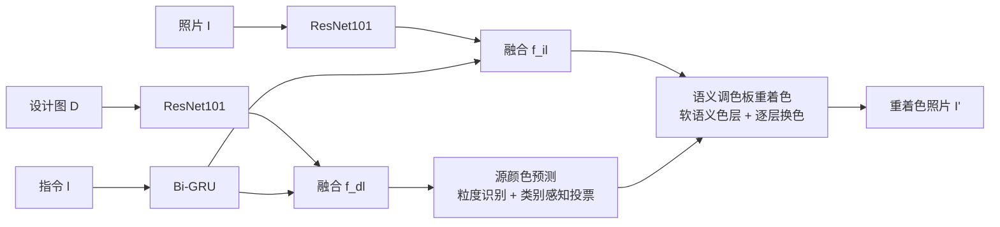

## 一句话总结

提出 LangRecol：给定一张含照片的平面设计和一句自然语言指令，模型自动从设计元素中提取"源颜色"、在照片里定位目标区域，并把照片局部重新着色成与设计相配的颜色。

## 研究背景

- 领域现状：平面设计（海报、广告、传单）里插入的照片常需要重新着色以与文字、背景、形状等元素协调。已有工具与工作大体分三类——涂鸦式、调色板式、示例图式重着色，近来又出现语言驱动的图像编辑。
- 核心痛点：现有方案在"易用性"和"表达力"之间二选一。商业软件（Photoshop 等）灵活但要求专业经验；基于和谐配色方案或主题色的自动方法难以约束局部、可能把肤色改绿；单击式方法只能给出唯一确定结果；而通用的语言驱动编辑用"蓝色"这类模糊颜色词，颜色不精确、还难限制在局部语义区域内。
- 本文 idea：用一句"多粒度"语言指令作为桥梁连接设计与照片，既能精确指定源颜色（直接取自设计元素本身），又能在语义局部区域内自然地重着色，同时容许一条指令对应多个合理结果。

## 方法

整体框架分两大模块：先用"语言驱动源颜色预测"从指令指定的设计元素里抽出准确的源颜色，再用"语义调色板照片重着色"在照片里定位目标区域并逐层换色。设计图与照片分别用 ResNet101 编码、指令用 Bi-GRU 编码，再通过共注意力融合模块把指令特征分别注入到"设计+指令"和"照片+指令"两组特征中。

- **多粒度与合成数据集**：指令支持从粗（"背景"、"所有文字"）到细（"黄色形状"、"副标题"）。由于高质量设计需专业人员制作、难以大规模采集，作者按平面设计原则和从真实 Canva 设计里总结的知识，合成带指令与源颜色标注的设计数据集；最终定义 8 类带层级的基本设计元素（背景 / 文字 / 形状三大类）。颜色词依据基础色项语言学研究归为 11 类。

- **语言驱动源颜色预测**：多任务网络。粒度识别子网把问题拆成"元素类别"与"颜色属性"两个分类；类别感知颜色预测子网因文字类（颜色稀疏、常与背景重叠）与填充色类（大面积纯色、分布紧凑）表现差异大，分别用最大投票和求和投票从元素掩码内的像素里选出 $$k$$ 个基色（$$k=10$$，先用 $$6\times6\times6$$ 直方图分箱去重），再预测颜色残差与置信度，最终源颜色为 $$C_s = C_b + C_r$$，测试时只保留置信度高的颜色。

- **语义调色板照片重着色**：为避免仅靠网络预测不完美掩码导致的重着色伪影，采用"深度语义 + 调色板颜色连续性"的混合方案。先由分割子网出一个初始硬掩码，再用语义软分割把图像细化成前景/背景软掩码；同时用几何法从照片抽出软色层调色板；两者逐对相乘得到软语义色层。重着色时按与前景软掩码的重叠率 $$o_i = \frac{\sum_p (\alpha_i \odot m_f)}{\sum_p (\alpha_i)}$$ 选出最主导的 top-n 层（$$n=4$$）换成源颜色，并在 CIE Lab 的 L 通道保留原有明度梯度 $$\hat{L}_i = L_{C_s} + \Delta L_i$$ 以维持纹理。

- **损失**：粒度（交叉熵）+ 分割（BCE）+ 源颜色（$$L_2$$）+ 置信度（BCE）加权求和；训练用课程学习，先预训练分割与粒度子网再联合训练，避免坍塌。

## 实验结果

测试集为从 Canva 收集的 71 张真实设计、共 165 条设计-指令对，由三位专业设计师手工制作源颜色与重着色作为参考真值。与两种可定量比较的语言驱动图像编辑方法在 PSNR / SSIM 上对比（GDRecolor 因无法按指令定位区域、不参与定量比较）：

| 方法 | PSNR ↑ | SSIM ↑ |
|------|--------|--------|
| Open-Edit | 15.55 | 0.5230 |
| ManiGAN | 16.91 | 0.6662 |
| 本文 LangRecol | 24.27 | 0.8500 |

用户研究（2AFC 成对比较）中，在自然度与忠实度上本文相对 Open-Edit、ManiGAN 都有约 70%~83% 的偏好率（均显著），但与专业设计师相比仍有差距。消融显示：粒度识别子网帮助区分粗/细指令、准确定位元素；类别感知子网降低文字类与形状过渡区的噪声颜色，完整模型的源颜色 MSE 最小（RGB 每通道平均误差约 ±5.95）。可用性研究里语言界面较涂鸦界面平均每例省时约 43 秒（约 63.7%）。

## 亮点与局限

- 亮点：
  - 提出全新任务与端到端系统，把"多粒度语言指令"作为连接设计与照片的桥梁，兼顾易用与表达力。
  - 源颜色取自设计元素本身而非模糊颜色词，颜色精确；类别感知投票针对文字/填充色分别处理。
  - 语义调色板混合方案有效抑制不完美掩码带来的色溢出，重着色自然并保留纹理。
  - 提出可无限量生成带标注的合成设计数据集方法，解决训练数据稀缺。
  - 展示了模板配对、手册多图重着色、设计合集批量重着色、迭代重着色等实用应用。

- 局限：
  - 语言模型仅为从零训练的 Bi-GRU，若目标物体或设计元素未出现在训练集中则可能失效，作者建议改用 CLIP 等预训练跨模态模型。
  - 与专业设计师仍有明显差距；复杂的多目标区域指令目前只能拆分处理。
  - 依赖合成设计数据，真实设计分布仍可能存在差距。

## 延伸思考

- 用更强的预训练视觉-语言模型（CLIP、或文本到图像扩散模型）替换 Bi-GRU，有望提升开放词汇泛化与指令解析能力，但需解决"结构保持 + 颜色精确取自设计"的约束。
- "调色板软色层 + 语义软分割"的思路本质是把可微编辑约束在语义局部，这套 recipe 对其他局部外观编辑（材质、光照微调）可能同样适用。
- 该任务把"设计语境"显式建模进重着色，比通用图像编辑更贴近实际排版工作流；后续可探索矢量格式设计、跨多页版式的一致性配色。
