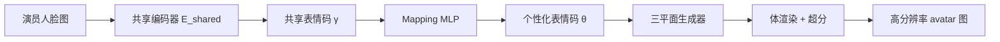

## 一句话总结

LatentAvatar 抛开传统人脸模板，用自监督端到端学到的"隐式表情编码"作为驱动信号，让 NeRF 头部 avatar 能捕捉皱纹、牙齿、眼球等高频细节表情，并支持跨身份重演。

## 研究背景

- 领域现状：从单目视频重建可动画的 3D 头部 avatar 已有大量进展，主流做法要么基于显式人脸模板（3DMM、FLAME），要么用 NeRF 等隐式表示，但都用人脸模板的表情系数当驱动信号。
- 核心痛点：模板方案的表现力被线性表情基（blendshape / 线性蒙皮）锁死，难以表达高频、个性化的细节表情；模板跟踪的误差还会给表情条件引入额外偏差；表情系数与身份系数容易耦合，跨身份重演时产生伪影。
- 本文 idea：不用任何预训练模板，直接从人脸图像端到端、自监督地学一个隐式表情编码作为驱动信号。因为通过光度重建目标来学习，这个编码既保持 3D 一致性，又能忠实记录模板表达不了的细节表情。

## 方法

整体 pipeline 分两条线：先训一个"隐式头部 NeRF"（一个自编码器），把人脸图编码成个性化表情编码 $$\theta_p$$，再解码渲染出图像；为实现跨身份重演，再用 Y 形网络学一个不同人共享的表情编码 $$\gamma$$，最后用一个 mapping MLP 把共享编码映射到个性化编码来驱动 avatar。

关键设计：

- **隐式头部 NeRF（自编码器视角）**：把头部 NeRF $$\Phi$$ 建成一个自编码器——编码器 $$E$$ 把人脸区域图 $$I_{face}$$ 编成个性化表情码 $$\theta_p = E(I_{face})$$，再经 $$(c,\sigma)=\Phi(x,d,\theta_p)$$ 体渲染解码。这样表情条件是可学习的隐编码，而非预定义的模板系数，用光度重建就能自动挖出细粒度个性化表情。这是全篇的核心动机。
- **三平面 + 混合渲染的解码器**：表情码 $$\theta_p$$ 送入 StyleGAN 式 2D 卷积网络生成三平面特征 $$(H_{xy},H_{yz},H_{xz})$$，对 3D 点投影取特征求和得到 $$H$$，轻量 MLP 输出颜色、密度与高维特征；先体渲染出低分辨率图与特征图，再经 U-Net 超分模块得到高清人脸。相比 EG3D 这类纯生成任务，这里更关注单人表情增强，故三平面生成器可大幅瘦身。
- **Y 形网络学共享表情空间**：一个共享编码器 $$E_{shared}$$ 加 avatar / actor 两个独立解码器，随机选一人做自重建训练（冻结另一支解码器）。为保证两人表情分布重叠一致，借鉴 CycleGAN 加了循环一致性损失 $$\mathcal{L}_{cycle}$$，约束编码经跨身份解码再编码后仍一致。
- **Mapping MLP 搭桥**：训一个小 MLP 把共享潜空间的码 $$\gamma$$ 映射到个性化潜空间的码 $$\theta$$，损失为 $$\mathcal{L}=\lVert E(I_{ava})-Mapping(E_{shared}(I_{ava}))\rVert_2$$。推理时演员图只需过一次共享编码器再过 MLP 即得驱动信号。

隐式头部 NeRF 的训练损失为高清 L1 + VGG 感知损失 + 低分辨率 L1 + mask 损失：

$$\mathcal{L} = \lVert I_{hr}-I_{gt}\rVert_1 + \lambda_{vgg}VGG(I_{hr},I_{gt}) + \lambda_{lr}\lVert I_{lr}-I_{gt}\rVert_1 + \lambda_{mask}\lVert M-M_{gt}\rVert_2$$

## 实验结果

在自采与 MEAD 数据集上，选 6 个 avatar 做自重演，对比 IMavatar、NeRFace 及消融基线 Coeff+Tri-plane（把驱动信号换成 3DMM 表情系数、其余架构相同）。LatentAvatar 在所有指标上都最优；与结构相同、仅驱动信号不同的 Coeff+Tri-plane 相比的领先，直接印证了"隐式表情编码优于模板系数"这一核心主张。

| 方法 | MSE×10⁻³ ↓ | PSNR ↑ | SSIM ↑ | LPIPS ↓ |
|------|-----------|--------|--------|---------|
| IMavatar | 6.89 | 21.79 | 0.871 | 0.209 |
| NeRFace | 3.39 | 25.64 | 0.903 | 0.135 |
| Coeff+Tri-plane | 2.70 | 27.00 | 0.917 | 0.049 |
| Ours | 2.61 | 27.61 | 0.919 | 0.048 |

定性上，模板方法无法生成鼻翼皱纹、眼球移动等细节，跨身份重演时因身份/表情系数耦合而出伪影、遇到夸张表情（如噘嘴、龇牙）易崩；LatentAvatar 都能稳定捕捉并迁移。循环一致性损失的消融显示：去掉后共享潜空间分布更发散，表情一致性明显下降。

## 亮点与局限

- 亮点：
  - 用自监督隐式表情编码彻底摆脱人脸模板，同时解决了表情表达力不足与跟踪误差两大顽疾；
  - 能捕捉牙齿、舌头、眼球等模板系数无法表达的高频细节；
  - Y 形网络 + 循环一致性 + mapping MLP 的组合，把"个性化"与"跨身份共享"两个潜空间优雅地桥接起来。
- 局限：
  - 跨身份重演需要为演员额外训练（学习共享/个性化两套潜码），不是即插即用；
  - 当两人外观或表情分布差异很大时，共享编码会混入个体外观信息，导致表情映射错误（论文给出了失败案例）。

## 延伸思考

- 隐式表情编码的思路与 NeRFace、AvatarMAV 等模板驱动方案形成鲜明对照，可看作"用重建目标反向学驱动信号"的代表；后续 3D Gaussian 头部 avatar 是否也能用类似的自监督隐编码替代显式表情系数，值得追问。
- 作者提出的用元学习 + 大规模视频数据增强泛化是自然方向；共享潜空间"外观-表情解耦"若做得更彻底，可望免去演员端的额外训练，走向真正通用的跨身份重演。
- 论文特意讨论了伪造视频的伦理风险，提醒这类表现力越强的重演技术越需要配套的 forgery 检测。
