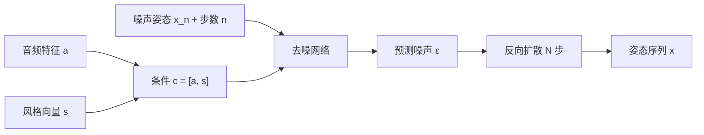

## 一句话总结

用扩散模型把音频（语音 / 音乐）映射成高质量 3D 全身动作，配合 Conformer 骨干与无分类器引导，实现语音手势、舞蹈、路径行走的统一生成，并且能对风格强度做连续调节甚至风格插值。

## 研究背景

- 领域现状：音频驱动的人体动作生成（协同语音手势、跳舞）是角色动画、虚拟人、社交机器人等应用的关键。此前主流做法覆盖 RNN、归一化流、VAE、VQ-VAE、GAN 等各类生成模型。
- 核心痛点：给定音频，动作是高度不确定、一对多的——同一段语音可以配无数种合理手势，同一首曲子可以有千百种舞姿。回归式模型只输出单一结果，会退化成"平均姿态"，动作僵硬；而 GAN 训练难、流模型受可逆性架构限制，都难以精准刻画这种强随机性。此外，风格控制往往和音频耦合，难以做到"任意风格配任意音频"。
- 本文 idea：扩散模型能用任意深度网络刻画极其一般的概率分布，且只需最小化一个简单的去噪平方误差即可高效训练，天然适合这种高歧义任务。作者把音频合成里的 DiffWave 架构改造成 3D 姿态序列生成器，并用无分类器引导独立地控制"表达哪种风格"和"表达多强"。

## 方法

整体框架：任务是给定逐帧音频特征 $$\boldsymbol{a}_{1:T}$$（以及可选风格向量 $$\boldsymbol{s}$$），生成同样帧率的姿态序列 $$\boldsymbol{x}_{1:T}$$。模型在 DiffWave 基础上改造：去掉上采样、把标量波形输出改为向量姿态输出，学习条件分布 $$p(\boldsymbol{x}_{1:T} \mid \boldsymbol{a}_{1:T})$$。姿态用相对 T-pose 的关节旋转指数映射表示，另加根节点在地面上的旋转与平移，让角色能移动。

关键设计：

1. **扩散建模刻画歧义**：训练一个网络 $$\hat{\boldsymbol{\varepsilon}}(\boldsymbol{x}, \boldsymbol{c}, n)$$ 预测被加到干净姿态上的噪声，损失是带权的平方误差。虽然是平方误差，但由于随机变量 $$\boldsymbol{\varepsilon}$$ 的存在，它不会退化成"回归到均值"，而等价于最大化数据对数似然的变分下界——因此模型学到的是完整的动作分布，可从中采样出多样且自然的结果。

2. **Conformer 替换膨胀卷积**：把 DiffWave 残差块里的膨胀卷积换成 Conformer 堆叠（每块 4 个）。Conformer 把 Transformer 的自注意力与卷积结合，既能像注意力那样整合长时程信息，又保留卷积计算帧间差分（速度、加速度）这类动力学量的优势，在动作质量上优于纯 Transformer 或纯 CNN 的消融版本。

3. **平移不变的位置编码**：动作应对时间平移不变，因此采用平移不变自注意力（TISA）而非正弦位置编码。这让模型虽然只在 150 帧短序列上训练，却能泛化到上千帧的长序列一次性生成，且不出现明显脚滑。

4. **无分类器引导做风格控制**：把风格作为条件同时训练一个"带风格"和一个"不带风格"的模型，推理时按 $$\hat{\boldsymbol{\varepsilon}}_\gamma = \hat{\boldsymbol{\varepsilon}}(\boldsymbol{a}) + \gamma(\hat{\boldsymbol{\varepsilon}}(\boldsymbol{c}) - \hat{\boldsymbol{\varepsilon}}(\boldsymbol{a}))$$ 组合。引导系数 $$\gamma < 1$$ 弱化风格、$$\gamma > 1$$ 夸张风格，从而独立于"风格身份"地调节"风格强度"。进一步把两个条件模型做重心式组合，还能在两种风格之间做插值与外推（专家乘积集成）。

## 实验结果

作者在五个高质量动捕数据集上训练，核心评估是四项成对偏好用户研究（TSG 手势、ZeroEGGS 手势偏好与风格控制、舞蹈），并辅以客观指标。用户研究以 merit score（0/1/2 记分）衡量。下表为主观偏好实验的 merit score（越高越好，含 95% 置信区间）：

| 数据集 | 本文(LDA) | 变体 | 基线 | 真值(GT) |
|--------|-----------|------|------|----------|
| TSG 手势 | 0.59±0.03 | LDA-DW 0.50±0.03 | SG 0.31±0.03 | 0.95±0.04 |
| ZeroEGGS 手势 | 0.64±0.08 | LDA-G 0.41±0.07 | ZE 0.43±0.07 | — |
| 舞蹈 | 0.71±0.06 | LDA-U 0.51±0.05 | BL 0.24±0.06 | 0.87±0.06 |

所有差异均统计显著。本文方法在三个数据集上都显著优于强基线（StyleGestures、ZeroEGGS、Bailando），舞蹈上对真值仍有近 40% 胜率。风格控制实验中，引导版 LDA-G 的风格辨识度反超 ZeroEGGS，验证了强度可调；客观指标（FGD、FID、多样性、节拍对齐 BAS）总体与主观感受一致，本文舞蹈多样性和节拍对齐都优于 Bailando。此外还展示了在 100STYLE 上做路径驱动行走，无需脚部稳定后处理即可贴合路径与风格。

## 亮点与局限

- 亮点：
  - 首次将扩散模型系统性地用于音频驱动动作生成，同一套架构统一覆盖手势、舞蹈、路径行走。
  - 无分类器引导带来"风格身份"与"风格强度"解耦的控制，还自然推广出专家乘积集成实现风格插值/外推，具有独立价值。
  - TISA 位置编码让短序列训练泛化到长序列生成；全程未用脚部稳定、平滑等后处理即得干净动作。
  - 发布了一个更大、覆盖完整曲目和新舞种的高质量舞蹈动捕数据集。

- 局限：
  - 扩散模型采样需反向走完 N 步，速度较慢，作者明确把加速采样留作未来工作。
  - 评估以主观用户研究为主，领域缺乏公认基准与客观指标；动捕数据集偏小，导致 FGD/FID 等客观分数偶有与主观不一致的离群点。
  - 用无引导的风格无条件模型（LDA-U）在音乐特征很少时难以自动触发合适舞种，说明"任意风格配任意音频"仍依赖显式风格标签。

## 延伸思考

这项工作把"扩散模型 + 无分类器引导"从图像域成功迁移到动作域，其中把引导推广成专家乘积、用于概率分布层面的风格插值，是一个可复用的通用思路，可迁移到多条件动作编辑、动作风格迁移等场景。采样效率是最直接的后续方向，可结合蒸馏或少步采样（如一致性模型）来做实时角色驱动。另外，用最小化音乐特征集来避免"舞种被音乐绑死"的做法，提示了在可控生成里刻意限制条件信息以换取泛化与可控性的权衡，值得在其他跨模态生成任务中借鉴。
