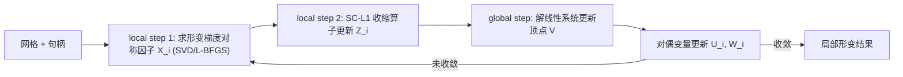

## 一句话总结

提出一种"平滑截断 $$\ell_1$$"（SC-L1）稀疏正则项，把弹性能驱动的形变自动约束在用户操作的局部区域内，并用三块 ADMM 求解器实现交互帧率的局部形状编辑。

## 研究背景

- 领域现状：形状编辑主要分两派。一派是**直接法**（样条、笼子坐标、线性混合蒙皮、Kelvinlets 笔刷等），把"局部性"预先编码进高层参数；另一派是**优化法**，最小化定义在形状上的弹性能并施加用户位置约束，形变自然、能感知几何、能跨 2D/3D/布料泛化。
- 核心痛点：弹性能最小化天生是**全局**的——它一次性求解所有自由度，因此往往需要预先"钉住"（rig）形状的某些部分，或事先指定影响区域（ROI）。但在有约束、或事先不知道形变是大是小的场景里，ROI 很难预先确定；已有的稀疏正则做法（如对 ARAP 用 $$\ell_{2,1}$$ 范数）又会在操作句柄附近产生**伪影**，且求解慢到无法实时。
- 本文 idea：设计一个新的稀疏诱导正则项，既能把形变"逼稀疏、逼局部"，又不像 $$\ell_{2,1}$$ 那样把所有顶点往原位硬拽而产生伪影；同时把稀疏项的 ADMM 与弹性项的 local-global 策略**合并进同一次 ADMM 迭代**，从而实现实时。

## 方法

整体框架：给定一个三角网格/四面体网格（或 1D 折线）和一组被选中的控制句柄顶点，在"弹性能 + SC-L1 局部性正则"的目标下求解形变后顶点位置。局部性正则逐顶点作用于 $$\boldsymbol{V}_i - \tilde{\boldsymbol{V}}_i$$（形变位移），把大部分顶点压回静止位置、只在被操作处放开，从而得到随形变大小、几何和所用弹性能**自动自适应**的影响区域。

关键设计：

1. **SC-L1 正则（核心贡献）**：定义为
   $$\lVert \boldsymbol{x}\rVert_{\text{SC-L1}} = \lVert \boldsymbol{x}\rVert_2 - \frac{1}{2s}\lVert \boldsymbol{x}\rVert_2^2 \quad (\lVert \boldsymbol{x}\rVert_2 < s), \qquad \lVert \boldsymbol{x}\rVert_{\text{SC-L1}} = \frac{1}{2s} \quad (\lVert \boldsymbol{x}\rVert_2 \ge s)$$
   其中 $$s$$ 是"截断阈值"：位移小于 $$s$$ 时它像群 $$\ell_1$$ 范数一样把位移逼向 0（诱导稀疏、逼出局部性）；位移一旦超过 $$s$$，正则值变为常数、**不再惩罚**。这正是它避免 $$\ell_{2,1}$$ 伪影的关键——$$\ell_{2,1}$$ 会把已经大幅移动的顶点也持续往原位拽，与弹性能"打架"造成句柄附近的扭曲；SC-L1 对大位移松手，让弹性能在放开区内自由主导。该函数连续可微、分段光滑，且其邻近收缩算子没有局部极小。它相当于 [Zhang 2010] MCP 损失的群变体，但作者强调 minimax-concave 性质对局部形变并非必需。

2. **局部形变能量**：总能量为 $$E(\boldsymbol{V}) + \sum_i w a_i \lVert \boldsymbol{V}_i - \tilde{\boldsymbol{V}}_i\rVert_{\text{SC-L1}}$$，弹性项 $$E$$ 可任意选取（与正则解耦），$$a_i$$ 是顶点重心面积（保证不同网格分辨率下同一常数 $$w$$ 结果一致），还可加位置约束和可选的仿射约束。$$w$$ 用来控制 ROI 尺度，$$s$$ 一般设为形状尺寸的一个小比例后就不再动。

3. **三块 ADMM 求解器（效率关键）**：借鉴 [Brown and Narain 2021] 的 local-global 策略，引入辅助变量把能量改写为对形变梯度对称因子 $$\boldsymbol{X}_j$$ 和位移 $$\boldsymbol{Z}_i = \boldsymbol{V}_i - \tilde{\boldsymbol{V}}_i$$ 的约束优化。求解交替进行：local step 1 在奇异值上求最优对称因子（ARAP 下是正交 Procrustes 问题，用 SVD 解；Neo-Hookean 下在奇异值上用 L-BFGS）；local step 2 用 SC-L1 专属的收缩算子更新 $$\boldsymbol{Z}_i$$（需满足 $$\rho > \max(w a_i)/s$$ 以避免局部极小）；global step 解一个线性系统 $$(\boldsymbol{L} + \rho \boldsymbol{I})\boldsymbol{V} = \boldsymbol{B} + \rho(\tilde{\boldsymbol{V}} + \boldsymbol{Z}^k - \boldsymbol{U}^k)$$（固定 $$\rho$$ 可预分解 Cholesky 因子）。对比 [Chen et al. 2017] 在**每个 global step 里都要跑一整套完整 ADMM**，本文把两套策略融成**单层 ADMM**，因此快得多。

4. **跨维度与能量泛化**：切换材料模型只需替换 local step 1 里对对称因子奇异值的最小化。作者展示了 ARAP、允许局部缩放的 ACAP（更好保纹理）、体积保持的 Neo-Hookean，以及布料（ARAP + 硬应变限制 + 二次弯曲阻力）和 1D 折线编辑。ROI 会随所用能量自动变化，例如 ACAP 因允许局部缩放，ROI 比 ARAP 更小。

## 实验结果

论文以定性对比为主；唯一的定量主实验是 2D ARAP 局部能量下与 $$\ell_{2,1}$$ 方法 [Chen et al. 2017] 的**运行时对比**（相同收敛阈值、跨不同网格分辨率与形变幅度），核心结论如下：

| 形变幅度 | 对比对象 | 本文相对加速 | 说明 |
|----------|----------|--------------|------|
| 小形变 | [Chen et al. 2017]（$$\ell_{2,1}$$） | 约 1000× | 单层三块 ADMM vs 嵌套 ADMM |
| 大形变 | [Chen et al. 2017]（$$\ell_{2,1}$$） | 约 100× | 本文达交互帧率，对比方法无法实时 |

定性方面：相对 $$\ell_{2,1}$$ 方法消除了句柄附近伪影；相对基于欧氏距离的 Kelvinlets 做到了"感知几何"（避免测地线远、欧氏近的两部分互相串扰）；相对双调和坐标无需预先摆放额外固定控制点来圈定 ROI。还验证了 ROI 随形变幅度增大而自然扩张、随移动方向不同而变化，以及在多物体+布料复杂场景下的局部编辑。

## 亮点与局限

- 亮点：
  - SC-L1 正则思路简洁、易实现，"对大位移松手"这一点精准命中了 $$\ell_{2,1}$$ 伪影的根因。
  - ROI 无需人工设定，自动随几何、形变大小和弹性能自适应；不需要预先 rigging 或控制点布置。
  - 三块 ADMM 把稀疏与弹性两套迭代合并，带来约 100–1000× 加速，真正做到交互帧率。
  - 框架通用：跨 1D/2D/3D/布料、跨 ARAP/ACAP/Neo-Hookean 等能量。
- 局限：
  - 正则逐顶点独立施加，难以直接用于样条、NURBS 或单元尺寸高度不均的网格。
  - 依赖 ADMM，对非凸能量缺乏收敛保证，高精度需求下收敛慢。
  - 面向大幅"自由"形变时弹性能会与之对抗，需与其他雕刻工具配合（如每次拖拽后重置静止形状）。

## 延伸思考

- SC-L1 本质是把统计回归里的"折叠凹损失"（MCP/SCAD）迁移到几何形变，这种"阈值以上不再惩罚"的思想在其他需要局部稀疏又不想惩罚显著响应的图形任务（如局部纹理编辑、稀疏形变模式提取）里可能同样有效。
- 逐顶点正则的局限提示了一个自然方向：把局部性正则定义在更高层的几何表示（样条控制点、细分基、子空间模态）上，以适配非均匀网格与参数曲面。
- 将局部弹性形变整合进雕刻工作流（直观调 ROI 尺度、与笔刷工具混用）是作者点明但未深入的实用方向，工程价值明显。
