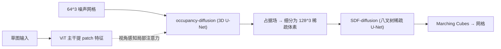

## 一句话总结
提出一个两阶段的 SDF 扩散模型 LAS-Diffusion，配合"视角感知的局部注意力"机制，让用户通过一张 2D 草图就能可控地生成高质量、可泛化的 3D 形状。

## 研究背景
- 领域现状：GAN、自回归、扩散等生成模型已被广泛用于 3D 形状生成，但生成结果与训练数据之间存在明显的质量差距，且大多缺乏直观的可控手段。
- 核心痛点：其一，点云/体素等离散表示受分辨率限制、需要脆弱的显式转网格步骤，几何质量差；直接做高分辨率 3D SDF 扩散又因立方级显存与算力开销而不现实。其二，现有草图/图像条件生成往往把整张图编码成单一全局特征，缺乏局部可控性，对训练集之外的新结构泛化很弱。
- 本文 idea：用连续 SDF 表示 + 扩散模型解决质量问题，并把 3D 生成拆成"粗占据 → 细 SDF"两阶段来压低成本；再引入一个把 2D 图像局部 patch 特征按投影关系注入 3D 体素特征的局部注意力机制，换取局部可控性与泛化能力。

## 方法
整体是一个两阶段自条件（self-conditioning）连续扩散流水线：第一阶段 occupancy-diffusion 在 $$64^3$$ 粗网格上生成表面占据场，勾勒形状薄壳；第二阶段 SDF-diffusion 只在被占据的体素内细分到 $$128^3$$ 稀疏体素并生成精细 SDF，最后用 Marching Cubes 抽取网格。草图条件通过视角感知局部注意力在第一阶段注入。

- **离散 SDF 表示与两阶段拆分**：直接生成高分辨率满网格 SDF 代价过高，因此先生成低分辨率占据场（阈值 $$\lvert g(z) \rvert \le \delta$$ 定义占据体素）逼近薄壳，再把占据体素细分后仅在其内部生成高分辨率 SDF。两个模块各自独立训练，显著降低显存与算力。
- **自条件连续扩散**：前向过程按 $$\boldsymbol{x}_t = \sqrt{\gamma(t)}\,\boldsymbol{x}_0 + \sqrt{1-\gamma(t)}\,\boldsymbol{\epsilon}$$ 加噪，网络 $$f(\boldsymbol{x}_t, \tilde{\boldsymbol{x}}_0, t)$$ 直接预测 $$\boldsymbol{x}_0$$，并把上一步估计 $$\tilde{\boldsymbol{x}}_0$$ 作为额外输入通道（以概率 0.5 启用）来提升生成质量；采样用 DDPM，条件生成用 classifier-free guidance。
- **视角感知局部注意力**：假设草图的相机视角已知，把每个体素中心投影到图像平面得到坐标 $$p$$，只选取 $$p$$ 邻域内（距离小于阈值 $$d_\delta$$）的图像 patch 与该体素特征做一层多头交叉注意力 $$f^{\text{new}}_V = \mathrm{MH\text{-}Attention}(Q,K,V,M)$$，其中 $$M$$ 是由投影诱导的掩码。用冻结的 Laion2B 预训练 ViT 提取 patch 特征，只在 $$8^3$$ 与 $$4^3$$ 层做注意力。因为用的是局部 patch 特征而非全局向量，模型对视角小扰动不敏感、对未见结构泛化更好，用户只需给一个大致视角。

## 实验结果
在 IKEA 椅子数据集上做草图条件生成的定量对比（Sketch-CD/CD/EMD 越低越好，CLIPScore/Voxel-IOU 越高越好）：

| 方法 | CLIPScore↑ | Sketch-CD↓ | CD↓ | EMD↓ | Voxel-IOU↑ |
|------|-----------|-----------|-----|------|-----------|
| Sketch2Model | 88.77 | 101.0 | 49.38 | 20.31 | 22.76 |
| Sketch2Mesh | 93.46 | 37.64 | 19.16 | 16.39 | 32.40 |
| SketchSampler$$_m$$ | 90.43 | 42.94 | 33.41 | 21.24 | 26.67 |
| LAS-Diffusion | 96.92 | 10.33 | 6.48 | 8.85 | 49.83 |

LAS-Diffusion 在所有指标上大幅领先。此外：在专业艺术家草图数据集 ProSketch-3D 上，调整视角后的 LAS-Diffusion★ 取得最佳成绩；在类别条件生成任务上，单类别模型在 chair/airplane/car/table/rifle 五类的 shading-image FID 全面优于 IM-GAN、SDF-StyleGAN、Wavelet-Diffusion、3DILG；消融实验表明全局注意力几乎无法处理未见结构、视角无关注意力会产生错误几何，验证了"局部 + 视角感知"的必要性；邻域大小 $$d_\delta$$ 在 2/4/6 倍 patch 宽度下表现相近。

## 亮点与局限
- 亮点：
  - 两阶段"粗占据 + 细 SDF"设计巧妙规避了高分辨率 3D 扩散的算力墙，1080 Ti 上约 10 秒即可推理出一个形状。
  - 视角感知局部注意力带来实打实的局部可控性（改草图局部即改几何）与强泛化（可生成飞翼椅、飞行汽车等训练集外的新结构，甚至跨类别、支持自由手绘草图）。
  - 机制简单灵活，作者指出可自然扩展到彩色图、深度图乃至点云等多模态条件；还支持通过交换 ViT patch 特征来"拼接"生成新形状。
- 局限：
  - 仅在合成数据上训练，草图风格与渲染管线绑定，对高度扭曲线条、过度描摹（oversketch）、透视严重不一致的草图适应差。
  - 只用几何、不生成外观纹理；且依赖单视角草图，无法完整表达设计意图，需要已知视角信息。

## 延伸思考
把预训练 2D 视觉主干（ViT）的局部 patch 特征按几何投影关系"锚定"到 3D 体素上，是一个很通用的桥接思路——它绕开了"整图压成一个全局向量"导致的局部失控问题，本质上是在 3D 生成里复用 2D 大模型的空间局部先验。顺着作者展望的方向，若把条件从草图扩展到彩色/深度图并联合语言描述，有望做几何与外观一致的多模态可控生成；而多视角草图输入则可能缓解单视角的歧义。另一个值得追问的点是：该机制对相机视角的鲁棒性来自"局部 patch 集合在小扰动下近似不变"，那么在无法预知视角或视角估计误差较大的真实场景中，是否需要引入视角预测网络与端到端联合训练来进一步稳住生成质量。
