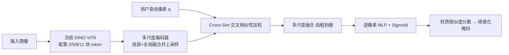

## 一句话总结

给定一张图片和用户点选的一个像素，自动选出图中所有"和这个像素同材质"的区域，且对阴影、高光、投影等光照变化鲁棒，不依赖预定义的材质类别。

## 研究背景

- 领域现状：图像选择工具主要有两类。一类基于颜色/亮度（Photoshop 的魔棒、套索、KNN matting），另一类基于语义/实例分割选中整个物体。材质分类与材质分割方法也存在，但都局限于一组预定义的高层类别（木头、金属……）。
- 核心痛点：现有方法都无法做"细粒度材质选择"。颜色类工具对光照极不鲁棒——同一材质在不同视角和光照下颜色差异巨大，投影和高光会导致误选；语义分割选的是物体而非材质（一个物体可能由多种材质构成，同一材质也可能出现在多个物体上）；材质分类把同类的不同实例（两种不同的木头）混为一谈，粒度不够。而且缺乏带细粒度逐像素材质标注的数据集。
- 本文 idea：不把问题当作固定类别的分类，而是形式化为"基于用户查询位置的相似性分组"。借用自监督视觉模型 DINO 的通用自然图像特征作为起点，再训练一个材质感知的多尺度编码器，通过一个新的 Cross-Similarity Feature Weighting（交叉相似性特征加权）模块把用户查询像素注入网络，最终对每个像素输出一个材质相似度分数，阈值化即得选择掩码。

## 方法

整体框架：输入图像先经过冻结的预训练 DINO ViT 提取多层 token 特征；一个可训练的多尺度编码器把这些通用特征专门化为对材质敏感、对光照/物体性不敏感的特征；用户点选的查询像素通过交叉相似性加权层注入到每个尺度的特征上；多尺度特征由粗到细融合后，经一个逐像素小网络输出 $$[0,1]$$ 的材质相似度分数，阈值化得到二值掩码。

关键设计：

1. **以冻结 DINO 特征打底，跨越合成-真实域差**。用 DINO 的 ViT 8×8 配置，取 12 个注意力块中第 (2,5,8,11) 四块的输出作为初始特征。每块含编码局部 patch 信息的 local token（记为 $$\phi_i$$）和编码全局上下文的 global token（记为 $$\psi_i$$），特征维度 $$d=768$$。用在自然图像上预训练的特征起步，既省去昂贵的真实标注，又缓解了"纯合成数据训练带来的域差"——这是模型能泛化到真实照片的关键。

2. **多尺度材质编码器**。对每个块，先把 global token 空间复制后与 local 特征拼接，再经卷积网络加双线性上采样，用不同放大因子 $$s_0=4, s_1=2, s_2=s_3=1$$（越早的块上采样越多），得到通道数 $$d'=256$$、分辨率分别为输入 $$1/2, 1/4, 1/8, 1/8$$ 的材质特征图 $$f_i$$。这一步把 DINO 天然偏粗（1/8 分辨率）的特征细化，并让选择过程能分析多个尺度。

3. **交叉相似性特征加权（查询注入）**。这是把"点选像素"变成动态选择、且能泛化到未见材质的核心。从 $$f_i$$ 用两个线性层得到键 $$K$$ 和值 $$V$$；查询 $$Q$$ 则取查询位置 $$q$$ 处的嵌入、拼上 patch 内子像素坐标（提供比 DINO patch 更细的空间信息）后经 MLP 得到。像素 $$p$$ 在尺度 $$i$$ 的权重为
$$w_{i,pq} = \sigma(Q^T K / \sqrt{d}) \in [0,1]$$
再加权得到待融合特征 $$g_{i,pq} = w_{i,pq} \cdot V$$。它与标准注意力有两点不同：其一是"一对多"比较（一个查询对所有像素），而非多对多；其二是要的是查询与各嵌入的非负相似度分数，而非空间上归一化的相对重要性，因此用 sigmoid $$\sigma$$ 而非 softmax，权重无需在空间维求和为 1。

4. **合成训练数据 + 真实评测基准**。因缺乏细粒度逐像素材质标注数据集，作者用 Blender Cycles 渲染了 5 万张室内场景 HDR 图（100 个场景、随机相机轨迹、每次渲染从约 3000 个平稳化的 Adobe Substance 材质中随机替换），并输出全局一致的材质 ID 图作监督——这隐式地把"共享同一平稳 SVBRDF"定义为同材质。训练用二值交叉熵损失。评测则手工标注了 50 张真实照片（Pixabay/Pexels，平均每图 2 种材质）作为公开基准。可选地用 KNN matting 后处理精修细小结构边界。

## 实验结果

主实验：在 50 张真实图的稠密标注基准上，每图随机取 10 个查询点，报告平均 mIoU（各方法均用网格搜索取最优阈值）。

| 方法 | mIoU ↑ | 需负样本 |
|------|--------|----------|
| DMS 材质分割 | 0.38 | 否 |
| UNet on RGB | 0.612 | 否 |
| KNN matting（5 patch, HSV） | 0.677 | 是 |
| 消融：单 DINO 块 | 0.5 | 否 |
| 消融：去掉 Cross-Sim 层 | 0.9 | 否 |
| DINO ViT16 骨干 | 0.877 | 否 |
| 本文 DINO ViT8 | 0.917 | 否 |
| 本文 + KNN matting 精修 | 0.92 | 否 |

结论：本文方法显著优于所有基线，且推理时不需要负样本。消融显示——单个 DINO 块远不够（0.5），说明 DINO 原生特征不足以判别材质，必须靠多块融合的查询相关机制；去掉 Cross-Sim 层虽仍有 0.9，但空间定位变差、边界不精确并过度选择；ViT8（8×8 patch）因空间分辨率更高，边界比 ViT16 更精确。其它实验：查询点自一致性 cross-mIoU 达 0.9387，不同光照下 cross-mIoU 达 0.956，均验证了鲁棒性。方法还能跨图像选择（视频逐帧、材质检索）、并通过滑窗处理支持 1K 高分辨率图像。

## 亮点与局限

- 亮点：
  - 首个面向自然图像的材质选择方法，对光照、投影、高光和几何变化鲁棒，且不受固定材质类别限制、能泛化到训练未见材质。
  - 新颖的查询驱动、受 ViT 启发的交叉相似性加权架构，把单个点选像素优雅地注入多尺度网络。
  - 纯合成数据训练却能很好泛化到真实（含室外）照片；跨图像能力自然衍生出视频选择、材质检索、图像编辑等应用；并释放了新的合成数据集与真实评测基准。
- 局限：
  - 细小/薄结构（羽毛、椅背细网格、蚂蚁）难以精确分割，源于 DINO 特征分辨率偏低、以及合成训练数据缺少细几何结构；KNN 精修也救不回极细结构。
  - "何为单一材质"的定义绑定于图形学的平稳材质概念（如带生长色差的木板算一种材质），未必总符合用户直觉。
  - 对极端直接投影导致的严重欠曝区域不准，因为那些区域几乎不含材质信息。

## 延伸思考

- 该方法定位为逆渲染的"前置引导"：材质分割常是逆渲染的必需输入，本文可为其提供跨图像共享信息的高质量材质分组，值得与可微渲染管线联动。
- 依赖冻结 DINO 是双刃剑——它带来自然图像先验和域适应能力，但也把分辨率上限锁死。用更高分辨率或分层的自监督骨干（或引入超分/边界细化分支）或许能直接改善薄结构问题。
- "相似性分组"而非"闭集分类"的思路很通用，可迁移到其它需要用户交互、类别开放的选择任务（如纹理、光照条件、风格）。
- 合成 ID 图作监督隐式定义了"同材质"，若能引入可调粒度的标注或多查询点交互（论文已支持正负点组合），可让选择粒度更贴合用户意图。
